# jira-integration · Claude Code Plugin

**[English]** | [한국어](#korean)

[](#)
[](LICENSE)
[](https://docs.anthropic.com/en/docs/claude-code)
[](https://github.com/sooperset/mcp-atlassian)

> **Automate your entire dev workflow — from Jira issue to merged PR — inside Claude Code.**

---

## Why This Plugin?

Most Jira + AI tools stop at CRUD (read/create/update issues). This plugin automates the **entire development lifecycle**: planning → design → implementation → testing → review → PR → done, with every step synced back to Jira automatically.

| | **This Plugin** | Atlassian Official AI | netresearch/jira-skill |
|---|:---:|:---:|:---:|
| Jira MCP integration | ✅ | ✅ | ❌ Python scripts |
| Full PDCA lifecycle | ✅ | ❌ code gen only | ❌ CRUD only |
| Multi-worktree batch setup | ✅ | ❌ | ❌ |
| Auto Jira status transitions | ✅ | ✅ | manual |
| Plan / Design / Test docs | ✅ | ❌ | ❌ |
| Design-Impl gap analysis | ✅ | ❌ | ❌ |
| Progress tracking across sessions | ✅ | ❌ | ❌ |

---

## Workflow

```mermaid
graph LR
    A["/jira-task init\nBatch worktree setup"] --> B["/jira-task start\nIn Progress"]
    B --> C["/jira-task plan\nPlanning doc"]
    C --> D["/jira-task design\nDesign doc"]
    D --> E["/jira-task impl\nImplement"]
    E --> F["/jira-task test\nE2E + unit tests"]
    F --> G["/jira-task review\nGap analysis + review"]
    G --> H["/jira-task merge\nLocal merge"]
    H --> I["/jira-task pr\nCreate GitHub PR"]
    I --> J["/jira-task done\nDone"]

    style A fill:#2B50D4,color:#fff
    style J fill:#156030,color:#fff
```



Each step automatically posts a comment and/or attachment to the Jira issue and transitions its status.

---

## Key Features

**Multi-Worktree Parallel Development**
`/jira-task init 5` creates isolated git worktrees for each assigned task at once. Work on multiple issues simultaneously without context switching.

**Document Auto-generation**
Generates `plan.md`, `design.md`, test reports, and review results — then immediately posts them as Jira attachments and comments. No copy-paste required.

**Status Transition Automation**
`start` → In Progress, `merge` → In Review, `done` → Done. Jira stays up to date without opening a browser.

**Design-Impl Gap Analysis**
`/jira-task review` compares your design document against actual code changes and flags discrepancies alongside code quality issues.

**Session Continuity**
Progress is tracked in `.jira-context.json`. Reopen Claude Code anytime and see exactly where you left off:
```
Progress: init ✓ → start ✓ → plan ✓ → design → impl → test → review → merge → pr → done
```

---

## Prerequisites

| Requirement | Required | Purpose |
|---|:---:|---|
| [Claude Code](https://docs.anthropic.com/en/docs/claude-code) | Yes | CLI environment |
| Python 3.10+ + [uv](https://docs.astral.sh/uv/) | Yes | Run MCP server (`uvx mcp-atlassian`) |
| [Git](https://git-scm.com/) | Yes | Branch / worktree management |
| Jira Cloud account + API Token | Yes | Jira integration |
| [GitHub CLI (`gh`)](https://cli.github.com/) | PR step only | Create GitHub PRs |

---

## Quick Start

```bash
# 1. Install the plugin
claude plugin marketplace add mzd-hseokkim/jira-claude-code-integration
claude plugin install jira-integration@jira-claude-code-integration

# 2. Register the Atlassian MCP server
claude mcp add atlassian \
  -e JIRA_URL=https://your-domain.atlassian.net \
  -e JIRA_USERNAME=your-email@company.com \
  -e JIRA_API_TOKEN=your-api-token \
  -e JIRA_PROJECTS_FILTER=PROJ \
  -- uvx mcp-atlassian

# 3. Verify connection
claude
> /jira

# 4. Fetch your top tasks and set up worktrees
> /jira-task init 5

# 5. Work through a task (TASK-ID is auto-detected from branch/directory)
> cd ../your-project_worktree/PROJ-123
> /jira-task start      # Transition to In Progress
> /jira-task plan       # Generate planning doc
> /jira-task design     # Generate design doc
> /jira-task impl       # Implement based on design
> /jira-task test       # Run tests + post report to Jira
> /jira-task review     # Gap analysis + code review
> /jira-task merge      # Merge locally (choose strategy)

# 6. Back in the main repo
> cd ../your-project
> /jira-task pr         # Push branch + create GitHub PR
> /jira-task done       # Transition to Done + post summary
```

---

## Setup

### Step 1: Install the Plugin

```bash
claude plugin marketplace add mzd-hseokkim/jira-claude-code-integration
claude plugin install jira-integration@jira-claude-code-integration

# For local dev / testing:
claude --plugin-dir /path/to/jira-claude-code-integration
```

### Step 2: Create a Jira API Token

1. Go to https://id.atlassian.com/manage-profile/security/api-tokens
2. Click **"Create API token"**
3. Enter a label (e.g. `claude-code`) → **Create**
4. Copy the token (shown only once)

### Step 3: Register the MCP Server

```bash
claude mcp add atlassian \
  -e JIRA_URL=https://your-domain.atlassian.net \
  -e JIRA_USERNAME=your-email@company.com \
  -e JIRA_API_TOKEN=your-api-token \
  -e JIRA_PROJECTS_FILTER=PROJ \
  -- uvx mcp-atlassian
```

This saves credentials to `.claude/settings.local.json`. **Add it to `.gitignore`**:
```
.claude/settings.local.json
```

| Variable | Required | Description |
|---|:---:|---|
| `JIRA_URL` | Yes | Jira Cloud URL (no trailing `/`) |
| `JIRA_USERNAME` | Yes | Atlassian account email |
| `JIRA_API_TOKEN` | Yes | API token from Step 2 |
| `JIRA_PROJECTS_FILTER` | No | Comma-separated project keys (e.g. `PROJ,DEV`) |

### Step 4: Verify Connection

```bash
claude
> /jira
```

---

## Commands

| Command | Run from | Description |
|---|---|---|
| `/jira` | anywhere | Connection status + help |
| `/jira-task init [N]` | main repo | Fetch top N tasks + create worktrees |
| `/jira-task start [ID]` | worktree | Start task (branch, In Progress) |
| `/jira-task plan [ID]` | worktree | Generate `docs/plan/<ID>.plan.md` |
| `/jira-task design [ID]` | worktree | Generate `docs/design/<ID>.design.md` |
| `/jira-task impl [ID]` | worktree | Implement based on design doc |
| `/jira-task test [ID]` | worktree | Run tests + post report to Jira |
| `/jira-task review [ID]` | worktree | Gap analysis + code review → Jira |
| `/jira-task merge [ID]` | worktree | Merge locally (strategy: ff/squash/rebase) |
| `/jira-task pr [ID]` | main repo | Push branch + create GitHub PR |
| `/jira-task done [ID]` | main repo | Transition Done + post summary |
| `/jira-task report` | anywhere | My assigned issues status report |
| `/jira-task status` | anywhere | Current active task status |

### TASK-ID Auto-detection

When working inside a worktree, `[ID]` can be omitted. It is resolved in this order:

1. Git branch name: `feature/PROJ-123` → `PROJ-123`
2. Current directory name matching `[A-Z]+-\d+`
3. `.jira-context.json` active task ID

---

## Project Structure

```
jira-claude-code-integration/
├── .claude-plugin/
│   ├── plugin.json              # Plugin manifest
│   └── marketplace.json
├── CLAUDE.md                    # Claude behavior instructions
│
├── commands/
│   ├── jira.md                  # /jira
│   └── jira-task.md             # /jira-task (router)
│
├── skills/                      # One SKILL.md per workflow step
│   ├── jira-task-init/
│   ├── jira-task-start/
│   ├── jira-task-plan/
│   ├── jira-task-design/
│   ├── jira-task-impl/
│   ├── jira-task-test/
│   ├── jira-task-review/
│   ├── jira-task-pr/
│   ├── jira-task-done/
│   ├── jira-task-report/
│   └── jira-local-merge/
│
├── agents/                      # Subagent definitions
│   ├── jira-planner.md          # Jira context + doc generation
│   ├── jira-reviewer.md         # Gap analysis + code quality
│   └── jira-reporter.md         # Issue status report
│
├── hooks/                       # Session event hooks
│   ├── hooks.json
│   └── scripts/
│       ├── session-start.js     # Show active task on startup
│       └── stop-sync.js         # Remind to sync Jira on exit
│
└── templates/
    ├── plan.template.md
    └── report.template.md
```

### Worktree Layout

```
workspace/
├── your-project/                  ← main repo (base branch)
└── your-project_worktree/         ← created by /jira-task init
    ├── PROJ-101/                  ← feature/PROJ-101 branch
    ├── PROJ-102/
    └── PROJ-103/
```

---

## Multi-Worktree Merge Strategy

When multiple tasks touch the same files, merging in the wrong order causes conflicts.

```
Check for file overlap at design time
├─ No overlap            → PR in any order
├─ Overlap (independent releases) → Sequential rebase-and-merge
└─ Overlap (release together)     → Integration branch strategy
```

Check before starting implementation:
```bash
git diff --name-only main feature/PROJ-101
git diff --name-only main feature/PROJ-102
```

Available merge strategies when running `/jira-task merge`:

| Strategy | Description | Equivalent GitHub option |
|---|---|---|
| `--no-ff` (default) | Merge commit, preserves branch history | Create a merge commit |
| `--squash` | Squash all commits into one | Squash and merge |
| `rebase` | Linear history, no merge commit | Rebase and merge |

---

## Troubleshooting

**"Atlassian MCP server not connected"**
```bash
claude mcp list                  # Check registered servers
claude mcp get atlassian         # Verify env vars
uvx mcp-atlassian                # Test server directly (Ctrl+C to stop)
pip install uv                   # Install uv if missing
```

**"Transition failed"**
```
"Show available transitions for PROJ-123"
```
Transition names vary by Jira workflow. Common names: `To Do`, `In Progress`, `In Review`, `Done`.

**"Authentication failed"**
- Verify `JIRA_USERNAME` matches your Atlassian account email exactly
- Confirm `JIRA_URL` has no trailing `/`
- Check if the API token has expired

**"`gh` CLI not found"**
```bash
# macOS
brew install gh && gh auth login

# Windows
winget install GitHub.cli && gh auth login
```

**Worktree creation failed**
```bash
git rev-parse --git-dir          # Confirm you're in a git repo
git branch -a | grep feature/    # Check for existing branches
git worktree prune               # Clean stale worktree refs
```

---

## Roadmap

- [ ] Bitbucket Cloud + GitLab MR support for `/jira-task pr`
- [ ] Jira Server / Data Center (Personal Access Token)
- [ ] Sub-task auto-creation from design doc task breakdown
- [ ] Time tracking: auto-log work sessions to Jira
- [ ] CI/CD result posting (GitHub Actions, Bitbucket Pipelines)
- [ ] Slack / Teams notifications on PR creation and task completion
- [ ] Interactive setup wizard: `/jira setup`
- [ ] English documentation for all templates

---

## License

MIT

---

<a name="korean"></a>

## 한국어 요약

이 플러그인은 **Jira + Claude Code를 연결하는 개발 워크플로우 자동화 도구**입니다.

### 핵심 특징

- `/jira-task init 5` 하나로 할당된 태스크 5개의 **git worktree 일괄 생성**
- 기획 → 설계 → 구현 → 테스트 → 리뷰 → PR → 완료까지 **전 단계 커맨드화**
- 각 단계 완료 시 **Jira 코멘트·첨부파일·상태 전이 자동 처리**
- 설계 문서와 실제 구현 코드 간 **Gap 자동 분석**
- `.jira-context.json`으로 **세션 간 진행 상황 자동 복원**

### 설치

```bash
claude plugin marketplace add mzd-hseokkim/jira-claude-code-integration
claude plugin install jira-integration@jira-claude-code-integration

claude mcp add atlassian \
  -e JIRA_URL=https://your-domain.atlassian.net \
  -e JIRA_USERNAME=your-email@company.com \
  -e JIRA_API_TOKEN=your-api-token \
  -- uvx mcp-atlassian
```

자세한 설정은 [상세 설정 섹션](#setup-·-상세-설정)을 참고하세요.

### 기타

- 커맨드 목록, Worktree 전략, 트러블슈팅 등 상세 내용은 영문 섹션에 동일하게 기술되어 있습니다.
- 이슈·제안은 [GitHub Issues](https://github.com/mzd-hseokkim/jira-claude-code-integration/issues)에 남겨주세요.
