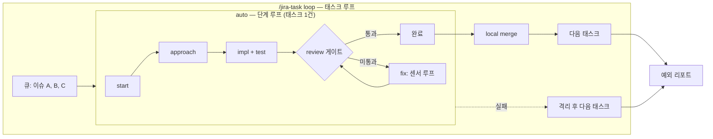

# jira-integration · Claude Code Plugin

[](.claude-plugin/plugin.json)
[](LICENSE)
[](#)
[](https://github.com/sooperset/mcp-atlassian)

Jira 이슈 하나를 **브랜치 생성 → 설계 → 구현 → 테스트 → 리뷰 → 병합**까지 Claude Code가 끝까지 처리하고, 그 과정을 전부 Jira에 기록하는 플러그인입니다. 이슈 여러 건을 큐에 넣고 돌리면, 사람은 마지막에 **예외 리포트만** 보고 결정합니다.

> **English TL;DR** — A Claude Code plugin that drives a Jira issue through branch → approach → impl → test → review → local merge, posting every step back to Jira. Queue several issues with `/jira-task init`, drain them with `/jira-task loop`; failures are quarantined per task and you review one exception report at the end. Orchestration runs as a deterministic Workflow script, not prompt-interpreted control flow. The rest of this document is in Korean.

---

## 목차

1. [5분 퀵스타트](#1-5분-퀵스타트)
2. [동작 원리 — 두 개의 루프](#2-동작-원리--두-개의-루프)
3. [Jira 연계 모델](#3-jira-연계-모델)
4. [운영 규칙 — 꼭 알아야 할 것](#4-운영-규칙--꼭-알아야-할-것)
5. [명령어 레퍼런스](#5-명령어-레퍼런스)
6. [설정 레퍼런스](#6-설정-레퍼런스)
7. [파일과 산출물](#7-파일과-산출물)
8. [대시보드](#8-대시보드)
9. [트러블슈팅](#9-트러블슈팅)
10. [설계 문서와 개발](#10-설계-문서와-개발)

---

## 1. 5분 퀵스타트

### 준비물

| 항목 | 용도 |
|---|---|
| Claude Code | 플러그인 실행 환경 |
| Python 3.10+ 와 `uv` | Jira MCP 서버(`uvx mcp-atlassian`) 실행 |
| Git | 브랜치·worktree |
| Jira Cloud 계정 + [API 토큰](https://id.atlassian.com/manage-profile/security/api-tokens) | Jira 연동 |
| `gh` CLI | `/jira-task pr`에서만 필요 |

### 설치

```bash
claude plugin marketplace add mzd-hseokkim/jira-claude-code-integration
claude plugin install jira-integration@jira-claude-code-integration
```

### Jira 연결

프로젝트 루트에서 Claude Code를 열고:

```
/jira setup
```

마법사가 Jira URL·이메일·API 토큰을 묻고 MCP 서버(`atlassian`)를 등록한 뒤 연결을 검증합니다. 자격증명은 `.claude/settings.local.json`에 저장됩니다 (커밋 금지 — `.gitignore`에 있는지 확인).

### 첫 실행 — 이슈 큐를 끝까지 돌리기

```
/jira-task init MAE-100        # 부모 이슈의 하위작업들을 큐로 잡고 worktree 생성
/jira-task loop                # 큐를 순서대로 소진: 태스크마다 자동 파이프라인 + 로컬 병합
```

`loop`가 끝나면 이런 리포트가 나옵니다:

```
🔁 Loop 완료 — 통과 2 / 격리 1 / 미착수 0
✅ 클린 통과 (검토 중, 사람 확인만 필요):
   MAE-101  +115/-0, 5 files — …
   MAE-103  +64/-9, 5 files — …
⛔ 격리 — 결정 필요:
   MAE-102  [stage-failed] test FAIL … — 권장: /jira-task impl MAE-102
```

통과한 태스크는 main에서 동작을 확인하고 `/jira-task done <KEY>`로 닫습니다. 격리된 태스크만 사람이 들여다보면 됩니다.

이슈 하나만 처리하려면 `init` 대신 해당 이슈의 worktree에서 `/jira-task auto <KEY>`를 쓰고, 단계를 하나씩 직접 밟고 싶으면 `start → approach → impl → test → review → merge`를 개별 명령으로 실행합니다.

---

## 2. 동작 원리 — 두 개의 루프

이 플러그인은 **단계 루프**(태스크 안)와 **태스크 루프**(태스크 사이) 두 층으로 돌아갑니다.


```mermaid
flowchart LR
  subgraph loop["/jira-task loop — 태스크 루프"]
    direction LR
    Q[큐: 이슈 A, B, C] --> A
    subgraph A["auto — 단계 루프 (태스크 1건)"]
      direction LR
      S[start] --> AP[approach] --> IT[impl + test] --> R{review 게이트}
      R -- 통과 --> OK[완료]
      R -- 미통과 --> F[fix: 센서 루프] --> R
    end
    OK --> M[local merge] --> N[다음 태스크]
    A -. 실패 .-> QT[격리 후 다음 태스크]
  end
  N --> RPT[예외 리포트]
  QT --> RPT
```

### 단계 루프 (`auto`)

한 태스크를 `start → approach → impl+test → review` 순으로 처리합니다. 각 단계는 **격리된 sub-agent**로 실행되어 서로의 컨텍스트를 오염시키지 않고, 단계마다 적절한 모델이 배정됩니다 (start: haiku / approach: opus / impl+test: sonnet / review: L1이면 sonnet, 그 외 opus).

- **리뷰 게이트**: 리뷰어는 "증거를 열어보기 전엔 전부 미충족"이라는 Default-FAIL 계약으로 판정합니다. 설계-구현 매칭률과 Critical 건수가 구조화된 값으로 나오고, 게이트는 이 값을 코드로 판정합니다.
- **fix 루프**: 게이트 미통과 시 수정 agent가 투입됩니다. 수정 agent는 안쪽에서 lint·typecheck·**관련 테스트만** 도는 싼 센서 루프(최대 5회)로 수렴시킨 뒤, 전체 테스트와 재리뷰를 각 1회만 돌립니다. 재리뷰는 직전 지적 항목과 수정 파일만 다시 보는 delta 모드입니다. 바깥 루프 상한은 2회.
- **중단 조건**: 매칭률 < 70% 또는 Critical ≥ 3이면 "스코프 누락"으로 보고 fix 루프에 들어가지 않습니다. 센서 루프가 5회 안에 green이 안 되면 재리뷰 없이 중단합니다. 이 경우 모두 사람에게 결정이 넘어옵니다.

이 제어 흐름 전체는 프롬프트가 아니라 **Workflow 스크립트**(`scripts/auto.workflow.js`)가 결정론적으로 실행합니다. 순서·분기·재시도에 LLM 판단이 개입하지 않습니다.

### 태스크 루프 (`loop`)

`init`으로 잡은 큐를 순서대로 소진합니다. 태스크마다 `auto` → 로컬 `--no-ff` 병합 → 남은 worktree를 최신 base로 rebase.

- **격리(quarantine)**: 어떤 태스크가 게이트에 걸리거나, 단계가 실패하거나, 병합·rebase가 충돌하면 **그 태스크만 보류하고 다음으로 계속**합니다. 루프 전체가 멈추지 않습니다.
- **전체 중단은 시스템 실패일 때만**: 서로 다른 태스크가 같은 단계에서 연속 2건 실패하거나, 인증(401/403)·MCP 연결·base 손상 같은 인프라 신호가 보이면 멈춥니다.
- **예외 리포트**: 끝나면 "통과 목록 / 격리 목록 + 권장 조치"를 한 장으로 보여줍니다. 격리 태스크는 사유를 해결하고 `loop`를 다시 실행하면 자동 재시도됩니다.

### 사람의 자리

| 지점 | 누가 | 왜 |
|---|---|---|
| 이슈 작성 / 큐 구성 | 사람 | 무엇을 할지는 사람이 정함 |
| start → review → merge | 자동 | 검증 가능한 산출물이 있는 단계 |
| merge 후 main 확인 → `done` | 사람 | 병합 결과를 실제로 보는 게이트 (의도된 설계) |
| 격리 태스크 처리 | 사람 | 자동으로 못 메우는 종류의 문제 |
| `pr` | 사람이 트리거 | 외부 공개 행위 |

---

## 3. Jira 연계 모델

### 이슈 하나 = 브랜치 + worktree + 컨텍스트 파일

| Jira | 로컬 |
|---|---|
| 이슈 키 `MAE-123` | 브랜치 `feature/MAE-123` |
| | worktree `../<프로젝트>_worktree/MAE-123/` |
| | 그 안의 `.jira-context.json` (진행 단계·상태·캐시) |

메인 레포의 `.jira-context.json`은 **큐 전체**(`tasks[]`)를 담는 aggregate이고, 각 worktree의 것은 그 태스크 하나의 상태입니다. 둘 다 gitignore 대상입니다.

이슈 타입별 처리 단위:
- **하위작업(Subtask) · 작업(Task) · 버그** → 1건 = 1 worktree. `init <부모키>`는 부모의 미완료 하위작업을 전부 큐로 잡습니다.
- **Story** → 보통 하위작업으로 분해된 뒤 처리 (`discover`/`create`가 분해를 제안·생성).
- **Epic** → 직접 처리하지 않음. `approach`가 Epic에서 호출되면 자식 Story 시퀀싱만 내고 끝납니다.

### 명령별 Jira 부수효과

각 명령이 Jira에 남기는 것. 코멘트 제목은 영어, 본문은 한국어입니다.

| 단계 | 상태 전이 | 코멘트 | 첨부 |
|---|---|---|---|
| `init` | — | Worktree Initialized | — |
| `start` | 할 일 → **진행 중** (+ 담당자를 나로 지정) | Start Work | — |
| `approach` | — | Approach Document Created (레벨·핵심 1줄) | `<KEY>.approach.md` |
| `impl` | — | Implementation Complete (변경 파일) | — |
| `test` | — | Test Results (PASS/FAIL 표) | 테스트 리포트, 실패 스크린샷 |
| `review` | — | Code Review Complete (결과·매칭률·리뷰어 서명) | `<KEY>.review.md` |
| `merge` | 진행 중 → **검토 중** | Task Merged Locally (커밋·파일·라인 수) | — |
| `pr` | — | PR 링크 | — |
| `done` | 검토 중 → **완료** | Task Completed (요약) | — |

상태명은 Jira 프로젝트의 워크플로를 따릅니다 (영문 프로젝트면 To Do / In Progress / In Review / Done). 전이 전에는 항상 가능한 전이 목록을 조회하고, 전이 후 재조회로 실제 상태를 확인합니다.

**격리는 Jira를 건드리지 않습니다.** `loop`가 태스크를 보류해도 상태 전이나 코멘트가 없습니다 — 격리는 로컬 워크플로 상태(`.jira-context.json`의 `deferred`)일 뿐이라, Jira에서는 마지막으로 성공한 단계의 상태 그대로 보입니다.

### 이슈를 만드는 길 / 가져오는 길

```
[만드는 길]  /jira-task epic set <EPIC>  →  /jira-task discover <주제>  →  /jira-task create --from-requirements <문서>
[가져오는 길]                                                              /jira-task init <부모키 | N | 자연어>
```

- `epic set`: 프로젝트에 Epic 스코프를 고정(`.jira-epic.json`). 이후 `create`가 만드는 이슈는 자동으로 그 Epic에 연결됩니다.
- `discover <주제>`: 코드베이스를 보고 질문하며 요구사항 문서(`docs/requirements/<주제>.requirements.md`)를 씁니다. 말미에 이슈 분해안(L1 단일 / L2 Story+하위작업 / L3 Epic+Story)을 제안합니다. Jira에는 아무것도 만들지 않습니다.
- `create`: 대화로 이슈를 만들거나, `--from-requirements`로 요구사항 문서의 분해안을 그대로 등록합니다.
- `init`: 이미 있는 이슈를 가져옵니다. 부모 키를 주면 미완료 하위작업을 의존성(`is blocked by`) 분석 후 착수 가능한 것만 큐에 넣고, 숫자를 주면 나에게 할당된 고우선순위 N건을 잡습니다.

### 현황 보기

- `/jira-task status` — 현재 디렉터리의 활성 태스크 + Jira 최신 상태
- `/jira-task report` — 나에게 할당된 이슈를 상태별로 분류한 리포트 (Scrum이면 활성 스프린트 기준)
- [대시보드](#8-대시보드) — 모든 worktree의 진행 단계·도구 호출·Jira 상태를 실시간 카드로

---

## 4. 운영 규칙 — 꼭 알아야 할 것

### worktree에서 실행한다

`start` 이후의 단계(`approach`/`impl`/`test`/`review`/`auto`)는 **그 태스크의 worktree를 현재 디렉터리로** 실행합니다. 그래야 구현이 worktree 브랜치에 들어가고 컨텍스트 파일도 맞는 것을 읽습니다. `loop`는 태스크마다 worktree 진입·복귀를 알아서 처리하므로 메인 레포에서 실행하면 됩니다. `merge`/`pr`/`clean`/`done`은 메인 레포에서.

### 작업 규모 레벨 — L1 / L2 / L3

`approach`가 이슈 규모를 판정해 산출물 분량과 리뷰 깊이를 맞춥니다.

| 레벨 | 기준 (issuetype 폴백) | approach 산출물 |
|---|---|---|
| L1 | Subtask / Task / Bug | 5줄 요약 (변경 영역·핵심 결정·검증·리스크·롤백) |
| L2 | Story | 한 페이지 (아키텍처·구현 계획·결정·테스트 계획·리스크) |
| L3 | Epic | 자식 Story 시퀀싱만 |

L1이라도 데이터 모델·트랜잭션 경계·외부 API 계약·동시성·보안 경계를 건드리면 L2로 자동 승급됩니다. 판정은 한 줄로 통보되고, "L1로 줄여줘" 같은 자연어로 바꿀 수 있습니다. `create`가 이슈를 만들 때 `breakdownLevel`을 기록해 두면 그 값이 우선합니다.

### PDCA 권고 — 단계 스킵

`start`가 이슈 성격을 보고 `approach`와 `test` 두 단계에 한해 "스킵 가능"을 권고합니다 (예: 문서만 바꾸는 변경은 test 스킵). `auto`는 이 권고를 자동 적용하되 사용자가 `--skip`으로 명시한 것이 우선합니다. `impl`·`review`·`merge`는 절대 스킵되지 않습니다.

### 게이트 임계값

| 게이트 | 기준 |
|---|---|
| review 통과 | 리뷰어 Approve (매칭률 ≥ 90%, Critical 0 — Warning/Info는 차단하지 않음) |
| fix 루프 진입 | 매칭률 ≥ 70% 이고 Critical < 3 (아니면 스코프 누락으로 즉시 중단) |
| fix 루프 상한 | 바깥 2회, 안쪽 센서 루프 5회 |

매칭률 임계값은 worktree `.jira-context.json`의 `reviewGate.matchRateThreshold`로 바꿀 수 있습니다.

### 격리 종류와 대응

| `deferredKind` | 뜻 | 권장 조치 |
|---|---|---|
| `scope-shortfall` | 설계 대비 구현이 크게 모자람 | 부분 수용 `merge` 후 나머지는 별도 이슈로, 또는 worktree에서 추가 구현 후 `review` |
| `gate-exhausted` | fix 루프로 수렴 실패 | `docs/review/<KEY>.review.md` 확인 → 수동 수정 → `test` → `review` |
| `stage-failed` | 어떤 단계가 실패 | 실패 단계부터 직접: `/jira-task <단계> <KEY>` |
| `merge-failed` | base 병합 충돌 | worktree에서 충돌 해결 후 `loop` 재실행 |
| `rebase-conflict` | 앞 태스크 병합 후 rebase 충돌 | worktree에서 해결(또는 미커밋 정리) 후 `loop` 재실행 |

### 중단 후 재개

모든 단계는 `.jira-context.json`의 `completedSteps`에 기록됩니다. `auto`나 `loop`를 다시 실행하면 끝난 단계는 건너뛰고 남은 것만 실행합니다. 격리 태스크도 다음 `loop`에서 자동 재시도됩니다.

---

## 5. 명령어 레퍼런스

`/jira-task <action> [인자]`. TASK-ID는 생략하면 브랜치명(`feature/<KEY>`) → 디렉터리명 → 컨텍스트 파일 순으로 자동 감지합니다.

**이슈 만들기**

| 명령 | 설명 |
|---|---|
| `epic set <키\|이름>` / `show` / `clear` | 프로젝트 Epic 스코프 고정·조회·해제 |
| `discover <주제> [--lite] [--from <파일>]` | 요구사항 문서 + 이슈 분해 제안 |
| `create [힌트]` / `create --from-requirements <문서>` | 이슈 생성 (하위작업·Blocks 링크·Epic 연결 자동) |

**큐와 자동 실행**

| 명령 | 설명 |
|---|---|
| `init [N \| 부모키 \| 자연어]` | 태스크 조회 + worktree 일괄 생성 (큐 구성) |
| `loop [--skip <단계,...>]` | 큐 소진: 태스크마다 auto + 로컬 병합, 격리 후 계속, 예외 리포트 |
| `auto <KEY> [--skip <단계,...>]` | 한 태스크의 start→review 자동 실행 (worktree에서) |

**개별 단계**

| 명령 | 설명 |
|---|---|
| `start <KEY>` | 브랜치/worktree 생성, 진행 중 전이, PDCA 권고 |
| `approach <KEY>` | 레벨별 접근 설계 문서 (`plan`/`design`은 구버전 별칭) |
| `impl <KEY>` | approach 기반 구현 + 종료 시 lint 1회 |
| `test <KEY>` | 테스트 작성·실행 (Playwright / vitest·jest / pytest / custom 자동 감지) + Jira 리포트 |
| `review <KEY>` | 독립 리뷰어의 Gap 분석 + 코드 리뷰 → Jira |
| `merge <KEY>` | 로컬 `--no-ff` 병합, 검토 중 전이 (메인 레포에서) |
| `pr <KEY>` | `gh pr create` + Jira 링크 (merge 선행, 메인 레포에서) |
| `done <KEY>` | 요약 게시 + 완료 전이 |

**조회와 정리**

| 명령 | 설명 |
|---|---|
| `status` | 활성 태스크 + Jira 상태 |
| `report` | 할당 이슈 현황 리포트 |
| `clean [KEY ...] \| --all \| --list` | worktree·브랜치 정리 (메인 레포에서, dry-run 후 확인) |

**그 외**

| 명령 | 설명 |
|---|---|
| `/jira setup` | Jira MCP 등록 마법사 |
| `/jira` | 연결 상태·도움말 |
| `/jira dashboard [start\|stop\|status\|setup]` (또는 `/dashboard`) | 대시보드 제어 |

---

## 6. 설정 레퍼런스

### 환경변수

`/jira setup`이 MCP 서버 등록 시 함께 저장합니다. 직접 등록하려면:

```bash
claude mcp add atlassian \
  -e JIRA_URL=https://your-domain.atlassian.net \
  -e JIRA_USERNAME=you@company.com \
  -e JIRA_API_TOKEN=your-api-token \
  -e JIRA_PROJECTS_FILTER=PROJ \
  -- uvx mcp-atlassian
```

| 변수 | 필수 | 설명 |
|---|---|---|
| `JIRA_URL` | ✓ | Jira Cloud URL (끝에 `/` 없이) |
| `JIRA_USERNAME` | ✓ | Atlassian 계정 이메일 |
| `JIRA_API_TOKEN` | ✓ | API 토큰 |
| `JIRA_PROJECTS_FILTER` | | MCP 서버가 노출할 프로젝트 키 (쉼표 구분) |
| `JIRA_DEFAULT_PROJECT` | | **플러그인 자체 변수** — 설정하면 모든 JQL에 `project = …`가 붙고 `create`가 프로젝트를 묻지 않음. MCP 서버 변수가 아니므로 `.claude/settings.local.json`의 `env`나 셸 환경에 설정 |

### worktree로의 MCP 전파

worktree는 별도 프로젝트 루트로 인식되어 MCP 설정이 자동 상속되지 않습니다. `init`/`start`가 `scripts/propagate-mcp-config.sh`로 `atlassian` 설정을 worktree에 복사합니다. worktree에서 `.mcp.json`을 처음 로드할 때 신뢰 승인 프롬프트가 한 번 뜰 수 있습니다.

### Phase Gate (선택, 기본 비활성)

단계 순서를 훅으로 강제하는 기능입니다 (예: approach 없이 impl 금지). 기본은 꺼져 있습니다 — 이 플러그인은 필요한 단계만 골라 쓰는 도구함이라 강제 선형화가 유연성을 해치기 때문입니다. 켜려면 `hooks/hooks.json`의 `PreToolUse`에 `hooks/scripts/phase-gate.js`를 등록합니다. 우회: `JIRA_PHASE_GATE_BYPASS=1`(1회) 또는 `.jira-context.json`의 `bypassGate: true`. 의존 그래프는 `hooks/scripts/phase-gate.config.json`.

---

## 7. 파일과 산출물

```
<프로젝트>/
├── .jira-context.json          # aggregate — 큐 전체 (gitignore)
├── .jira-epic.json             # Epic 스코프 (gitignore)
├── docs/
│   ├── requirements/<주제>.requirements.md   # discover 산출물
│   ├── approach/<KEY>.approach.md            # 접근 설계
│   ├── test/<KEY>.test-report.md             # 테스트 리포트 (L2+)
│   ├── review/<KEY>.review.md                # 리뷰 리포트
│   ├── review-log/                           # 리뷰 판정 로그 (jsonl) — 리뷰어 보정·오탐 추적용
│   └── run-log/                              # auto/loop 실행 로그 (jsonl) — 단계 소요·fix 횟수·격리 기록
└── ../<프로젝트>_worktree/<KEY>/
    ├── .jira-context.json      # 태스크 하나의 상태 (gitignore)
    └── TASK-README.md          # 이슈 요약 (gitignore)
```

- `docs/approach`, `review-log`, `run-log`는 merge로 main에 들어옵니다. `docs/review`·`test`·`requirements`는 기본 gitignore입니다 (프로젝트 정책에 따라 조정).
- `review-log`와 `run-log`는 하니스 자체의 관측 데이터입니다 — 리뷰 오탐률, 단계별 소요, fix 루프 빈도, 격리 사유가 쌓여 이후 튜닝의 근거가 됩니다. 스키마는 각 디렉터리의 README 참고.
- 문서 템플릿은 `templates/` (approach / requirements / test-report / review / pr-description / report).

---

## 8. 대시보드

```
/jira dashboard          # 상태 확인 후 꺼져 있으면 설치+기동
```

`http://127.0.0.1:8765`에서 워크스페이스의 모든 worktree를 카드로 보여줍니다 — Jira 상태 배지, 진행 단계(stepper), 도구 호출 수, 마지막 프롬프트/응답, 진행 중 도구, blocked/stale 배지, 이슈 간 `blocks` 링크 그래프. 플러그인 훅이 보내는 이벤트를 SSE로 받아 실시간 갱신됩니다. stale 카드는 🗑 버튼으로 worktree·브랜치를 정리할 수 있습니다.

수동 실행: `npm install && npm run dashboard:build && npm run dashboard` (포트 변경 `PORT=9000`, 브라우저 자동 열기 억제 `DASHBOARD_NO_OPEN=1`). 로그는 `logs/dashboard-server.log`. localhost 전용이며 인증이 없습니다.

---

## 9. 트러블슈팅

| 증상 | 원인 / 조치 |
|---|---|
| Jira 도구(`mcp__atlassian__*`)가 안 보임 | 세션 시작 시 MCP 서버가 늦게 붙은 경우. `/mcp`에서 atlassian 재연결 또는 세션 재시작 |
| `401 Unauthorized` | 토큰 만료·오타. `/jira setup`으로 재등록 |
| `uvx: command not found` | `uv` 미설치 (`pip install uv` 또는 공식 설치 스크립트). Windows는 Store 스텁 python 주의 |
| auto가 "cwd 불일치"로 중단 | worktree가 아닌 곳에서 실행. 해당 worktree로 이동해 재실행 (`loop`는 자동 처리) |
| worktree에서 Jira 도구 없음 | MCP 전파 누락. 메인 레포에서 `bash scripts/propagate-mcp-config.sh <repoRoot> <worktree>` 또는 `/jira setup` |
| 이슈 생성 시 "유효한 이슈 유형" 오류 | 프로젝트가 로컬라이즈된 타입명을 씀 (예: 한국어 프로젝트는 `작업`, 하위작업은 `Subtask`). `create`는 프로젝트 메타를 조회해 맞추지만 직접 호출 시 주의 |
| 플러그인 업데이트가 반영 안 됨 | `claude plugin marketplace update jira-claude-code-integration` → `claude plugin update jira-integration@jira-claude-code-integration` → 세션 재시작 |
| `loop`가 시작부터 전체 중단 | 시스템 실패 판정(인증/MCP/base). 리포트의 "판정 근거"를 보고 원인 해결 후 재실행 — 완료 태스크는 건너뜀 |

---

## 10. 설계 문서와 개발

이 플러그인의 오케스트레이션 설계와 개선 이력은 `tasks/`에 있습니다:

- `tasks/loop-engineering-roadmap.md` — 개선 로드맵 인덱스 (구현 현황 포함)
- `tasks/auto-workflow-design.md` — auto의 Workflow 스크립트화
- `tasks/sensor-loop-design.md` — fix 루프의 센서 루프·delta 재리뷰
- `tasks/loop-quarantine-design.md` — loop 격리·예외 리포트
- `tasks/retro-skill-design.md`, `tasks/l1-fastpath-design.md` — 예정 항목

플러그인을 수정할 때의 컨벤션은 `CLAUDE.md`, Atlassian MCP 도구 레퍼런스는 `docs/mcp-atlassian-tools.md`를 참고하세요.

```bash
npm test                              # phase-gate 훅 테스트
python -m unittest discover tests     # 스크립트 단위 테스트
npm run test:dashboard                # 대시보드 테스트
claude --plugin-dir .                 # 로컬 개발용 로드
```

## License

MIT
