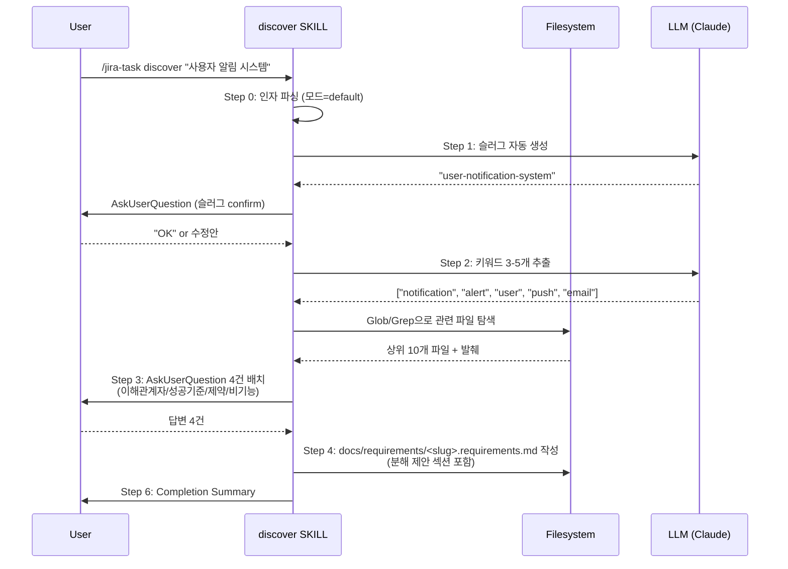
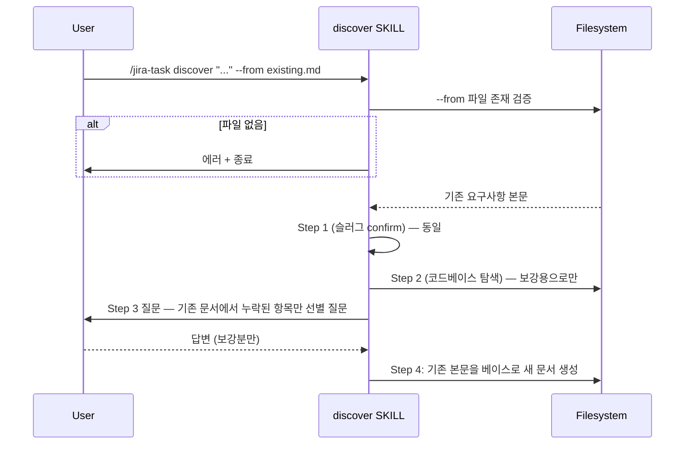

# Design: MAE-115 — [1.1.2] jira-task-discover 스킬 작성

## Architecture

`jira-task-discover`는 단일 SKILL.md 파일로 구성된다. 다른 jira-task-* 스킬과 동일한 구조를 따른다.

```
skills/jira-task-discover/
└── SKILL.md          # 본 태스크의 유일한 산출물
```

**관련 컴포넌트 (참조만 하고 수정하지 않음):**

```
templates/requirements.template.md   ← MAE-117에서 생성. 본 스킬은 경로만 참조
docs/requirements/<SLUG>.requirements.md  ← 본 스킬의 출력 디렉터리
commands/jira-task.md                ← MAE-119에서 discover 액션 라우팅 추가
.jira-context.json                   ← 본 스킬은 건드리지 않음 (Jira 통합 없음)
```

**스킬 호출 흐름 (전체 워크플로 컨텍스트):**

```
user → /jira-task discover "<자연어>" [--lite] [--from <경로>]
         ↓
       commands/jira-task.md (MAE-119에서 라우팅)
         ↓
       skills/jira-task-discover/SKILL.md  ← MAE-115 (본 태스크)
         ↓
       docs/requirements/<SLUG>.requirements.md
         ↓
       (MAE-116) /jira-task create --from-requirements <경로>
         ↓
       Jira 이슈 (에픽/스토리/서브태스크) 생성
```

**SKILL.md 내부 구조:**

```
1. Frontmatter (name, description, argument-hint, allowed-tools, user-invocable)
2. Language Rule (다른 스킬과 동일 문구)
3. Overview (스킬 목적, 입력/출력, --lite/--from 모드 요약)
4. Input Model (자연어 + --lite + --from의 조합 규칙)
5. Workflow
   - Step 0: 인자 파싱 + 모드 판정
   - Step 1: 슬러그 생성 + 사용자 confirm
   - Step 2: 코드베이스 컨텍스트 수집
   - Step 3: 배치 질문 (AskUserQuestion 1회)
   - Step 4: 요구사항 문서 생성
   - Step 5: 이슈 분해 제안 (Step 4의 한 섹션)
   - Step 6: Completion Summary
6. Inline Fallback Template (templates/requirements.template.md 부재 시)
7. Error Handling
8. Non-goals
```

## Sequence Diagram

### Default 모드 (자연어 주제만)



### --from 모드



### --lite 모드

`--lite` 단독은 default와 같은 흐름이지만:
- Step 3의 4건 묶음 중 "비기능 요구사항"을 기본 제외하여 3건만 묻는다
- Step 4의 출력 문서는 한 페이지 분량으로 축약 (각 섹션 최대 5줄, "Edge Cases"·"Out of Scope" 등 메타 섹션 생략)

`--from --lite` 동시 사용 시: 두 효과 모두 적용 (질문 축소 + import 베이스).

## Implementation Plan

본 태스크의 산출물은 **SKILL.md 파일 단 하나**다. 코드 변경은 없다.

| # | 파일 | 변경 내용 |
|---|------|----------|
| 1 | `skills/jira-task-discover/` | 디렉터리 신규 생성 |
| 2 | `skills/jira-task-discover/SKILL.md` | 신규 작성. 아래의 모든 섹션 포함 |

**`SKILL.md`에 포함되는 섹션 (구현 순서):**

1. **Frontmatter** — `name: jira-task-discover`, `description`은 한/영 invocation 키워드 포함, `argument-hint: "<자연어 주제> [--lite] [--from <파일경로>]"`, `allowed-tools: [Read, Write, Bash, Glob, Grep, AskUserQuestion]`, `user-invocable: false`
2. **Language Rule** — `jira-task-plan/SKILL.md`와 동일 문구
3. **Overview** — discover의 목적, 입력 3종(자연어/--lite/--from), 출력 1종(요구사항 문서) 요약
4. **Input Model** — 인자 파싱 규칙 명세 (위치 인자 = 자연어 주제, 플래그 2개)
5. **Workflow Step 0: Parse Arguments** — `$ARGUMENTS` 분해, `--lite`/`--from <path>` 플래그 추출, 자연어 본문 추출
6. **Workflow Step 1: Slug Generation & Confirm** — LLM 영문 kebab 슬러그 생성 → `AskUserQuestion`으로 1회 확인 → 중복 검사 → 확정
7. **Workflow Step 2: Codebase Context Collection** — 키워드 3-5개 추출 → `Glob`/`Grep` → 상위 10개 파일, 파일당 30줄 발췌. 결과 0건이면 디렉터리 트리로 폴백
8. **Workflow Step 3: Batched Questions** — `AskUserQuestion` 1회 호출, 4건(`--lite` 시 3건). 각 질문의 형태(질문/옵션) 명세
9. **Workflow Step 4: Generate Requirements Document** — `templates/requirements.template.md` 존재하면 사용, 없으면 SKILL.md 본문에 명시된 인라인 fallback 구조 사용. 출력 경로 `docs/requirements/<slug>.requirements.md`
10. **Workflow Step 5: Issue Breakdown Section** — Step 4 문서의 마지막 섹션으로 에픽 1 + 스토리 N + 서브태스크 M 트리. **이슈를 만들지 않음** — 문서에만 기록
11. **Workflow Step 6: Completion Summary** — 다른 스킬과 동일 형식. Progress 라인은 `discover`만 표시 (이어지는 스텝은 "**Next**: `/jira-task create --from-requirements <경로>`")
12. **Inline Fallback Template** — Step 4가 사용할 마크다운 구조 전문(全文)을 SKILL.md 안에 박아둔다. 실제 파일은 MAE-117에서 생성
13. **Error Handling** — 자연어 누락, `--from` 파일 부재, 슬러그 중복, 탐색 결과 0건, 모든 답변 빈 값 등
14. **Non-goals** — Jira 이슈 생성/코멘트/첨부 안 함, `.jira-context.json` 안 건드림, `completedSteps` 갱신 안 함

**핵심 인터페이스 (이름·역할만 명시, 코드 작성은 impl 단계):**

- `parseArguments(rawArgs: string)` — 위치 인자(자연어)와 `--lite`/`--from` 분리
- `generateSlug(topic: string)` — 영문 kebab-case 슬러그 후보 1개 반환
- `extractKeywords(topic: string, count: 3..5)` — Glob/Grep 입력용 키워드 배열
- `searchCodebase(keywords: string[])` — 상위 10개 파일 + 발췌 반환
- `buildBatchedQuestions(lite: boolean)` — `AskUserQuestion`에 넘길 질문 배열 (4 or 3개)
- `composeDocument(context, answers, fromContent?)` — 마크다운 본문 합성
- `proposeBreakdown(context, answers)` — 에픽/스토리/서브태스크 트리 생성

## Error Handling

| 시나리오 | 처리 전략 |
|---------|----------|
| 자연어 주제 누락 | "discover에는 자연어 주제가 필요합니다" 안내 후 `AskUserQuestion`으로 단답형 입력 요청 |
| `--from` 파일 부재 | 경로와 함께 에러 메시지 출력 후 종료 (1회 안내, 자동 재시도 없음) |
| `--from` 파일 비어있음 | 경고 출력 후 default 모드로 진행 (자연어 주제 기반) |
| 슬러그 confirm 거부 | `AskUserQuestion`으로 슬러그 직접 입력 1회 허용. 그것도 비면 default 슬러그 강제 사용 |
| 슬러그 중복 (같은 파일 존재) | `<slug>-2`, `<slug>-3` 자동 부여 + 사용자에게 알림. 또는 overwrite 여부 confirm |
| 키워드 추출 결과 0개 | repo root의 디렉터리 트리(depth 2)로 폴백, 컨텍스트 섹션에 "관련 영역 자동 탐색 실패" 명시 |
| Glob/Grep 결과 0건 | 컨텍스트 섹션에 "관련 영역 미발견"으로 기록하고 진행 (블로킹하지 않음) |
| 사용자가 모든 답변에 "Other → (빈)" 응답 | 해당 항목을 "TBD"로 문서에 기록하고 진행 |
| 탐색 결과가 컨텍스트 폭주 | 파일 10개·파일당 30줄 상한 강제. 초과 시 절단 |
| 템플릿 파일 부재 (`templates/requirements.template.md`) | SKILL.md 안의 인라인 fallback 구조 사용. 경고 출력 안 함 (정상 흐름) |
| `--lite`와 `--from` 동시 사용 | 두 효과 모두 적용 (질문 3건 + import 베이스) |

## Security Checklist

본 태스크는 **로컬 파일 작성에만 한정**되므로 보안 표면이 좁다. 다만 다음을 확인:

- [ ] `--from <path>` 경로 traversal 방지: 절대 경로/상대 경로 둘 다 허용하지만, 파일 내용을 그대로 마크다운에 인라인하므로 **임의 코드 실행 위험 없음** (LLM 컨텍스트로만 사용, 셸 실행 X)
- [ ] 슬러그 생성 시 파일시스템 위험 문자 제거 (`/`, `..`, 공백, 한글) — kebab-case 강제 + 영문/숫자/하이픈만
- [ ] 출력 파일이 worktree 외부로 빠지지 않도록 항상 `docs/requirements/` 내부에 작성
- [ ] `--from` 파일이 매우 클 경우 (>1MB) 경고 후 사용자 확인 — 컨텍스트 폭주·LLM 토큰 비용 방지
- [ ] Jira 자격증명·외부 API 호출 없음 → 인증/네트워크 보안 항목 해당 없음

## Test Plan

### Unit Test (없음)

본 태스크의 산출물은 SKILL.md(마크다운 명세 문서)다. 실행 가능한 코드가 없으므로 unit test 대상이 없다.

대신 **smoke check**로 SKILL.md의 구조적 완전성을 검증한다:

| # | 검증 항목 | 방법 | 기대 결과 |
|---|----------|------|----------|
| S1 | frontmatter 필드 존재 | `head -20 SKILL.md \| grep -E "^(name\|description\|argument-hint\|allowed-tools\|user-invocable):"` | 5개 필드 모두 매치 |
| S2 | Language Rule 섹션 존재 | `grep "^## Language Rule" SKILL.md` | 1건 매치 |
| S3 | Workflow Step 0~6 명세 존재 | `grep -E "^### (Step [0-6])" SKILL.md` | 7건 매치 |
| S4 | Inline Fallback Template 섹션 | `grep "^## Inline Fallback Template" SKILL.md` | 1건 매치 |
| S5 | Non-goals 섹션 | `grep "^## Non-goals" SKILL.md` | 1건 매치 |
| S6 | `--lite` / `--from` 키워드 | `grep -c -- "--lite" SKILL.md`, `grep -c -- "--from" SKILL.md` | 각 ≥3건 |
| S7 | 다른 스킬 패턴 일치 (Language Rule 문구) | `diff <(sed -n '/^## Language Rule/,/^##/p' SKILL.md) <(sed -n '/^## Language Rule/,/^##/p' skills/jira-task-plan/SKILL.md)` | 본문 동일 |

### Manual Test (E2E 시나리오)

본 스킬은 사용자 상호작용(AskUserQuestion)이 핵심이라 자동화된 E2E는 적용 불가. 대신 **수동 시나리오 점검**:

| # | 시나리오 | 입력 | 기대 동작 (SKILL.md 명세 기준) |
|---|---------|------|-------------------------------|
| M1 | Default 모드 정상 흐름 | `discover "사용자 알림 시스템"` | 슬러그 confirm → 키워드 추출 → 4건 질문 → 문서 생성. 출력: `docs/requirements/user-notification-system.requirements.md` |
| M2 | --lite 모드 | `discover "다크모드 토글" --lite` | 질문 3건만. 문서 한 페이지 분량 |
| M3 | --from 모드 | `discover "결제 모듈" --from old-spec.md` | old-spec.md 내용을 베이스로 출력. 누락 항목만 질문 |
| M4 | 자연어 누락 | `discover` (인자 없음) | 자연어 주제 입력 요청 |
| M5 | --from 파일 부재 | `discover "..." --from /tmp/nonexistent.md` | 에러 메시지 + 종료 |
| M6 | 슬러그 중복 | 동일 주제 두 번 호출 | 두 번째는 `<slug>-2` 부여 또는 overwrite confirm |
| M7 | --lite + --from 동시 | `discover "..." --from x.md --lite` | 둘 다 적용 (질문 3건 + import) |
| M8 | 사용자가 슬러그 거부 | confirm에서 "수정" 선택 | 직접 입력 1회 허용 |

각 시나리오는 **SKILL.md 본문에 해당 분기 처리가 명시되어 있는지**로 검증된다 (실제 동작은 LLM 인터프리터의 책임).

### Integration Test (없음)

상위 통합(예: `/jira-task create --from-requirements`로 연결)은 MAE-116의 책임. 본 태스크 범위 밖.

## Dependencies & Open Questions

**Dependencies (런타임):**
- `templates/requirements.template.md` — MAE-117. 본 SKILL.md는 부재해도 동작하도록 인라인 fallback 포함
- `commands/jira-task.md` 라우팅 — MAE-119. 본 SKILL.md만으로는 `/jira-task discover` 호출 불가지만, 직접 Skill 도구 호출은 가능. 라우팅 부재가 본 태스크 완료를 막지 않음

**Open Questions: 없음.** plan 단계에서 의사결정 8건 모두 합의 완료.
