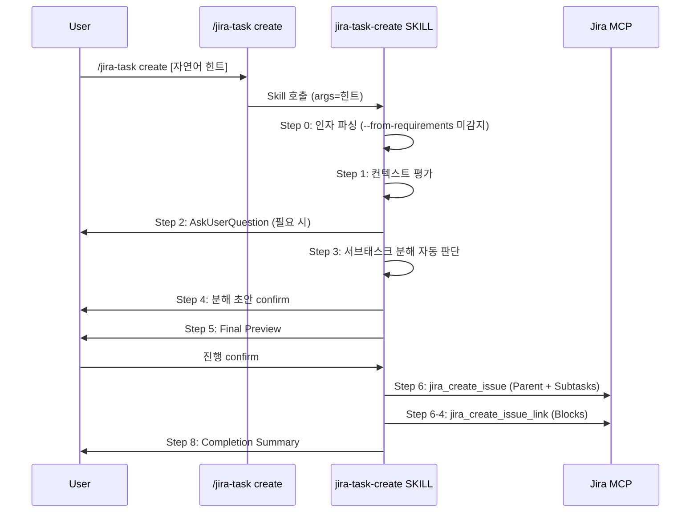
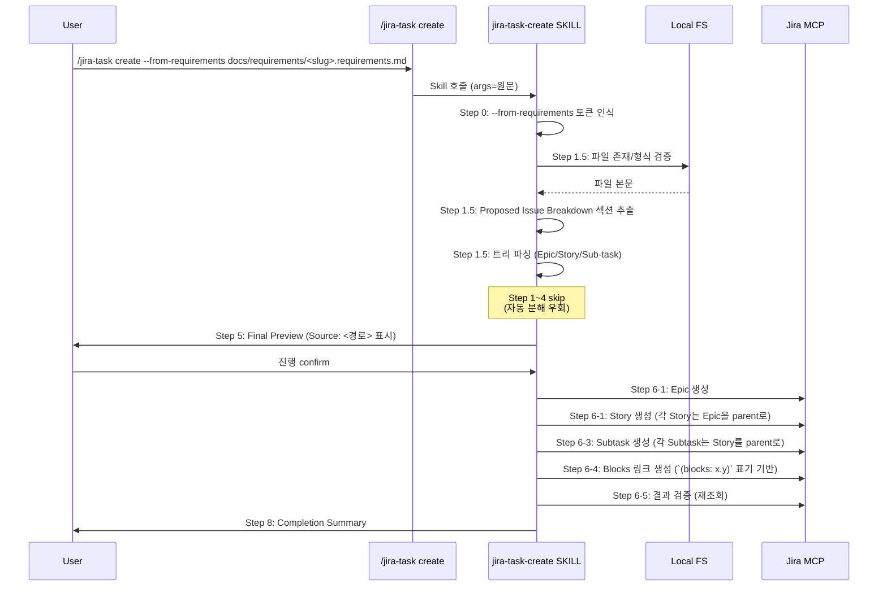
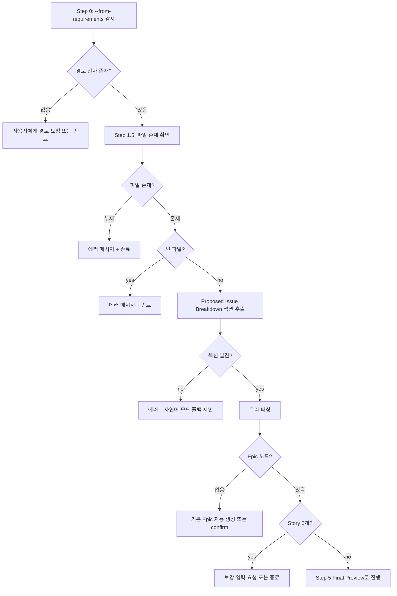

# Design: MAE-116 — [1.1.3] jira-task-create와의 연결 (--from-requirements)

## 개요

본 설계는 `jira-task-create` 스킬에 `--from-requirements <경로>` 분기를 추가하기 위한 SKILL.md 명세 변경 계획이다. 이 분기는 `jira-task-discover`가 생성한 요구사항 문서(`docs/requirements/<slug>.requirements.md`)의 `Proposed Issue Breakdown` 섹션을 파싱하여 Epic/Story/Sub-task를 일괄 등록하는 흐름을 명시한다.

본 태스크는 **코드 변경이 아니라 명세(SKILL.md) 변경**이 핵심이다. 실제 파싱·등록 로직은 LLM이 SKILL.md 명세를 따라 런타임에 수행한다.

## Architecture

### 컴포넌트 구조

```
commands/jira-task.md                         (라우팅: 변경 불요 — 검토만)
  └─> Skill: jira-integration:jira-task-create
        └─> skills/jira-task-create/SKILL.md  (★ 본 태스크의 주 변경 대상)
              ├─ Step 0:    Parse Argument (확장)
              ├─ Step 1.5:  Parse Requirements Document (★ 신설)
              ├─ Step 1:    Assess Context Sufficiency (skip 분기)
              ├─ Step 2:    Gather Missing Info (skip 분기)
              ├─ Step 3:    Decide Sub-task Split (★ skip 명시)
              ├─ Step 4:    Propose Sub-task Breakdown (★ skip 명시)
              ├─ Step 5:    Final Preview (출처 표기 추가)
              ├─ Step 6:    Create in Jira (Story 분기 + Blocks 매핑)
              ├─ Step 7:    Post Creation Comment (변경 없음)
              └─ Step 8:    Completion Summary (변경 없음)

(연관 — 변경 없음, 정합성만 검증)
skills/jira-task-discover/SKILL.md            (Step 6에서 안내하는 명령 형식)
templates/requirements.template.md            (Proposed Issue Breakdown 형식 출처)

.claude-plugin/plugin.json                    (★ version 0.14.0 → 0.15.0)
```

### 설계 결정의 근거

- **신설 단계 위치**: Step 0(인자 파싱) 직후, Step 1(컨텍스트 평가) 이전에 Step 1.5로 삽입한다. 이유: import 모드일 때 Step 1~4(자동 분해 판단/제안)를 skip해야 하므로, 그 분기점이 가장 빠른 곳에 있어야 한다.
- **기존 Step 6 재사용**: Epic/Story/Sub-task 생성 호출 자체는 기존 `jira_create_issue` 루프 패턴을 그대로 쓴다. import 모드에서 추가되는 것은 (a) Story 타입 분기, (b) `(blocks: ...)` → 이슈 링크 매핑이다.
- **`commands/jira-task.md` 무수정 원칙**: 기존 `create` 분기는 `args` 그대로 위임 규약(`<사용자가 입력한 create 이후의 전체 인자를 그대로 전달>`)을 따르므로, `--from-requirements`도 자동으로 흡수된다. 변경 불필요를 design 단계에서 명시 확정한다.

## Sequence Diagram

### Default 모드 (기존 흐름 — 변경 없음)



### `--from-requirements` 모드 (신설 흐름)



### 에러 처리 분기



## Implementation Plan

### 변경 대상 파일

| # | 파일 | 변경 요약 |
|---|------|-----------|
| 1 | `skills/jira-task-create/SKILL.md` | `--from-requirements` 분기 명세 추가 (Step 0/1.5/3/4/5/6/Error Handling 섹션 갱신) |
| 2 | `commands/jira-task.md` | 변경 불요. `create` 분기에 인자 예시 1줄 추가 여부는 Open Question(Step 7) 결정 |
| 3 | `.claude-plugin/plugin.json` | `version` 0.14.0 → 0.15.0 |

각 파일의 변경은 **명세 텍스트 추가/수정**이 전부이며, 코드 작성은 없다.

### 구현 순서

1. **SKILL.md Step 0 확장**
   - 기존 "초기 힌트 추출" 문구 뒤에 `--from-requirements <path>` 토큰 인식 규칙을 추가
   - `importPath`(파일 경로)와 `importMode`(boolean) 변수 도입을 명세에 기술
   - 자연어 힌트와의 충돌 처리: import 우선, 자연어 힌트는 Epic description 컨텍스트로만 사용

2. **SKILL.md Step 1.5 신설 — `Parse Requirements Document`**
   - 위치: Step 1(Assess Context Sufficiency) 직전. 단, `importMode`가 true일 때만 실행
   - 하위 절차 명세:
     - 파일 존재/빈 파일 검증
     - `## Proposed Issue Breakdown` 섹션 정확 매칭으로 추출 (대소문자 정확 매칭, 다른 헤딩 등장 시 종료)
     - 트리 파싱 규칙(아래 매핑 표 + 들여쓰기/불릿 허용 변형)
     - 파싱 결과를 내부 표(Epic 1 + Story[] + Subtask[])로 정리

3. **SKILL.md 트리 → 이슈 매핑 규칙 표 추가**
   - 위치: Step 1.5 끝 또는 새 하위 섹션 `### Tree → Issue Mapping`
   - 매핑 규칙은 아래 "트리 파싱 및 이슈 매핑 규약" 섹션에서 명세

4. **SKILL.md Step 3/4에 import 모드 skip 분기 명시**
   - 각 Step 도입부에 다음 문구 추가: `> **import 모드(Step 1.5에서 importMode=true)에서는 본 단계를 skip하고 Step 5로 직행한다.** 트리는 Step 1.5에서 이미 확정되었다.`

5. **SKILL.md Step 5(Final Preview)에 출처 표시 추가**
   - import 모드일 때 Preview 첫 줄에 `Source: docs/requirements/<slug>.requirements.md` 라인 추가
   - Sub-tasks 섹션 위에 `## Stories (N개)` 블록 추가 (default 모드에는 없는 새 블록)

6. **SKILL.md Step 6 분기 보강**
   - **Step 6-1**: Epic 생성용 `additional_fields` 예시 (priority, labels). 실패 시 `Task` + label `epic-substitute`로 폴백.
   - **Step 6-2**: import 모드에서는 본 단계 skip(Epic을 직접 만들었으므로 검증 불필요)
   - **Step 6-3 직전 신설 단계 또는 6-3 보강**: Story 생성 루프. 각 Story는 `parent=Epic-KEY`. Story 타입 비활성 프로젝트에서는 `Task` + `parent=Epic-KEY`로 폴백.
   - **Step 6-3**: Subtask 생성 루프. import 모드에서는 `parent=Story-KEY`(트리 매핑). Story 비활성으로 폴백된 경우에도 `parent`는 그대로 작동.
   - **Step 6-4**: `(blocks: <ref>)` 표기를 Blocks 링크로 변환. 참조 키 해석 규칙(아래 명세) 추가.

7. **SKILL.md Error Handling 섹션 보강**
   - import 관련 7개 시나리오를 표 형태로 추가 (아래 "Error Handling" 섹션 참조)

8. **SKILL.md `mcp-atlassian Schema Notes`에 Story·Epic 추가 주의사항 1개 보강 (선택)**
   - Story 타입은 일부 프로젝트에서 비활성. Epic은 Cloud team-managed에서 `parent` 인라인으로 동작.
   - 이 내용은 기존 "에픽 연결 별칭" 단락에 1-2줄 추가하는 수준.

9. **`commands/jira-task.md` 검토**
   - 라우팅 자체는 변경 없음을 확인 (위임 규약으로 자동 흡수)
   - 인자 예시 라인 1줄 추가는 Open Question으로 남기고 impl 단계에서 결정

10. **`.claude-plugin/plugin.json` version 증가**
    - `0.14.0` → `0.15.0` (minor bump — 새 분기 추가는 기능 추가에 해당)

### 트리 파싱 및 이슈 매핑 규약

명세의 핵심이 되는 매핑 규약. SKILL.md에 표로 박는다.

#### 입력 트리 형식

```
- **Epic**: <에픽 1줄 요약>
  - **Story 1**: <스토리 요약>
    - Sub-task 1.1: <서브태스크 요약>
    - Sub-task 1.2: <서브태스크 요약> (blocks: 1.1)
  - **Story 2**: <스토리 요약>
    - Sub-task 2.1: <서브태스크 요약>
```

#### 파싱 규칙 (상태머신 기반)

- **들여쓰기**: 2-space 또는 4-space 모두 허용. 같은 문서 내 혼용 시 첫 자식의 들여쓰기 폭을 기준으로 삼고, 그와 다르면 경고.
- **불릿 기호**: `-` 또는 `*` 모두 허용. 같은 문서 내 혼용 허용.
- **노드 식별**:
  - `**Epic**:` 또는 `Epic:` 으로 시작 → Epic 노드 (트리 루트)
  - `**Story <N>**:` 또는 `Story <N>:` → Story 노드
  - `Sub-task <N>.<M>:` 또는 `Subtask <N>.<M>:` → Subtask 노드
  - 일치하지 않는 라인은 무시(주석으로 간주)하되 디버그 로그 남김
- **부모 매핑**:
  - Epic은 트리 1개당 1개. 0개이면 자동 Epic 생성(파일명/슬러그 기반 summary) 또는 사용자에게 confirm.
  - Story `<N>`의 부모는 Epic.
  - Subtask `<N>.<M>`의 부모는 Story `<N>`.
- **`(blocks: <ref>)` 표기**:
  - 위치: Story 또는 Subtask 라인 끝
  - 참조 형식: `<N>` (같은 Epic 아래의 Story 인덱스) 또는 `<N>.<M>` (같은 Story 아래의 Subtask 인덱스)
  - 같은 부모 아래 sibling 참조만 허용. 다른 Story의 Subtask 참조는 에러 처리(스킵 + 경고)
  - 다중 참조: `(blocks: 1.1, 1.2)` 형식 허용

#### 이슈 타입 매핑

| 트리 노드 | Jira issue_type | parent 필드 | 폴백 |
|-----------|----------------|------------|------|
| Epic | `Epic` | (없음) | 실패 시 `Task` + label `epic-substitute` |
| Story | `Story` | Epic-KEY | 실패 시 `Task` + parent=Epic-KEY |
| Sub-task | `Subtask` | Story-KEY | 실패 시 `Task` + parent=Story-KEY |

#### 의존성 표현

- `(blocks: ...)` 표기를 만나면 `link_type="Blocks"` (정확한 이름은 `jira_get_link_types`로 조회)
- "A가 B를 블록한다" → `outward_issue_key=A, inward_issue_key=B`
- 트리 인덱스를 실제 키로 변환하는 매핑 테이블은 Step 6에서 노드 생성 직후 누적(`draft_index → created_key`)

### 인터페이스 (개념)

코드는 작성하지 않으나, SKILL.md 명세의 추상 모델을 명확히 하기 위해 개념적 인터페이스를 기술:

- `ImportPayload`: 파싱 결과 컨테이너. `epic`(노드 1개), `stories`(N개, 각각 자식 `subtasks` 포함), `links`(blocks 관계 리스트)
- `IssueDraft`: 단일 이슈 초안. `summary`, `issueType`, `parent`(선택), `priority`, `labels`, `description`
- `BlocksLink`: `outwardRef`, `inwardRef` (트리 인덱스 표기, 생성 후 실제 키로 해석)

이들은 LLM이 SKILL.md 절차를 따를 때 머릿속에 들고 있어야 할 자료 구조이며, 실제 파일·함수로 구현되지 않는다.

## Error Handling

SKILL.md `Error Handling` 섹션에 다음 7개 시나리오를 표로 추가한다.

| # | 시나리오 | 처리 전략 |
|---|---------|----------|
| E1 | `--from-requirements`만 있고 경로 누락 | `AskUserQuestion`으로 경로 요청. 답변 없으면 종료 |
| E2 | 지정 경로의 파일 부재 | 에러 메시지(경로 표시) + 종료. 자동 재시도 없음 |
| E3 | 파일은 있으나 빈 파일 | 에러 메시지 + 종료 |
| E4 | `Proposed Issue Breakdown` 섹션 부재 | 에러 메시지 + 자연어 모드 폴백 제안(`AskUserQuestion`) |
| E5 | 트리 노드 0개 (Epic 없음 + Story 없음) | 보강 입력 요청 또는 종료 |
| E6 | Epic 없이 Story부터 시작 | 기본 Epic 자동 생성(summary는 파일명/슬러그) 후 confirm. confirm 거부 시 종료 |
| E7 | `(blocks: <ref>)`가 존재하지 않는 ref 참조 | 해당 링크 1건만 skip + 경고. 나머지 생성/링크는 진행 |
| E8 | 동일 summary의 이슈가 이미 존재 (project-wide JQL 검색) | 경고 + `AskUserQuestion`으로 확정 진행/취소 선택 |
| E9 | Epic/Story 타입 비활성 프로젝트 | 매핑 표의 폴백 규칙대로 `Task` + `parent` 또는 + label로 폴백. 사용자에게 폴백 사용을 알림 |
| E10 | 트리 파싱 중 들여쓰기 혼용 감지 | 경고 출력 후 첫 자식 들여쓰기 기준으로 진행. 파싱 실패 시 종료 |

## Security Checklist

본 태스크는 명세(SKILL.md) 변경이 핵심이며, 신규 외부 입출력은 **로컬 파일 읽기 1건**(요구사항 문서)뿐이다. 그럼에도 다음 항목을 점검한다.

- [ ] **경로 검증**: `--from-requirements` 경로에 `..`, 절대 경로(`/etc/...`), 심볼릭 링크 등이 들어와도 워크트리 외부 파일을 읽지 않는다는 가드 명세는 **불필요**(로컬 LLM 도구이며 사용자 의도가 명확). 단, 1MB 초과 시 confirm 요청은 명시(discover 패턴과 일관).
- [ ] **민감 정보 비포함**: 요구사항 문서가 자격증명/비밀번호/토큰을 포함할 가능성은 낮으나, Jira description으로 그대로 전달되므로 사용자에게 Final Preview에서 확인 책임을 둔다 (별도 자동 마스킹 없음).
- [ ] **Jira 권한**: 이슈 생성/링크 생성 권한은 기존 MCP 토큰을 그대로 사용. 추가 권한 요청 없음.
- [ ] **부분 실패의 안전성**: 자동 롤백 없음 정책 유지. 실패 지점부터 재개 가능하도록 진행 상태 표 노출. 이미 만들어진 이슈를 자동 삭제하지 않음.
- [ ] **중복 생성 방지**: 동일 summary 검출 시 경고+confirm으로 사용자 결정에 위임 (자동 차단 없음). 자동 차단을 도입하면 의도된 중복 등록(예: 다른 Epic 아래 같은 이름의 Subtask)을 막아 더 큰 부작용 발생 우려.

## Test Plan

본 태스크의 변경은 명세 텍스트가 핵심이므로, **자동 단위 테스트는 도입하지 않는다**(SKILL.md는 LLM 명세이며 코드가 아님). 대신 다음 두 종의 검증을 수행한다.

### Verification: 명세 정합성 점검 (impl 단계에서 수기 수행)

| # | 점검 항목 | 검증 방법 |
|---|----------|---------|
| V1 | Step 0에 `--from-requirements <path>` 토큰 인식 명시 | `grep -n "from-requirements" skills/jira-task-create/SKILL.md` 결과 ≥ 2 (Step 0 + Step 1.5 + Step 5 정도 예상) |
| V2 | Step 1.5(Parse Requirements Document) 신설 | `grep -n "Parse Requirements Document\|Step 1.5" skills/jira-task-create/SKILL.md` 결과 ≥ 1 |
| V3 | 트리 → 이슈 매핑 표 존재 | SKILL.md 내 Markdown 테이블 검색에서 Epic/Story/Subtask 행 모두 존재 |
| V4 | Step 3/4 skip 분기 문구 명시 | `grep -n "import 모드.*skip\|import mode.*skip" skills/jira-task-create/SKILL.md` 결과 ≥ 2 |
| V5 | Step 5 Preview에 `Source:` 출처 라인 명시 | SKILL.md 내 `Source: docs/requirements/` 문자열 존재 |
| V6 | Step 6에 Story 생성 분기 명시 | `grep -n "issue_type.*Story\|Story 생성" skills/jira-task-create/SKILL.md` 결과 ≥ 1 |
| V7 | `(blocks: ...)` → Blocks 링크 매핑 명세 | SKILL.md에 `(blocks:` 표기 + Blocks 링크 변환 절차 모두 존재 |
| V8 | Error Handling 시나리오 7건 이상 추가 | SKILL.md Error Handling 섹션에 import 관련 행 ≥ 7 |
| V9 | discover SKILL.md 안내와 인자 형식 일치 | discover SKILL.md Step 6의 `Next:` 라인이 `/jira-task create --from-requirements docs/requirements/<slug>.requirements.md` 형식 — create SKILL.md Step 0이 동일 형식 인식 |
| V10 | `commands/jira-task.md` 라우팅 변경 불요 확인 | `grep -n "from-requirements" commands/jira-task.md` 결과는 0 또는 1(예시로만 1줄 추가). 라우팅 본문은 변경 없음 |
| V11 | `.claude-plugin/plugin.json` version 증가 | `cat .claude-plugin/plugin.json | grep version` → `0.15.0` |

### Smoke Simulation: 가상 요구사항 문서로 dry-run

SKILL.md 명세가 실제로 동작 가능한지 수기 시뮬레이션. impl 단계에서 다음 견본 입력을 만들어 Step 0~Step 5 흐름을 머릿속으로 따라가며 명세 누락을 잡는다.

**견본 입력** (`docs/requirements/sample-notification.requirements.md`):

```markdown
# Requirements: 사용자 알림 시스템

(... 생략 ...)

## Proposed Issue Breakdown

- **Epic**: 사용자 알림 시스템 도입
  - **Story 1**: 알림 채널 인프라
    - Sub-task 1.1: 메시지 큐 토폴로지 설계
    - Sub-task 1.2: 채널 추상화 인터페이스 정의 (blocks: 1.1)
  - **Story 2**: 사용자별 구독 설정 UI
    - Sub-task 2.1: 설정 화면 컴포넌트
    - Sub-task 2.2: API 연동
```

**기대 트레이스**:

| Step | 기대 결과 |
|------|----------|
| Step 0 | `importMode=true`, `importPath=docs/requirements/sample-notification.requirements.md`, `topic=""` |
| Step 1.5 | 파일 존재 OK, 섹션 발견 OK, 트리 파싱: Epic 1 + Story 2 + Subtask 4. blocks 링크: 1.2 ← 1.1 |
| Step 1~4 | skip |
| Step 5 | Preview에 `Source: docs/requirements/sample-notification.requirements.md` 표기. Stories(2개), Subtasks(4개), Blocks 링크(1개) 모두 표시 |
| Step 6-1 | Epic 1개 생성 |
| Step 6-1+ (Story 분기) | Story 2개 생성 (parent=Epic-KEY) |
| Step 6-3 | Subtask 4개 생성 (각자 parent=Story-KEY) |
| Step 6-4 | Blocks 링크 1개 생성: `outward=Subtask(1.1).key, inward=Subtask(1.2).key` |

이 시뮬레이션이 SKILL.md 명세를 따라 막힘없이 흘러가야 명세가 완결된 것으로 본다.

### Acceptance Criteria 매핑

| AC | 검증 항목 |
|----|---------|
| AC-1 (--from-requirements 분기 동작 명세) | V1, V2, V3 |
| AC-2 (트리 → 이슈 매핑 규칙) | V3, V6, V7 |
| AC-3 (discover 안내 메시지 정합성) | V9 |
| AC-4 (import 모드에서 자동 분해 skip) | V4 |
| AC-5 (에러 처리 명세) | V8 |
| AC-6 (인자 충돌 처리) | V1 (Step 0 명세에서 우선순위 명시 검증) |
| AC-7 (plugin version 증가) | V11 |

## 결론

본 설계는 코드 작성을 동반하지 않는 명세 변경이다. impl 단계에서는 SKILL.md 텍스트를 위 Implementation Plan의 10개 항목 순서대로 갱신하고, V1~V11 검증을 통과하면 완료로 본다. 명세가 LLM이 매번 따라야 할 절차를 충분히 결정적으로 적어 두었는지가 품질의 핵심이며, 그 검증은 smoke simulation으로 수행한다.
