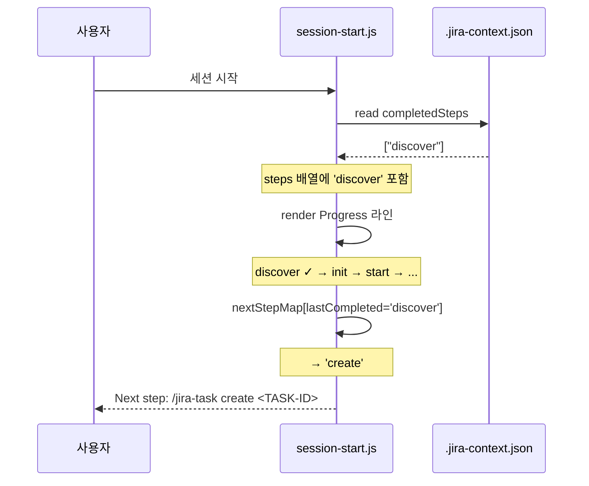
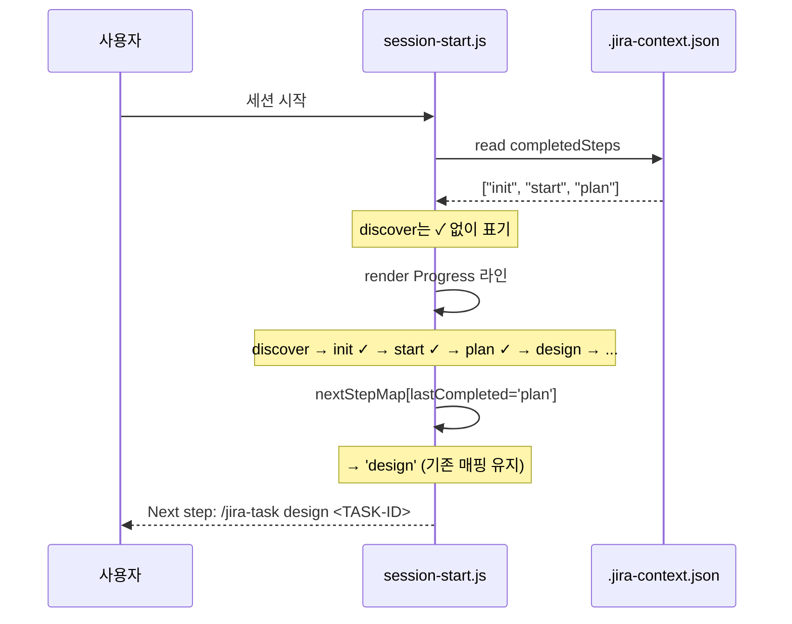

# Design: MAE-118 - [1.1.5] completedSteps에 "discover" 추가

## Overview

본 설계는 코드 변경 1곳(`hooks/scripts/session-start.js`), 문서 변경 2곳(`CLAUDE.md`, `commands/jira-task.md`), 메타데이터 변경 1곳(`.claude-plugin/plugin.json`)으로 구성된 경량 작업이다. 새로운 추상화나 모듈을 도입하지 않고, 기존의 단계 목록 데이터 구조에 `discover`를 첨가하는 데이터 변경 위주의 설계다.

핵심 원칙:
- **데이터 추가만, 로직 신설 없음**: `steps` 배열과 `nextStepMap` 객체에 신규 항목을 추가할 뿐 검색/렌더링 알고리즘은 그대로다.
- **하위 호환 유지**: 기존 `completedSteps` 값(`["init", "start", "plan"]` 등)은 그대로 정상 처리된다.
- **`discover ✓` 자동 기록은 본 PR 범위 외**: 본 작업은 "유효 단계로 인식"까지만 책임진다.

## Architecture

### 영향 받는 컴포넌트

```
.claude-plugin/plugin.json          (version 0.13.1 → 0.14.0)
CLAUDE.md
└─ Workflow Progress Tracking 섹션  (유효 단계 목록 line 177)
hooks/scripts/session-start.js
├─ steps 배열                        (line 104)
├─ nextStepMap 객체                  (lines 131-134)
└─ Available commands 안내 문자열    (line 89)
commands/jira-task.md
└─ 워크플로 단계 순서 안내 라인       (line 139)
```

### 데이터 흐름 (변경 후)

```
.jira-context.json (completedSteps 배열)
   │
   ▼
session-start.js:main()
   │
   ├─ steps 배열로 Progress 라인 렌더링
   │     steps = ['discover', 'init', 'start', 'plan', 'design',
   │              'impl', 'test', 'review', 'pr', 'done']
   │     출력: discover ✓ → init ✓ → start ✓ → plan → ...
   │
   └─ nextStepMap으로 다음 단계 추천
         nextStepMap = {
           discover: 'create',
           create:   'init',
           init:     'start',
           ... (이하 동일)
         }
         출력: Next step: /jira-task <next> <TASK-ID>
```

### 컴포넌트 간 관계

본 변경에는 컴포넌트 간 호출 관계 변화가 없다. 단계 목록을 사용하는 코드는 `session-start.js` 한 곳뿐이며, `CLAUDE.md`/`commands/jira-task.md`는 사용자/스킬이 참고하는 정적 문서 역할만 한다. 따라서 코드와 문서가 같은 단계 정의를 공유하도록 동기화하는 것이 본 설계의 본질이다.

## Sequence Diagram

### 시나리오 A: `discover` 단계만 완료된 신규 워크플로



### 시나리오 B: 기존 워크플로(`init`, `start`, `plan`) 회귀 점검



## Implementation Plan

### 변경 파일 요약

| # | 파일 | 변경 내용 | 비고 |
|---|------|-----------|------|
| 1 | `CLAUDE.md` | "Workflow Progress Tracking" 섹션의 유효 단계 목록 라인에 `discover`와 `create`를 `init` 앞에 추가 | line 177 부근 |
| 2 | `hooks/scripts/session-start.js` | `steps` 배열 첫 원소로 `'discover'` 추가 (Progress 렌더링용). `create`는 `nextStepMap` 키로만 다루고 `steps`에는 포함하지 않을지 결정 필요 → **포함**하기로 한다(아래 설계 결정 참조) | line 104 |
| 3 | `hooks/scripts/session-start.js` | `nextStepMap`에 `discover: 'create'`, `create: 'init'` 매핑 추가. 기존 매핑은 유지 | lines 131-134 |
| 4 | `hooks/scripts/session-start.js` | Available commands 안내 문자열에 `discover`/`create` 액션 노출 | line 89 |
| 5 | `commands/jira-task.md` | line 139 워크플로 단계 순서 안내 라인을 `discover → create → init → start → plan → design → impl → test → review → merge → pr → done`로 갱신 | line 139 |
| 6 | `.claude-plugin/plugin.json` | `version` 0.13.1 → 0.14.0 (minor: 신규 단계 정식 인식) | - |

### 설계 결정: `steps` 배열에 `create`를 포함하는가?

**결정**: 포함한다.

**근거**:
- `commands/jira-task.md`의 라우팅에 `create` 액션이 이미 존재하므로 워크플로상 별도 단계로 인정 가능
- Progress 라인에서 `discover ✓ → create ✓ → init ✓ → ...` 식으로 일관된 가시화 제공
- `nextStepMap`에 `discover: 'create'`, `create: 'init'` 매핑이 들어가는 것과 자연스럽게 정합
- 기존 `completedSteps`에 `create`가 없으면 단지 ✓ 없이 표기될 뿐 회귀 없음

**대안 검토**:
- `create`를 `steps`에서 제외 → `nextStepMap`에서 `lastCompleted = 'create'` 시 `find` 결과가 다른 단계를 가리켜 잘못된 추천이 될 수 있음. 또한 Progress 라인에 `discover → init`만 표기되어 `create` 액션의 존재가 가려짐.

따라서 `steps`에도 `create`를 포함한다.

### 변경 후 데이터 정의

#### `steps` 배열 (Progress 렌더링 순서)
```
['discover', 'create', 'init', 'start', 'plan', 'design',
 'impl', 'test', 'review', 'pr', 'done']
```
- `merge` 키는 기존 코드에 부재하므로 이번 작업에서도 추가하지 않는다(plan에 명시되지 않음, out-of-scope).

#### `nextStepMap` 객체 (다음 단계 추천)
- 신규 키: `discover → create`, `create → init`
- 기존 키: `init → start`, `start → plan`, `plan → design`, `design → impl`, `impl → test`, `test → review`, `review → pr`, `pr → done` (그대로 유지)

#### Available commands 안내 문자열
- 기존 액션 목록에 `discover`, `create`를 앞쪽에 노출
- 예: `/jira-task [discover|create|init|start|plan|...|auto] <TASK-ID>`

### 구현 순서

1. `.claude-plugin/plugin.json`의 `version`을 0.14.0으로 갱신
2. `CLAUDE.md` line 177 유효 단계 목록 갱신
3. `hooks/scripts/session-start.js` 수정
   - `steps` 배열에 `discover`/`create` 추가
   - `nextStepMap`에 매핑 2건 추가
   - Available commands 안내 문자열 갱신
4. `commands/jira-task.md` line 139 워크플로 단계 순서 안내 갱신
5. 회귀 검증 (Test Plan 수행)

### 인터페이스/타입

본 작업은 새로운 함수/모듈/타입을 정의하지 않는다. 기존 자료구조에 데이터 항목을 추가하는 변경에 한정된다.

## Error Handling

본 작업은 신규 분기/예외 처리를 추가하지 않는다. 다만 다음 시나리오의 무중단 동작을 사전 점검한다.

| 시나리오 | 기대 동작 | 보장 메커니즘 |
|----------|-----------|---------------|
| `completedSteps`에 워크플로 외 임의 문자열이 섞여 있음 | 무시되며 회귀 없음 | 기존 `[...completed].reverse().find(s => steps.includes(s))` 로직이 비유효 항목을 자동 건너뜀 |
| `completedSteps`가 비어 있음 (`[]`) | Progress는 모든 단계 ✓ 없음, Next step 안내 부재 | `lastCompleted`가 `undefined`이므로 안내 라인 미출력 (기존 동작 유지) |
| `.jira-context.json` 자체가 없거나 파싱 실패 | 기존 fallback 분기로 진입 | 기존 try-catch 유지 |
| `completedSteps`에 `"create"`만 있고 `discover`/`init`이 없음 | Next step → `init` 추천. Progress는 `discover → create ✓ → init → ...` | 신규 매핑 `create: 'init'`으로 흐름 연속성 확보 |
| 신규 `discover` 항목이 `merge` 같은 미등록 키와 충돌 | 무관 | 본 작업은 `merge` 키를 다루지 않음 (out-of-scope) |

## Security Checklist

본 작업은 인증·권한·외부 입력 처리·암호 관련 변경을 포함하지 않는다. 보안 영향이 없다.

- [x] 인증/세션 변경 없음
- [x] 사용자 입력 파싱 변경 없음 (단계 목록은 코드 내 상수)
- [x] 외부 API 호출/네트워크 변경 없음
- [x] 파일 시스템 권한 변경 없음
- [x] 비밀 정보 노출 가능성 없음

## Test Plan

본 작업은 실행 가능한 unit/E2E 테스트 자산이 별도로 없는 마크다운/메타 변경 + 노드 스크립트 데이터 추가다. 따라서 자동화 회귀 테스트보다는 **검증 스크립트 실행 + 시각 확인** 형태로 점검한다.

### Smoke Check (S-시리즈)

| ID | 목적 | 절차 | 기대 결과 |
|----|------|------|-----------|
| S1 | 유효 단계 목록 갱신 확인 (AC-1) | `grep '유효한 단계' CLAUDE.md` | `discover`와 `create`가 `init` 앞 순서로 명시됨 |
| S2 | `steps[0] === 'discover'` 확인 | `node -e "const fs=require('fs');const src=fs.readFileSync('hooks/scripts/session-start.js','utf8');/* steps 첫 원소가 'discover'인지 정규식 매칭 */"` 또는 단순 `grep "'discover'" hooks/scripts/session-start.js` | `discover`와 `create` 토큰이 `steps` 배열 정의 라인에 존재 |
| S3 | `nextStepMap.discover === 'create'` 확인 | `grep "discover:" hooks/scripts/session-start.js` | `discover: 'create'`, `create: 'init'` 매핑이 존재 |
| S4 | Available commands 문자열 갱신 (line 89) | `grep "discover" hooks/scripts/session-start.js \| grep "Available commands"` | 안내 문자열에 `discover`(가능하면 `create`도) 노출 |
| S5 | commands/jira-task.md 단계 순서 안내 갱신 (AC-5) | `grep -n "discover → create → init" commands/jira-task.md` | 본 표기가 라인 139 부근에 존재 |
| S6 | 플러그인 버전 증가 (AC-6) | `cat .claude-plugin/plugin.json \| grep version` | `"version": "0.14.0"` |

### Regression Check (R-시리즈)

| ID | 목적 (AC) | 절차 | 기대 결과 |
|----|-----------|------|-----------|
| R1 | 기존 `completedSteps: ["init","start","plan"]` 회귀 (AC-4) | 임시 `.jira-context.json`을 만들어 `completedSteps`를 `["init","start","plan"]`로 설정 → `node hooks/scripts/session-start.js` 실행 → JSON 출력의 `additionalContext` 필드 확인 | Progress 라인이 `discover → create → init ✓ → start ✓ → plan ✓ → design → impl → test → review → pr → done`로 출력. Next step은 `/jira-task design <TASK-ID>` |
| R2 | 신규 `completedSteps: ["discover"]` 시나리오 (AC-2, AC-3) | 임시 `.jira-context.json`의 `completedSteps`를 `["discover"]`로 설정 → 훅 실행 | Progress 라인에 `discover ✓` 가시화. Next step은 `/jira-task create <TASK-ID>` |
| R3 | `completedSteps: ["create"]`만 존재 시 매핑 연속성 | 임시 컨텍스트 → 훅 실행 | Next step은 `/jira-task init <TASK-ID>` |
| R4 | `completedSteps: []` 빈 배열 | 임시 컨텍스트 → 훅 실행 | Progress는 모든 단계 ✓ 없음. Next step 라인은 출력되지 않음 (기존 동작) |
| R5 | `completedSteps`에 비유효 항목(`["foo","start"]`) 포함 | 임시 컨텍스트 → 훅 실행 | `foo`는 무시되고 `start ✓` 가시화. Next step은 `/jira-task plan <TASK-ID>` |

### 검증 절차 (R-시리즈 공통)

1. 작업 디렉터리 임시 폴더(`/tmp/mae-118-test/`) 생성
2. 그 안에 `.jira-context.json` 작성 (`taskId`, `summary`, `completedSteps` 최소 포함, `status` 는 `In Progress`)
3. `cd /tmp/mae-118-test && node <repo>/hooks/scripts/session-start.js` 실행
4. stdout으로 출력되는 JSON의 `additionalContext` 필드를 사람 눈으로 검증
5. 각 케이스 검증 후 임시 폴더 삭제

### Acceptance Criteria 매핑

| AC | 검증 케이스 |
|----|-------------|
| AC-1 (CLAUDE.md 유효 단계 목록) | S1 |
| AC-2 (Progress 렌더링) | S2, R2 |
| AC-3 (다음 단계 안내) | S3, R2, R3 |
| AC-4 (회귀 없음) | R1, R4, R5 |
| AC-5 (commands 문서 갱신) | S5 |
| AC-6 (플러그인 버전) | S6 |

### 비실행 항목 (Out of Scope)

- `jira-task-discover` 스킬이 `.jira-context.json`을 자동 갱신하도록 만드는 변경 (별도 후속 결정)
- `jira-task-auto` 자동 실행 시퀀스에 `discover` 포함 (현 정책 유지)
- `commands/jira-task.md`의 routing 분기에 `discover` 추가 (MAE-119 책임)
- `merge` 키를 `steps` 배열에 추가하는 작업 (plan 범위 외)
- README/다이어그램 갱신 (MAE-120/MAE-121)
