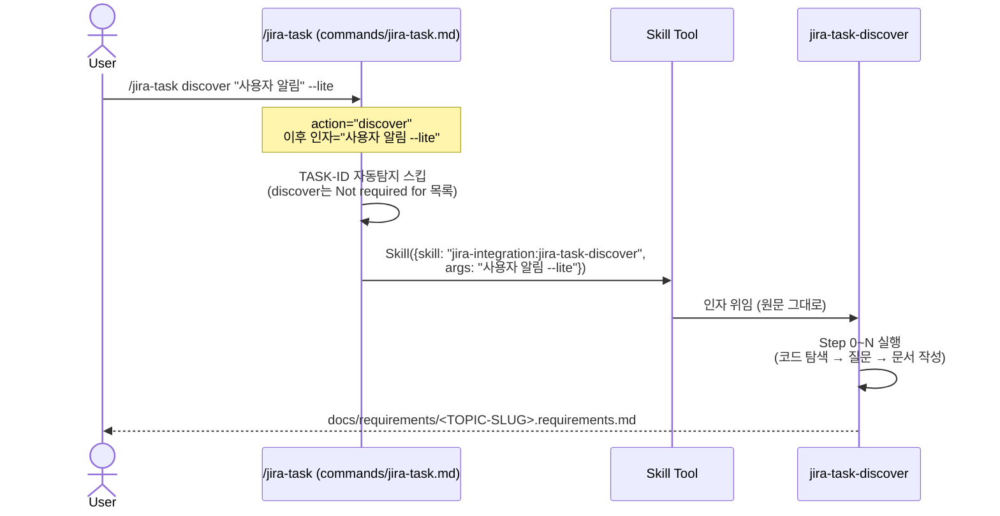

# Design: MAE-119 - [1.1.6] commands/jira-task.md 라우팅 추가 (discover 액션)

> 본 태스크는 단일 마크다운 문서의 surgical 편집이며 코드 로직 변경이 없다. Plan의 "경량 design" 권고에 따라, 분기 본문 초안 + 기존 분기와의 표현 정렬 표 + 변경 위치 매핑을 중심으로 작성한다.

## Architecture

### 영향 범위 (Affected Components)

| 컴포넌트 | 경로 | 변경 종류 |
|----------|------|-----------|
| 슬래시 커맨드 라우팅 정의 | `commands/jira-task.md` | 본문 편집 (3개 위치 + 1개 분기 추가) |
| 플러그인 메타 | `.claude-plugin/plugin.json` | `version` 패치 증가 (`0.13.1` → `0.13.2`) |
| (참조 only) 디스커버리 스킬 | `skills/jira-task-discover/SKILL.md` | 변경 없음 (인자 시그니처 참조만) |

### 라우팅 레이어와 스킬의 책임 경계

```
사용자 입력 (/jira-task discover ...)
        │
        ▼
commands/jira-task.md  ← 본 태스크의 책임 (라우팅 + 인자 위임)
   - action 파싱
   - "원문 인자 그대로 전달" 정책 적용
   - Skill 도구 호출
        │
        ▼
skills/jira-task-discover/SKILL.md  ← 변경 없음 (MAE-115 완료)
   - $ARGUMENTS 토큰화 (--lite / --from / 자연어 주제)
   - 빈 주제 처리 (Step 0)
   - 요구사항 문서 생성
```

라우팅 레이어는 **인자를 해석하지 않고**, 사용자가 입력한 `discover` 이후의 전체 문자열을 그대로 스킬 args로 전달한다. 이는 기존 `create`, `init` 분기와 동일한 패턴이다.

## Sequence Diagram



## Implementation Plan

### 변경 위치 매핑 (commands/jira-task.md)

| # | 위치 | 현재 (요약) | 변경 후 (요약) |
|---|------|-------------|----------------|
| 1 | YAML frontmatter `description` (3행) | "Actions create, init, start, plan, ..." | actions 나열에 `discover` 1개 토큰 추가 |
| 2 | YAML frontmatter `argument-hint` (5행) | `[create\|init\|start\|...]` | `discover` 토큰을 `init` 다음에 추가 |
| 3 | Argument Parsing 본문 (25~26행) | `**action**: One of create, init, ...` 및 `Not required for create, init, report, status` | action 목록에 `discover` 추가; "Not required for" 목록에 `discover` 추가 |
| 4 | Action Routing 섹션 (47행 부근) | `### create` 분기 직후가 자연 위치 | `### discover [자연어 주제] [--lite] [--from <파일경로>]` 분기 신규 추가 (create 다음, init 앞) |

`.claude-plugin/plugin.json`은 `version` 필드만 `0.13.1` → `0.13.2`로 단조 증가.

### 신규 분기 본문 초안 (Action Routing)

> 아래는 impl 단계에서 그대로 삽입할 마크다운 텍스트의 **명세**다. 코드는 아니며, 실제 구현 시 표현이 다소 조정될 수 있다.

```
### `discover [자연어 주제] [--lite] [--from <파일경로>]`

**강제 규칙**: `discover` 키워드가 감지되면 **반드시** 아래 Skill 도구를 호출한다.
Claude가 직접 코드베이스를 탐색하거나 요구사항 문서를 작성하는 것을 금지한다 —
질문 패턴/문서 템플릿/문서 경로 규약을 박아둔 스킬을 통해서만 처리한다.

Use the `Skill` tool: `Skill({ skill: "jira-integration:jira-task-discover",
args: "<사용자가 입력한 discover 이후의 전체 인자를 그대로 전달>" })`

인자 예시:
- `discover 사용자 알림 시스템` → args: `"사용자 알림 시스템"`
- `discover "결제 모듈 리뉴얼" --lite` → args: `"\"결제 모듈 리뉴얼\" --lite"`
- `discover --from docs/raw/req.md` → args: `"--from docs/raw/req.md"`

자연어 주제가 비어 있어도 그대로 위임한다 — 스킬 Step 0에서 사용자에게 재입력을 요청한다.
```

### 기존 분기와의 표현 정렬 표

| 항목 | `create` | `init` | `discover` (신규) |
|------|----------|--------|-------------------|
| TASK-ID 필요 | No | No | No |
| 강제 규칙 문구 | 있음 ("Claude가 직접 ... 금지") | 있음 (동일 패턴) | **있음** (동일 패턴) |
| 위임 표현 | `Skill({ skill: "...-create", args: "<원문 그대로>" })` | `Skill({ skill: "...-init", args: "<원문 그대로>" })` | `Skill({ skill: "...-discover", args: "<원문 그대로>" })` |
| 인자 예시 개수 | 3건 | 4건 | **3건** (AC-3 최소치 충족) |
| 빈 인자 처리 위치 | 스킬 (대화 컨텍스트 사용) | 스킬 | 스킬 (Step 0에서 재질의) |
| 헤딩 레벨 | `### \`create [...]\`` | `### \`init [...]\`` | `### \`discover [...]\`` (동일) |

### 구현 순서 (impl 단계용)

1. `commands/jira-task.md` frontmatter 2개 줄 편집 (`description`, `argument-hint`)
2. 본문 "Argument Parsing" 단락의 action 목록 + "Not required for" 목록 1줄 편집
3. "Action Routing" 섹션의 `### create` 직후에 `### discover` 분기 블록 신규 삽입
4. 파일 재읽기로 frontmatter/heading/code fence 무결성 검증
5. `.claude-plugin/plugin.json`의 `version`을 `0.13.1` → `0.13.2`로 갱신
6. (선택) `git diff`로 변경 줄이 ~15줄 이내인지 확인 (surgical 원칙)

## Error Handling

본 태스크는 라우팅 레이어 편집이라 런타임 에러 경로가 새로 생기지 않는다. 그러나 사용자 입력의 엣지 케이스에 대한 라우팅 정책은 명시한다.

| 시나리오 | 라우팅 동작 | 후속 처리 위치 |
|----------|-------------|----------------|
| `/jira-task discover` (인자 없음) | args=`""`로 스킬 위임 | discover 스킬 Step 0이 사용자에게 주제를 재요청 |
| `/jira-task discover --lite` (주제 없이 플래그만) | args=`"--lite"` 그대로 위임 | discover 스킬이 빈 주제 + lite 모드로 처리 |
| `/jira-task discover --from <path>` | args=`"--from <path>"` 그대로 위임 | discover 스킬이 파일 import 분기로 진입 |
| `/jira-task discover --from` (값 누락) | 그대로 위임 | discover 스킬 Step 0에서 에러 처리 |
| `/jira-task Discover ...` (대문자) | 매칭 실패 → 도움말 폴백 | 기존 정책 그대로 (변경 없음) |
| `feature/MAE-XXX` 브랜치에서 호출 | TASK-ID 자동탐지 결과 무시 | "Not required for" 목록에 discover 포함되어 있으므로 스킵 |

라우팅 자체는 어떤 에러도 발생시키지 않으며, 모든 검증 책임은 discover 스킬에 위임된다.

## Security Checklist

본 태스크는 다음 항목에 **해당 없음** — 인증/인가, 외부 API 호출, 입력 검증, 데이터 저장이 모두 라우팅 레이어 편집 범위 밖이다.

확인이 필요한 항목:

- [x] **사용자 입력 처리**: 라우팅은 입력을 해석/실행하지 않고 스킬에 그대로 전달. 명령어 인젝션 위험은 스킬과 그 하위 도구의 책임.
- [x] **권한 상승 없음**: `allowed-tools`에 새 권한 추가 없음 (Skill 도구는 이미 등록됨).
- [x] **민감 정보 노출 없음**: 변경 파일에 자격증명/토큰이 포함되지 않음.
- [x] **공급망 영향 없음**: 외부 의존성 추가 없음.

## Test Plan

자동 테스트는 불필요하다 (마크다운 문서 편집). 수동 검증 + 정적 검사로 충분.

### Manual Verification Cases (test 단계에서 수행)

| # | 시나리오 | 입력/대상 | 기대 결과 |
|---|----------|-----------|-----------|
| MV-1 | YAML frontmatter 검증 | 변경 후 `commands/jira-task.md`의 frontmatter 구간 | `description`에 `discover` 토큰 포함; `argument-hint`에 `discover` 포함; YAML 유효 (닫힘 구분자 `---` 정상) |
| MV-2 | Argument Parsing 본문 검증 | 본문 25~26행 부근 | action 목록에 `discover` 포함; "Not required for" 목록에 `discover` 포함 |
| MV-3 | Action Routing 분기 존재 | `### \`discover` 헤딩 검색 | 헤딩 1건 존재; 본문에 `jira-integration:jira-task-discover` 1건 포함; 인자 예시 ≥3건 |
| MV-4 | 기존 분기 보존 (회귀 방지) | `### \`create`, `### \`init`, `### \`start` ~ `### \`done`, `### \`auto`, `### \`clean`, `### \`report`, `### \`status` 헤딩 | 모두 존재; Skill 호출문 변경 없음 |
| MV-5 | 마크다운 무결성 | 전체 파일 | 헤딩 깨짐 없음; 코드 펜스 짝 일치 (` ``` ` 짝수); 표 구조 정상 |
| MV-6 | plugin.json 버전 증가 | `.claude-plugin/plugin.json` | `version` 필드가 `0.13.1`보다 큼 (`0.13.2` 권장); JSON 유효 |
| MV-7 | 위임 패턴 일관성 | `### \`create`, `### \`init`, `### \`discover` 본문 | 세 분기 모두 "강제 규칙" 단락 존재; `Skill({ skill: ..., args: "<원문 그대로>" })` 형태 동일 |

### Verification Commands (test 단계에서 사용 가능)

각 MV 케이스를 검증하기 위한 grep/jq 명령어 명세 (코드는 아님 — 의도만 기술):

| MV | 검증 방법 (의도) |
|----|------------------|
| MV-1 | frontmatter 첫 `---`부터 두 번째 `---`까지 추출 후 `discover` 토큰 카운트 |
| MV-2 | "Argument Parsing" 단락 내 `discover` 토큰 존재 여부 |
| MV-3 | `### \`discover` 헤딩 존재; `jira-task-discover` 호출문 존재; 백틱 둘러싸인 `discover ` 시작 인자 예시 ≥3 |
| MV-4 | 기존 헤딩 16종(`create`/`init`/`start`/`plan`/`design`/`impl`/`test`/`review`/`pr`/`merge`/`done`/`auto`/`clean`/`report`/`status`)이 모두 grep 매칭 |
| MV-5 | 코드 펜스 카운트 짝수; YAML 닫힘 `---` 2회 |
| MV-6 | `jq -r .version .claude-plugin/plugin.json` 결과가 `0.13.1`과 다름 |
| MV-7 | `### \`create`, `### \`init`, `### \`discover` 각각의 본문에서 "강제 규칙" 문자열 + `Skill({` 패턴 카운트 ≥1 |

### Acceptance Criteria 매핑

| AC (Plan) | 검증 케이스 |
|-----------|-------------|
| AC-1 (액션 메타 정보 갱신) | MV-1 |
| AC-2 (Argument Parsing 갱신) | MV-2 |
| AC-3 (Action Routing 분기 존재) | MV-3 |
| AC-4 (위임 패턴 일관성) | MV-7 |
| AC-5 (회귀 없음) | MV-4 |
| AC-6 (빌드/문법 무결성) | MV-5, MV-6 |

전체 7건의 MV 케이스가 모두 통과하면 6개 AC가 모두 충족된다.

## Open Questions / Decisions

| 결정 | 선택 | 근거 |
|------|------|------|
| 분기 위치 (create vs init 사이) | `create` 직후, `init` 직전 | Plan에서 권고한 "discover → create → init" 워크플로 순서와 일치. 다만 commands/jira-task.md 본문 순서는 사용자 정신 모델에 맞춰 "discover → create → init" 흐름이 자연스러움 |
| 강제 규칙 문구 강도 | `create`/`init`과 동일 강도 | AC-4 (위임 패턴 일관성). 약화하면 Claude가 직접 처리할 위험 |
| 인자 예시 개수 | 3건 (정확히 AC-3 최소치) | 과다하면 가독성 저하. 3건이면 자연어 주제 / 따옴표+플래그 / 플래그 only 케이스를 모두 시연 가능 |
| `plugin.json` 버전 증가 단위 | patch (0.13.1 → 0.13.2) | 사용자 향 동작 변화는 있으나 minor한 라우팅 추가. 기존 동작 보존. CLAUDE.md 규약은 "변경 시 version 증가"만 요구 |
