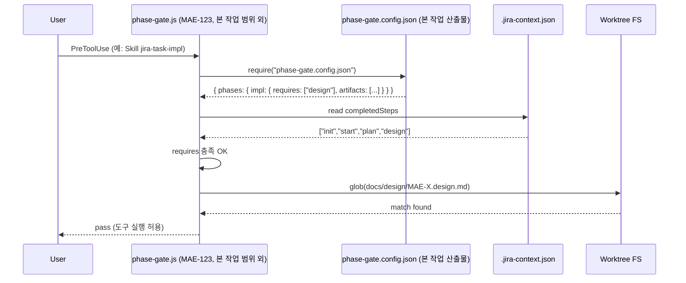

# Design: MAE-122 - [1.2.1] Phase 의존 그래프 정의 + 외부화

## Overview

본 작업은 단일 JSON 설정 파일(`hooks/scripts/phase-gate.config.json`)을 신설하여 후속 MAE-123(`phase-gate.js`)이 읽을 phase 의존 그래프를 외부화한다. 코드 변경은 없으며 신규 파일 1개와 README의 짧은 가이드 한 줄을 추가한다.

- **Plan 참조**: `docs/plan/MAE-122.plan.md`
- **연관 작업(블록 대상)**: MAE-123 (`phase-gate.js`)
- **참고**: `skills/jira-task-*/SKILL.md`의 `completedSteps` 패턴, `CLAUDE.md`의 워크플로 단계 정의

## Architecture

### Component Layout

```
hooks/scripts/
├── phase-gate.config.json   (신규, 의존 그래프 + artifact 패턴)
├── session-start.js         (기존, 무관)
└── stop-sync.js             (기존, 무관)

README.md
└── (신규) "Phase Gate Customization" 한 줄 안내 + config 경로
```

### Decision: 설정 형식

| 후보 | 장점 | 단점 | 채택 |
|------|------|------|------|
| JSON | Node `require`로 즉시 로드, 스키마 단순 | 주석 불가 → 가이드를 `_comment` 키로 우회 | **O** |
| JS module (`.config.js`) | 주석 가능, 동적 계산 | 보안/감사 부담, MCP-like sandbox에서 import 제약 | X |
| YAML | 주석 가능, 가독성 ↑ | 추가 의존성 (js-yaml), 단순 그래프엔 과함 | X |

**결론**: 이슈 description에 `phase-gate.config.json`이 명시되어 있어 JSON 채택. 주석 부재는 `_comment` / `_meta` 메타필드와 README 가이드로 보완.

### Decision: `requires` 표현 방식

| 후보 | 형태 | 채택 |
|------|------|------|
| 단일 문자열 | `"requires": "design"` | X (확장성 ↓) |
| 배열 | `"requires": ["design"]` | **O** |

**결론**: 향후 병렬 단계나 다중 선행 단계가 등장할 가능성을 고려해 배열로 통일. 현재는 모두 길이 0~1.

### Decision: artifact 검증 단위

플랜 단계의 산출물은 두 종류로 표현:
1. **completedStep**: `.jira-context.json`의 `completedSteps`에 특정 키가 있는지
2. **fileGlob**: 작업 디렉토리에 매칭 파일이 존재하는지

이슈 description의 "impl: design (문서 존재 + completedSteps)" 표현과 정합. MAE-123이 두 조건을 AND로 검사할 수 있게 둘 다 노출.

## Data Model

### Config Schema (시그니처 수준)

```
PhaseGateConfig {
  version:    string                       // "1.0"
  _comment:   string                       // 1줄 가이드 (사람용)
  phases:     Record<PhaseName, PhaseRule>
}

PhaseName = "discover" | "create" | "init" | "start" | "plan" | "design"
          | "impl" | "test" | "review" | "merge" | "pr" | "done"

PhaseRule {
  requires:   PhaseName[]                  // 선행 completedSteps (모두 만족해야 통과)
  artifacts?: ArtifactRule[]               // 부가 파일 존재 조건 (옵션)
  enforced:   boolean                      // false면 phase-gate가 검사 자체를 건너뜀
                                           // (discover/create처럼 init 이전 단계용)
}

ArtifactRule {
  fileGlob:   string                       // "docs/plan/{TASK_ID}.plan.md"
                                           // {TASK_ID} placeholder 치환은 MAE-123 책임
  optional?:  boolean                      // 기본 false
}
```

### Sample Entry

`design` 단계 예시 (개념):

```
phases.design = {
  requires:  ["plan"],
  artifacts: [{ fileGlob: "docs/plan/{TASK_ID}.plan.md" }],
  enforced:  true
}
```

### 워크플로 12단계 정의표 (구현 시 그대로 변환)

| Phase    | requires      | artifacts (fileGlob)                   | enforced |
|----------|---------------|----------------------------------------|----------|
| discover | []            | (없음)                                 | false    |
| create   | []            | (없음)                                 | false    |
| init     | []            | (없음)                                 | true     |
| start    | ["init"]      | (없음)                                 | true     |
| plan     | ["start"]     | (없음)                                 | true     |
| design   | ["plan"]      | `docs/plan/{TASK_ID}.plan.md`          | true     |
| impl     | ["design"]    | `docs/design/{TASK_ID}.design.md`      | true     |
| test     | ["impl"]      | (없음)                                 | true     |
| review   | ["test"]      | (없음)                                 | true     |
| merge    | ["review"]    | (없음)                                 | true     |
| pr       | ["merge"]     | (없음)                                 | true     |
| done     | ["pr"]        | (없음)                                 | true     |

> **주의**: `done` 단계의 `requires`는 워크트리 환경(로컬 병합 후 PR)에 맞춘 선형 정의다. 향후 환경별 변형이 필요하면 customize로 분기.

> `discover/create`는 `enforced: false` — `.jira-context.json`이 아직 없을 수 있는 단계이며 phase-gate가 검사 대상에서 제외한다.

## Sequence Diagram



## Implementation Plan

| 순서 | 파일 | 변경 사항 |
|------|------|-----------|
| 1 | `hooks/scripts/phase-gate.config.json` | 신규 작성. 위 12단계 정의표를 그대로 JSON으로 직렬화. 최상단에 `version`, `_comment` 메타필드 포함 |
| 2 | `README.md` | "Phase Gate Customization" 한 줄 추가: config 경로 안내 + "복사 후 수정" 한 줄 |
| 3 | `.claude-plugin/plugin.json` | `version` 패치 증가 (CLAUDE.md 규약) |

**코드는 작성하지 않는다.** JSON 파일 자체는 데이터이므로 `Implementation Plan`의 산출물이지만, 본 단계에서는 스키마 명세만 확정한다 — 실제 작성은 impl 단계에서 수행한다.

## Error Handling

본 작업은 정적 JSON을 추가할 뿐이라 런타임 에러 시나리오가 없다. 다만 후속 사용처(MAE-123)가 마주칠 수 있는 케이스를 위해 다음을 유지한다:

- **JSON 파싱 실패 방지**: `node -e "JSON.parse(require('fs').readFileSync(...))"`로 사전 검증 (impl 단계 verification)
- **누락 단계 방지**: 12개 단계가 모두 키로 존재하도록 정의표 그대로 옮김
- **알 수 없는 단계 호출**: 본 작업 범위 외. MAE-123에서 "정의되지 않은 phase는 enforced=false로 간주"하는 fallback 정책을 갖도록 design 단계에 메모만 남김 (config에 반영하지 않음)

## Security Checklist

- [x] 신규 파일은 정적 JSON. 외부 입력을 받지 않으므로 인젝션 표면 없음
- [x] 비밀값/토큰 미포함
- [x] 파일 권한: 일반 텍스트 (700/600 불필요)
- [x] config 사용처(MAE-123)에서 path traversal 위험은 본 작업 외 책임

## Test Plan

본 작업은 코드가 없으므로 unit/E2E test는 작성하지 않는다. 대신 verification 체크리스트를 test 단계에서 실행한다.

### Verification Checklist (test 단계에서 실행)

| ID | 항목 | 검증 방법 | 기대 결과 |
|----|------|-----------|----------|
| V-1 | 파일 존재 | `test -f hooks/scripts/phase-gate.config.json` | exit 0 |
| V-2 | JSON 유효성 | `node -e "JSON.parse(require('fs').readFileSync('hooks/scripts/phase-gate.config.json','utf8'))"` | 에러 없음 |
| V-3 | 12단계 정의 | `node -e "const c=require('./hooks/scripts/phase-gate.config.json'); console.log(Object.keys(c.phases).sort().join(','))"` | `create,design,discover,done,impl,init,merge,plan,pr,review,start,test` |
| V-4 | 의존 그래프 일치 | 위 정의표와 1:1 비교 (수동 점검 또는 jq 스크립트) | 모두 일치 |
| V-5 | artifact 패턴 | `phases.design.artifacts[0].fileGlob === "docs/plan/{TASK_ID}.plan.md"` 등 핵심 4개 (design, impl) 확인 | 일치 |
| V-6 | 가이드 존재 | `_comment` 필드가 비어있지 않음 + README에 "Phase Gate" 키워드 grep | grep 1건 이상 |
| V-7 | enforced 분포 | `discover`, `create`만 `enforced: false`, 나머지는 `true` | 일치 |

### Out of Scope (별도 sub-task에서)

- `phase-gate.js`의 동작 테스트 (MAE-123)
- bypass 메커니즘 테스트 (MAE-105의 다른 sub-task)
- 실제 차단/통과 시나리오 (MAE-105 후행)
