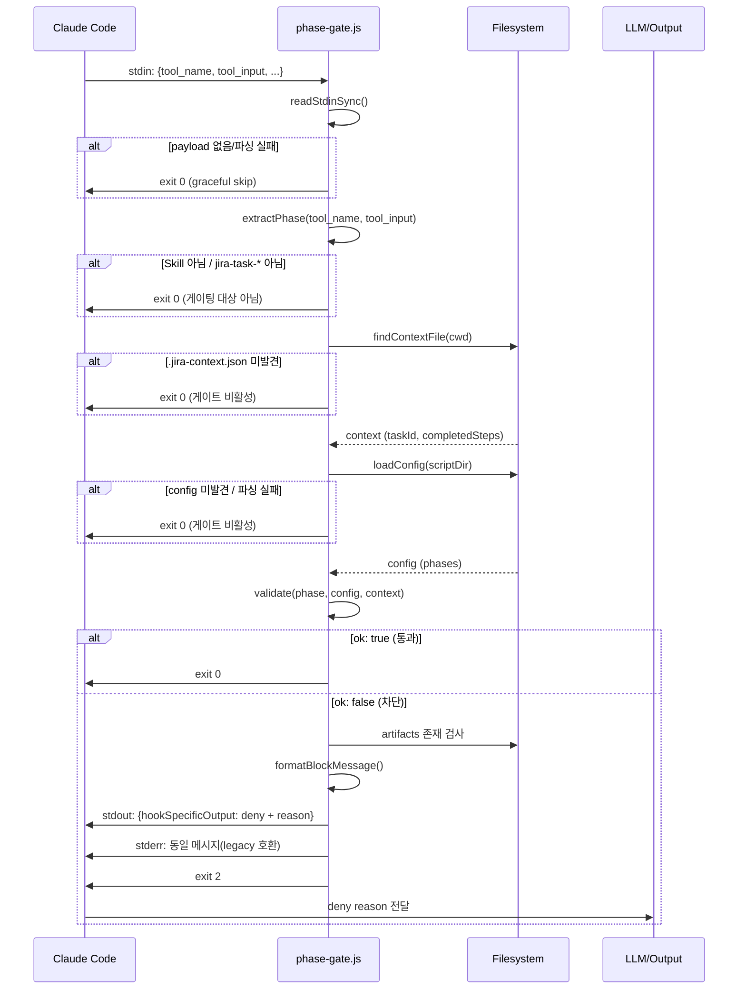

# Design: MAE-123 - [1.2.2] phase-gate.js 작성 (PreToolUse hook)

## Overview

PreToolUse hook으로 동작하는 단일 Node.js 스크립트 `hooks/scripts/phase-gate.js`를 작성한다. Skill 도구 호출(`jira-integration:jira-task-*`)을 인터셉트하여 선행 phase 미충족 시 호출을 차단한다.

- **Plan 참조**: `docs/plan/MAE-123.plan.md`
- **선행 작업**: MAE-122 (완료) — `phase-gate.config.json` 스키마 사용
- **후속 작업**: MAE-124 (bypass), MAE-125 (테스트), MAE-126 (hooks.json 등록)
- **참고**: 기존 `hooks/scripts/{session-start.js,stop-sync.js}` 동일 패턴 (Node.js, no deps, fs/JSON 기반)

## Architecture

### Component Layout

```
hooks/scripts/
├── phase-gate.js           ← 신규 (본 작업)
├── phase-gate.config.json  ← 기존 (MAE-122)
├── session-start.js        ← 무관
└── stop-sync.js            ← 무관
```

### Module Structure (단일 파일, 함수 단위 분리)

`phase-gate.js` 내부는 작은 순수 함수의 조합으로 구성:

| 함수 | 역할 |
|------|------|
| `readStdinSync()` | stdin에서 hook payload(JSON) 동기 읽기. 빈 입력/예외 시 `null` |
| `findContextFile(startDir)` | cwd부터 상위로 `.jira-context.json` 탐색 (max 6 levels) |
| `loadConfig(scriptDir)` | 동일 디렉토리에서 `phase-gate.config.json` 로드. 없으면 `null` |
| `extractPhase(toolName, toolInput)` | tool_name, skill 파라미터에서 phase 추출. 게이팅 대상 아니면 `null` |
| `validate(phase, config, context)` | requires/artifacts 검증. `{ ok: true }` 또는 `{ ok: false, reason, requiredPhases, missingArtifacts }` |
| `formatBlockMessage(phase, taskId, result)` | 한국어 안내 메시지 빌드 |
| `main()` | 위 함수들을 조합. 통과=exit 0, 차단=stderr+exit 2, 그 외 graceful exit 0 |

### Decision: 차단 메커니즘

Claude Code hook 규약(SDK 기존 hook들의 동작 패턴 참고):
- **stdout JSON** (`{"hookSpecificOutput": {"permissionDecision": "deny", "permissionDecisionReason": "..."}}`): 정식 권장 방식. PreToolUse에서 도구 호출을 deny할 수 있고, reason이 LLM 컨텍스트로 들어간다.
- **stderr + exit 2**: legacy/단순 차단 방식. stderr 내용이 LLM에 노출.

**결론**: 양자 호환. 본 구현은 **stdout JSON + permissionDecision: "deny"** 를 우선 출력하고, 호환성을 위해 **exit code 2**도 함께 사용한다. reason 텍스트에 한국어 안내 메시지를 담는다.

```
차단 시 출력:
  stdout: {"hookSpecificOutput":{"hookEventName":"PreToolUse","permissionDecision":"deny","permissionDecisionReason":"<message>"}}
  exit: 2
```

```
통과 시:
  stdout: (없음)
  exit: 0
```

근거: payload 형식 가정에 일부 불확실성이 있으나, exit 2는 모든 경우 차단으로 인식되는 안전망. 양쪽을 함께 두면 hook 런타임 변경에 강건하다.

### Decision: cwd 탐색 vs CWD 전달

Hook은 사용자 cwd에서 실행되며, worktree에서는 cwd 자체에 `.jira-context.json`이 위치. `process.cwd()`에서 시작해 max 6 단계 상향 탐색하면 worktree 안 어느 디렉토리에서 호출되어도 안전하게 발견된다.

### Decision: artifacts.fileGlob 처리

config에 등록된 패턴은 현재 `docs/plan/{TASK_ID}.plan.md`처럼 **단순 placeholder 치환만 필요**한 형태(와일드카드 없음). 따라서 본 작업에서는:

1. `{TASK_ID}` → context의 `taskId`로 문자열 치환
2. 결과 경로를 `path.resolve(contextDir, replaced)`로 절대화
3. `fs.existsSync()` 단일 검사

진짜 glob(예: `*`)은 미지원. 향후 필요 시 minimatch 도입은 별도 작업으로 분리.

## Data Model

### Hook Payload (input via stdin)

Claude Code PreToolUse hook의 payload (관찰된 형태):

```
PreToolUseInput {
  hook_event_name: "PreToolUse"
  tool_name:       string         // "Skill", "Bash", "Edit", ...
  tool_input:      object         // 도구별 파라미터. Skill의 경우 { skill: "...", args: "..." }
  session_id?:     string
  cwd?:            string
}
```

본 스크립트는 `tool_name`과 `tool_input.skill`만 사용.

### Hook Output (stdout via JSON)

```
PreToolUseOutput {
  hookSpecificOutput: {
    hookEventName:           "PreToolUse"
    permissionDecision:      "allow" | "deny" | "ask"
    permissionDecisionReason: string   // 차단 사유 (LLM에 노출)
  }
}
```

본 스크립트는 차단 시에만 위 페이로드를 출력. 통과 시 무출력.

### Internal Validation Result

```
ValidationResult {
  ok:                boolean
  reason?:           "missing-requires" | "missing-artifact" | "phase-not-enforced" | "no-context" | "no-config"
  requiredPhases?:   string[]      // 누락된 선행 phase
  missingArtifacts?: string[]      // 누락된 산출물 경로 (치환 후)
  taskId?:           string
}
```

`enforced: false`, `no-context`, `no-config`은 모두 `ok: true`로 처리(통과). `reason`은 디버깅용 메타데이터.

### File Layout (변경/생성 파일)

| 파일 | 변경 |
|------|------|
| `hooks/scripts/phase-gate.js` | 신규 — 본 스크립트 |

`hooks/hooks.json` 수정은 본 작업 범위 외 (MAE-126).

## Sequence Diagram



## Implementation Plan

| 순서 | 파일 | 변경 내용 |
|------|------|-----------|
| 1 | `hooks/scripts/phase-gate.js` | 파일 신규 생성. shebang `#!/usr/bin/env node`. CommonJS. |
| 2 | 동 | `readStdinSync()` 구현 — `fs.readFileSync(0, 'utf8')` try/catch. 빈 문자열도 허용. |
| 3 | 동 | `extractPhase()` 구현 — `tool_name === "Skill"` && `tool_input.skill`이 `^(jira-integration:)?jira-task-(.+)$` 패턴이면 phase 반환. 그 외 `null`. |
| 4 | 동 | `findContextFile(startDir)` 구현 — `path.join(dir, '.jira-context.json')` 존재 검사. `fs.existsSync` true면 반환. 없으면 `path.dirname(dir)`로 한 단계 상향. dir이 root거나 6단계 초과 시 `null`. |
| 5 | 동 | `loadConfig(scriptDir)` 구현 — `path.join(scriptDir, 'phase-gate.config.json')` 읽고 `JSON.parse`. 실패 시 `null`. |
| 6 | 동 | `validate(phase, config, context)` 구현 — 다음 순서로 단락 평가: <br/>① `config.phases[phase]` 미존재 → `{ok:true, reason:"phase-not-defined"}` <br/>② `phaseRule.enforced === false` → `{ok:true, reason:"phase-not-enforced"}` <br/>③ `requires` 중 `context.completedSteps`에 없는 항목 수집 → 있으면 `{ok:false, reason:"missing-requires", requiredPhases}` <br/>④ `artifacts` 각각 `{TASK_ID}` 치환 후 `fs.existsSync` 확인 → 누락 있으면 `{ok:false, reason:"missing-artifact", missingArtifacts}` <br/>⑤ 모두 통과 → `{ok:true}` |
| 7 | 동 | `formatBlockMessage(phase, taskId, result)` 구현 — 한국어 메시지: <br/>- 1줄: `🚫 phase gate: '<phase>' 단계 진입 차단 (<TASK-ID>)` <br/>- requires 누락 시: `필요한 선행 단계: <phases>` + `먼저 실행: /jira-task <missing> <TASK-ID>` <br/>- artifacts 누락 시: `필요한 산출물 누락: <paths>` <br/>- 마지막 줄(우회 안내): `우회: 환경변수 JIRA_PHASE_GATE_BYPASS=1 (MAE-124에서 도입 예정)` |
| 8 | 동 | `main()` 구현 — 위 함수 조합. 통과 시 exit 0. 차단 시 stdout JSON + stderr + exit 2. 모든 예기치 못한 예외는 try/catch로 감싸 graceful exit 0 (게이트가 hook 자체를 깨뜨리면 안 됨). |
| 9 | 동 | `if (require.main === module) main();` — 직접 실행 가드 (향후 단위 테스트에서 함수 import 가능하도록 모듈 export도 함께 명시). |

**테스트 가능성을 위한 export**: `module.exports = { extractPhase, findContextFile, loadConfig, validate, formatBlockMessage }` — MAE-125에서 단위 테스트가 import할 수 있게 함. main 자체는 export하지 않음.

## Error Handling

| 시나리오 | 처리 |
|----------|------|
| stdin이 비어 있음 / 비-JSON | `readStdinSync` try/catch → `null` 반환 → main에서 graceful exit 0 |
| `.jira-context.json` 손상 (JSON parse 실패) | findContextFile에서 발견 후 parse 시도 → 실패하면 `null` 반환 → exit 0 |
| `phase-gate.config.json` 손상 | loadConfig가 `null` 반환 → exit 0 (게이트 비활성) |
| `taskId` 필드 부재 | artifacts 치환 불가 → artifacts 검증 스킵, requires만 검증 |
| `completedSteps`가 배열 아님 | 빈 배열로 캐스팅 |
| 호출 phase가 config에 정의되지 않음 | `validate`가 `{ok:true}` 반환 (안전장치) |
| fs.readFileSync 권한 오류 등 | 최상위 try/catch → exit 0 |
| stdout JSON write 실패 | catch 후 stderr 메시지만 출력하고 exit 2 유지 |

**원칙**: phase-gate가 깨지면 hook 자체가 깨져 모든 도구 호출이 막힐 수 있음. 따라서 게이트 적용이 불가능한 모든 상황은 **통과(exit 0)** 로 처리. 이는 MAE-124(bypass)와 다른 별개의 fail-open 안전장치.

## Security Checklist

- [x] **No external deps**: 외부 패키지 import 없음 (Node.js 내장 `fs`, `path`만 사용) → supply chain 위험 없음
- [x] **No shell exec**: `child_process` 사용 없음
- [x] **Path traversal**: `findContextFile`은 path.dirname으로만 상향, `path.resolve`로 정규화. 사용자 입력 직접 path 결합 없음
- [x] **JSON parse**: 외부 입력(stdin, 파일)은 try/catch로 감싸 예외 격리
- [x] **stderr 안전**: 메시지에 사용자 데이터(taskId, completedSteps) 포함되나 한국어 텍스트 + 기본 sanitization 불필요
- [x] **Hook timeout**: 모든 IO 동기, 외부 네트워크 콜 없음 → ms 단위 종료, hooks.json의 timeout(10s) 한참 이내
- [x] **Privilege**: hook은 사용자 권한으로 실행. 권한 상승 없음

## Test Plan

MAE-125에서 별도 테스트 시나리오 작성. 본 작업에서는 design에 기반한 명세 수준으로 정의:

### Unit Test Cases (functions, no I/O)

`extractPhase()`:
- ✅ `Skill, {skill:"jira-integration:jira-task-impl"}` → `"impl"`
- ✅ `Skill, {skill:"jira-task-plan"}` → `"plan"` (prefix 옵션 처리 확인)
- ❌ `Bash, {command:"ls"}` → `null`
- ❌ `Skill, {skill:"jira-integration:jira-task-create"}` → `"create"` (enforced:false phase여도 phase 추출은 되어야 함; enforced 분기는 validate에서)
- ❌ `Skill, {skill:"review"}` → `null` (jira-task가 아님)
- ❌ payload에 `tool_input` 없음 → `null`

`validate()`:
- ✅ phase=`impl`, completedSteps=`["init","start","plan","design"]`, design.md 존재 → `{ok:true}`
- ❌ phase=`impl`, completedSteps=`["init","start","plan"]` → `{ok:false, reason:"missing-requires", requiredPhases:["design"]}`
- ❌ phase=`impl`, completedSteps=`["init","start","plan","design"]`, design.md **부재** → `{ok:false, reason:"missing-artifact", missingArtifacts:["docs/design/MAE-123.design.md"]}`
- ✅ phase=`discover` (enforced:false) → `{ok:true, reason:"phase-not-enforced"}`
- ✅ phase=`unknown_phase_xyz` → `{ok:true, reason:"phase-not-defined"}`
- ✅ context에 `taskId` 없음, phase=`impl` → artifacts 검증 스킵, requires만 평가

`formatBlockMessage()`:
- 메시지에 `🚫`, phase 명, TASK-ID, 요구 phase, `/jira-task` 권장 명령, 우회 안내 모두 포함

### Integration Test Cases (full main, mocked stdin)

E2E 시나리오는 MAE-125에서 작성 예정. 본 design에서 명세하는 케이스:

| # | 시나리오 | 기대 결과 |
|---|----------|-----------|
| I-1 | 전 phase 충족 + Skill jira-task-test 호출 | exit 0, stdout/stderr 비어있음 |
| I-2 | design 미완 상태에서 jira-task-impl 호출 | exit 2, stdout JSON에 `permissionDecision:"deny"` 포함 |
| I-3 | Bash 도구 호출 | exit 0 (스킵) |
| I-4 | `.jira-context.json` 없는 일반 디렉토리에서 jira-task-plan 호출 | exit 0 (graceful) |
| I-5 | worktree 하위 디렉토리(`docs/`)에서 호출 | 상위 탐색으로 context 발견 후 정상 게이팅 |
| I-6 | config 파일 손상 | exit 0 (게이트 비활성) |

### Manual Smoke Test (impl 단계 종료 후)

```
echo '{"tool_name":"Skill","tool_input":{"skill":"jira-integration:jira-task-impl","args":"MAE-123"}}' \
  | node hooks/scripts/phase-gate.js; echo "exit=$?"
```
- 본 worktree에서 design 완료 + design.md 존재 → exit 0 기대
- `.jira-context.json`을 임시로 `completedSteps: ["init","start","plan"]`로 수정 후 재실행 → exit 2 + 한국어 메시지 기대
