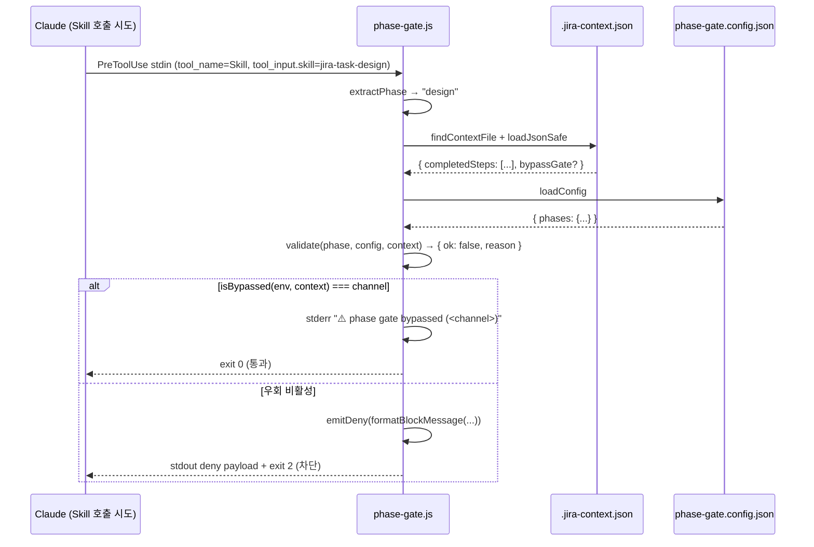

# Design: MAE-124 - [1.2.3] Bypass 메커니즘 (env + context flag)

## Architecture

`hooks/scripts/phase-gate.js` 단일 파일에 우회 로직을 추가한다. 외부 모듈/패키지 도입 없음.

```
┌────────────────────────────────────────────────────────────────┐
│ phase-gate.js (PreToolUse hook)                                │
│                                                                │
│   stdin → readStdinSync()                                      │
│     ↓                                                          │
│   extractPhase(tool_name, tool_input) → phase or null          │
│     ↓                                                          │
│   findContextFile(cwd) → contextPath or null (fail-open)       │
│     ↓                                                          │
│   loadConfig(__dirname) → config or null (fail-open)           │
│     ↓                                                          │
│   validate(phase, config, context) → { ok, reason, ... }       │
│     ↓                                                          │
│   ┌────────────────────────────────────────┐                   │
│   │ NEW: result.ok === false 일 때         │                   │
│   │   isBypassed(env, context) 검사        │  ← 추가 지점     │
│   │     truthy → stderr 경고 + exit 0      │                   │
│   │     falsy  → 기존 deny 흐름 (exit 2)   │                   │
│   └────────────────────────────────────────┘                   │
└────────────────────────────────────────────────────────────────┘
```

기존 검증 로직(`validate()`)은 손대지 않는다. 우회는 검증 결과를 **후처리**하는 형태로 삽입한다 — 검증 자체는 부수효과 없는 순수 함수로 유지하기 위함.

## Data Model

이 작업은 데이터 변경이 거의 없다. 변경되는 형식은 `.jira-context.json`의 선택적 필드 1개뿐.

### `.jira-context.json` — 신규 선택 필드

| 필드 | 타입 | 필수 | 설명 |
|------|------|------|------|
| `bypassGate` | `boolean` | No (기본 부재) | `true`로 명시 시 phase gate를 영속적으로 우회. `false` / 미존재는 기존 동작 |

엄격 비교(`=== true`)를 사용하므로 `"true"`(문자열), `1`, truthy 객체 등은 인정되지 않는다. 사용자 실수 방지.

### 환경변수

| 변수 | 의미 | truthy 판정 |
|------|------|------|
| `JIRA_PHASE_GATE_BYPASS` | 1회성 우회 | `trim()` 후 빈 문자열, `"0"`, `"false"`(case-insensitive)가 아닌 모든 값 |

다른 entity / 스키마 / DTO / 도메인 객체 / 상태 모델 / 데이터 흐름 변경: `N/A — no data changes`.

## Sequence Diagram



## Implementation Plan

순서대로 진행하되, 각 단계 완료 후 이미 존재하는 unit test를 즉시 추가한다 (TDD-friendly).

### 1. `phase-gate.js` — 헬퍼 추가
- 함수 추가: `isBypassed(env, context)` — env 인자(`process.env`)와 context를 받아 우회 채널을 반환
- 반환값: `null` | `"env"` | `"context"` (env 우선)
- 환경변수 truthy 판정 헬퍼: 내부 `isEnvTruthy(value)` (단순 inline도 무방, 별도 함수 권장)
- module.exports에 `isBypassed` 추가 (테스트 노출)

### 2. `phase-gate.js` — `main()` 수정
- 위치: 기존 `if (result.ok) { exit 0 }` 직후, `emitDeny(...)` 직전
- 동작: `validate`가 ok=false를 반환했고 `isBypassed(process.env, context)`가 truthy 채널을 반환하면 stderr에 경고를 출력하고 exit 0
- 경고 메시지 형식: `⚠️ phase gate bypassed (<channel>): <phase> 단계가 선행 요건을 만족하지 않지만 우회되었습니다`
  - context 채널인 경우 추가 안내: `(.jira-context.json: bypassGate=true)`
  - env 채널인 경우 추가 안내: `(JIRA_PHASE_GATE_BYPASS=<value>)`

### 3. `phase-gate.js` — 차단 메시지 갱신
- `formatBlockMessage`의 우회 안내 라인 갱신
- 기존: `우회: 환경변수 JIRA_PHASE_GATE_BYPASS=1 (MAE-124에서 도입 예정)`
- 신규: 두 줄로 분리
  - `우회 (1회성): JIRA_PHASE_GATE_BYPASS=1`
  - `우회 (영속): .jira-context.json에 "bypassGate": true 추가`

### 4. 단위 테스트 신설 — `hooks/scripts/phase-gate.test.js`
- Node 내장 `node:test` + `node:assert/strict` 사용 (외부 의존성 회피)
- 노출된 헬퍼(`isBypassed`, `validate`, `extractPhase`, `formatBlockMessage`)를 직접 호출
- 테스트 러너는 `node --test hooks/scripts/phase-gate.test.js` (별도 npm script 신설 불필요)

### 5. 산출물 검증 (수동)
- 우회 환경변수로 hook stdin을 mock한 1회 수동 실행 → exit code 0 + stderr 경고 확인
- bypassGate context 파일을 임시로 만들어 동일 검증

### 변경 파일 요약
| 파일 | 변경 |
|------|------|
| `hooks/scripts/phase-gate.js` | 헬퍼 추가, `main()`에 bypass 분기 삽입, 차단 메시지 우회 안내 라인 갱신, exports 갱신 |
| `hooks/scripts/phase-gate.test.js` | 신규 — `node:test` 기반 unit test |
| `hooks/scripts/phase-gate.config.json` | 변경 없음 |

## Error Handling

| 시나리오 | 처리 |
|----------|------|
| `process.env`가 정상이지만 변수 미설정 | `isBypassed`는 env 채널을 false로 판정. context로 fallback |
| `context.bypassGate`가 잘못된 타입 (예: `"true"` 문자열) | `=== true` 엄격 비교로 false 처리 — 우회 비활성 |
| stderr 쓰기 실패 (드문 케이스) | 기존 패턴(try/catch + ignore) 유지, exit 0은 그대로 진행 |
| 우회 분기 내 예외 발생 | 기존 `main()`의 try/catch가 잡아 `exit 0`로 fail-open |

기존 fail-open 철학(어떤 예외 상황에서도 hook chain을 깨지 않음)을 유지한다.

## Security Checklist

- 우회는 사용자 명시적 행위로만 발동 (환경변수 설정 또는 context 파일 수동 편집) — 자동/암묵적 우회 없음
- 환경변수 값은 stderr에 그대로 노출 — 민감정보가 들어갈 가능성이 낮은 변수명이지만, 사용자가 임의로 secret을 넣는 것을 방지하기 위해 메시지에는 변수명만 노출하고 값은 표시하지 않음
- bypassGate가 활성된 컨텍스트는 그 사실이 stderr에 반복 표시되어 사용자가 인지 — silent bypass 방지
- 우회 시에도 `validate()` 결과 자체는 변경하지 않음 — 차단 사유는 그대로 반환되어 후속 분석/로깅에 활용 가능

## Test Plan

`node --test hooks/scripts/phase-gate.test.js`로 실행. 모든 케이스는 외부 파일 시스템에 의존하지 않고 헬퍼 인자로 mock 데이터 주입.

### Unit Tests — `isBypassed(env, context)`

| # | 케이스 | 입력 (env, context) | 기대 반환 |
|---|--------|---------------------|-----------|
| U1 | env 미설정, context 정상 | `{}`, `{ completedSteps: [] }` | `null` |
| U2 | env=`"1"` | `{ JIRA_PHASE_GATE_BYPASS: "1" }`, `{}` | `"env"` |
| U3 | env=`""` (빈 문자열) | `{ JIRA_PHASE_GATE_BYPASS: "" }`, `{}` | `null` |
| U4 | env=`"0"` | `{ JIRA_PHASE_GATE_BYPASS: "0" }`, `{}` | `null` |
| U5 | env=`"false"` (case-insensitive) | `{ JIRA_PHASE_GATE_BYPASS: "FALSE" }`, `{}` | `null` |
| U6 | env=공백 문자열 `"  "` | `{ JIRA_PHASE_GATE_BYPASS: "  " }`, `{}` | `null` |
| U7 | context.bypassGate === true | `{}`, `{ bypassGate: true }` | `"context"` |
| U8 | context.bypassGate === false | `{}`, `{ bypassGate: false }` | `null` |
| U9 | context.bypassGate === "true" (문자열) | `{}`, `{ bypassGate: "true" }` | `null` |
| U10 | 양쪽 활성 — env 우선 | `{ JIRA_PHASE_GATE_BYPASS: "1" }`, `{ bypassGate: true }` | `"env"` |
| U11 | env=`"yes"` (임의 truthy) | `{ JIRA_PHASE_GATE_BYPASS: "yes" }`, `{}` | `"env"` |

### Unit Tests — `validate()` 회귀 (기존 동작 변경 없음)

| # | 케이스 | 기대 |
|---|--------|------|
| V1 | enforced=false phase | `{ ok: true, reason: "phase-not-enforced" }` |
| V2 | requires 누락 | `{ ok: false, reason: "missing-requires", requiredPhases: [...] }` |
| V3 | artifacts 누락 (실제 파일 없음) | `{ ok: false, reason: "missing-artifact" }` (임시 디렉토리 사용) |
| V4 | 모두 충족 | `{ ok: true }` |

### Unit Tests — `formatBlockMessage()` 메시지 갱신

| # | 케이스 | 기대 (substring 검사) |
|---|--------|------|
| M1 | missing-requires 메시지에 새 우회 안내 포함 | `"JIRA_PHASE_GATE_BYPASS=1"` 및 `"\"bypassGate\": true"` 두 줄 모두 존재 |
| M2 | 옛 placeholder 부재 | `"MAE-124에서 도입 예정"` 문자열이 메시지에 **포함되지 않음** |

### Integration / 수동 테스트

E2E 자동화는 hook chain 의존성으로 인해 본 태스크 범위 밖 (MAE-126이 hooks.json 등록을 담당). 본 단계는 수동 1회 검증으로 충분:

| # | 시나리오 | 검증 방법 |
|---|----------|-----------|
| I1 | env 우회 | `echo '{"tool_name":"Skill","tool_input":{"skill":"jira-task-design"}}' \| JIRA_PHASE_GATE_BYPASS=1 node hooks/scripts/phase-gate.js; echo "exit=$?"` — exit=0, stderr에 "bypassed (env)" 노출 |
| I2 | context 우회 | 임시로 `.jira-context.json`에 `"bypassGate": true` 추가 후 동일 stdin 실행 — exit=0, stderr에 "bypassed (context)" 노출 |
| I3 | 정상 차단 회귀 | env/context 모두 비활성 + completedSteps=[] 상태에서 동일 stdin 실행 — exit=2, deny 페이로드 출력 |

E2E 케이스(Claude Code 실제 hook chain 통합)는 MAE-126 완료 후 별도 회귀로 수행.
