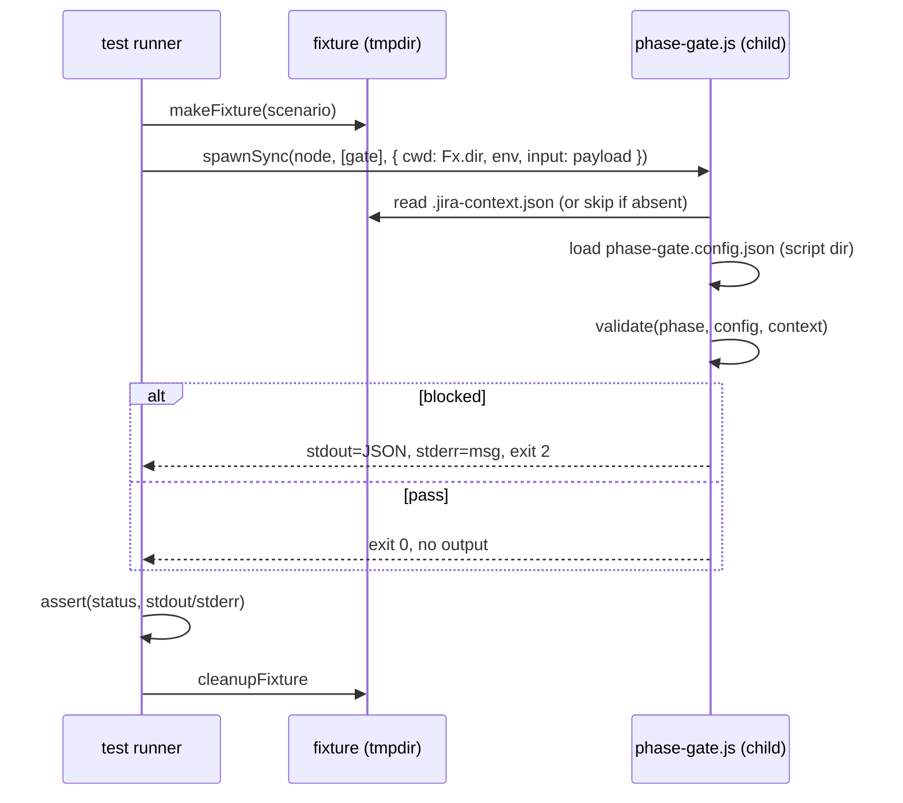

# Design: MAE-125 - [1.2.4] 테스트 시나리오 작성

## Architecture

### 위치 및 구조

- **테스트 스크립트**: `hooks/scripts/phase-gate.test.js` (단일 파일)
- **실행 방식**: `node hooks/scripts/phase-gate.test.js` — Node 18+ 표준 라이브러리만 사용
- **테스트 대상**: `hooks/scripts/phase-gate.js` (자식 프로세스로 spawn)
- **package.json 미존재**: 본 작업에서 새로 생성 (`scripts.test`만 정의)

### 컴포넌트 구성

```
phase-gate.test.js
├── runGate(payload, opts)        — phase-gate.js를 spawnSync로 실행, {status, stdout, stderr} 반환
├── makeFixture(steps, taskId)    — os.tmpdir()/phase-gate-test-<rand> 디렉토리 + .jira-context.json + (선택) artifact 생성
├── cleanupFixture(dir)           — fs.rmSync(dir, recursive)
├── isolatedTmpDir()              — 부모 체인에 .jira-context.json이 없는 임시 디렉토리 확보
├── isBypassImplemented()         — phase-gate.js 소스에 'JIRA_PHASE_GATE_BYPASS' 처리 분기가 있는지 검사 (단순 grep)
├── 시나리오 4개                   — runScenario('이름', async () => { ... assert ... })
└── reportAndExit()               — 합계 출력 + 실패 시 exit 1
```

### 테스트 대상 인터페이스 (phase-gate.js 실측 동작)

코드 확인 결과, `phase-gate.js`는 차단 시 다음 두 가지로 신호를 보낸다:
1. **stdout**: JSON `{ "hookSpecificOutput": { "hookEventName": "PreToolUse", "permissionDecision": "deny", "permissionDecisionReason": "<msg>" } }`
2. **stderr**: 동일한 사람-가독 메시지 (한국어, "🚫 phase gate" 시작)
3. **exit code**: 2

통과 시:
- exit 0, stdout/stderr 모두 비어 있음

이 사실을 시나리오 어서션에 반영한다 (stderr만 검사하지 않고 exit code 우선, 메시지는 includes로 보조).

## Data Model

### Fixture 데이터 (해당 시 적용)

| 필드 | 타입 | 의미 |
|------|------|------|
| `dir` | string (path) | 격리된 임시 디렉토리 절대 경로 |
| `contextPath` | string | `<dir>/.jira-context.json` |
| `taskId` | string | 가짜 TASK-ID (예: `TEST-1`, `TEST-2`) |
| `completedSteps` | string[] | phase-gate.config.json의 phase 이름 부분집합 |
| `artifacts` | { relPath, content }[] | 생성할 산출물 (예: `docs/design/TEST-2.design.md`) |

`.jira-context.json`은 phase-gate.js가 읽는 키만 포함:
- `taskId: string`
- `completedSteps: string[]`
- (시나리오 3 일부) `bypassGate: boolean` — MAE-124 인터페이스 가정

### 시나리오별 fixture 명세

| 시나리오 | taskId | completedSteps | artifacts | env | 추가 필드 |
|---------|--------|---------------|-----------|-----|----------|
| 1. 차단 | `TEST-1` | `["init","start","plan"]` | `docs/plan/TEST-1.plan.md` | — | — |
| 2. 통과 | `TEST-2` | `["init","start","plan","design"]` | `docs/plan/TEST-2.plan.md`, `docs/design/TEST-2.design.md` | — | — |
| 3a. bypass(env) | `TEST-3` | `["init","start","plan"]` | `docs/plan/TEST-3.plan.md` | `JIRA_PHASE_GATE_BYPASS=1` | — |
| 3b. bypass(flag) | `TEST-3b` | `["init","start","plan"]` | `docs/plan/TEST-3b.plan.md` | — | `bypassGate: true` |
| 4. 컨텍스트 없음 | — | — | — | — | `.jira-context.json` 자체 없음 |

비고: 시나리오 1/2 fixture는 `phase-gate.config.json`의 `phases.impl`을 기준으로 구성 (requires=design, artifacts=design.md). config가 변경되면 본 테스트 fixture도 동기화 필요.

## Sequence Diagram



## Implementation Plan

### 파일 변경 사항

| # | 파일 | 변경 유형 | 요약 |
|---|------|---------|------|
| 1 | `hooks/scripts/phase-gate.test.js` | 신규 | 테스트 러너, fixture helper, 4(+1) 시나리오 |
| 2 | `package.json` | 신규 | minimal 정의 (`name`, `private: true`, `scripts.test`) — Node 표준 lib만 쓰므로 deps 없음 |

### 작업 순서

1. **package.json 생성**: `name: jira-claude-code-integration`, `private: true`, `scripts.test: "node hooks/scripts/phase-gate.test.js"`. 다른 필드는 추가하지 않음 (YAGNI).
2. **phase-gate.test.js 스켈레톤**:
   - `runGate(payload, { cwd, env? })`: `spawnSync('node', [phaseGatePath], { cwd, env: { ...process.env, ...env }, input: JSON.stringify(payload), encoding: 'utf8' })`로 실행 후 `{ status, stdout, stderr }` 반환
   - `makeFixture({ taskId, completedSteps, artifacts })`: tmpdir 생성, `.jira-context.json` 작성, artifact 파일들 작성, `dir` 반환
   - `cleanupFixture(dir)`
   - `isolatedTmpDir()`: tmpdir의 부모 체인을 root까지 거슬러 올라가며 `.jira-context.json`이 없는지 확인. 있으면 throw (시스템 환경 이슈 안내).
   - `runScenario(name, fn)`: try → '✓ name', catch → '✗ name: <msg>', skip → '⊘ name: <reason>' 기록
   - `reportAndExit(results)`: `총 N개 중 P 통과, F 실패, S 스킵` 출력, F>0이면 exit 1
3. **시나리오 1 (차단)**:
   - fixture 생성 → `runGate({ tool_name:'Skill', tool_input:{ skill:'jira-integration:jira-task-impl', args:'TEST-1' } }, { cwd })`
   - assert: `status === 2`, `stderr.includes('design')`, `stdout`은 JSON parse 가능하고 `permissionDecision === 'deny'`
4. **시나리오 2 (통과)**:
   - fixture 생성 (design.md 포함) → 동일 payload(`TEST-2`)
   - assert: `status === 0`, `stderr === ''`, `stdout === ''`
5. **시나리오 3 (bypass)**:
   - **선조건 검사**: `isBypassImplemented()` — phase-gate.js 소스를 readFileSync로 읽고 `JIRA_PHASE_GATE_BYPASS` 처리 분기(단순 안내 문구만이 아닌 `process.env.JIRA_PHASE_GATE_BYPASS` 또는 `bypassGate` 참조)가 있는지 정규식으로 검사. 처리 분기 없으면 → `skip` (사유: "MAE-124 미완료")
   - 3a (env): 시나리오 1과 동일 fixture + `env: { JIRA_PHASE_GATE_BYPASS: '1' }`. assert: `status === 0`, stderr에 bypass 키워드 포함(예: `bypass`)
   - 3b (context flag): fixture에 `bypassGate: true`. assert: `status === 0`
   - 비고: bypass 통과 시 stderr에 경고 출력은 권장사항 — 미구현이면 status만 검사
6. **시나리오 4 (컨텍스트 없음)**:
   - `isolatedTmpDir()`로 격리된 빈 디렉토리 확보 → `runGate` payload는 `init` phase 호출
   - assert: `status === 0`, stderr/stdout 비어 있음
7. **결과 집계 + exit code**: `reportAndExit(results)`

### 인터페이스 (시그니처 수준만)

- `runGate(payload: object, opts: { cwd: string, env?: object }): { status: number, stdout: string, stderr: string }`
- `makeFixture(spec: { taskId?: string, completedSteps?: string[], artifacts?: string[], extraContext?: object }): { dir: string }`
- `cleanupFixture(dir: string): void`
- `isolatedTmpDir(): string`
- `isBypassImplemented(): boolean`
- `runScenario(name: string, fn: () => void | Promise<void>, opts?: { skipIf?: () => string | null }): void`
- `reportAndExit(results: { name: string, outcome: 'pass'|'fail'|'skip', reason?: string }[]): never`

## Error Handling

### 테스트 러너 자체

- fixture 생성 실패: 해당 시나리오 fail로 기록 후 다음 진행 (전체 중단 없음)
- spawnSync 실행 실패 (Node 미설치 등): 즉시 fail 종료 (exit 1) — 시스템 전제 미충족
- cleanup 실패: warning만 출력, exit code에는 영향 없음 (tmpdir이라 OS가 결국 정리)

### 시나리오 어서션 실패

- assert 실패 시 throw → `runScenario`가 catch하여 `✗ name: <expected vs actual>` 기록
- 어서션 메시지에 status, stdout, stderr 일부(첫 200자)를 포함하여 디버깅 용이

### 격리 실패 보호

- `isolatedTmpDir()`이 부모 체인에서 `.jira-context.json`을 발견하면: 시나리오 4 skip 처리 (사유 "환경에 상위 .jira-context.json 존재")

## Security Checklist

- [x] **임시 디렉토리 권한**: `os.tmpdir()` 하위 무작위 이름. 다른 사용자 추측 방지를 위해 `fs.mkdtempSync` 사용
- [x] **외부 입력 없음**: payload는 코드 리터럴, 환경 격리됨
- [x] **외부 의존성 없음**: 표준 라이브러리만 → 공급망 위험 없음
- [x] **임의 파일 시스템 변경 없음**: 모든 쓰기는 fixture 디렉토리 내부로 한정. cleanup으로 정리
- [x] **비밀 정보 미노출**: 테스트 payload에 자격증명 없음. `process.env`를 그대로 상속하므로 stderr 캡처 결과를 로그에 그대로 출력하지 않도록 첫 200자만 노출

## Test Plan

### 자기 검증 (테스트 스크립트 자체의 동작)

| # | 케이스 | 입력 | 기대 결과 |
|---|--------|------|----------|
| S-1 | 정상 실행 | `node phase-gate.test.js` | exit 0, "총 N개 중 N 통과" |
| S-2 | 의도적 실패 케이스 추가 (개발 중에만) | 잘못된 어서션 | exit 1, "✗" 마커 출력 |
| S-3 | bypass 미구현 환경 | phase-gate.js에 bypass 분기 없음 | 시나리오 3a/3b skip, 합계에 "스킵 2" 표시 |

### 핵심 4개 시나리오 (Acceptance Criteria 매핑)

| AC | 시나리오 | 입력 (payload + fixture) | 기대 |
|----|---------|------------------------|------|
| AC-2 | 차단 | impl 호출 + completedSteps에 design 없음 | status 2, stderr `design` 포함, stdout JSON `permissionDecision: deny` |
| AC-3 | 통과 | impl 호출 + design.md 존재 + completedSteps 충족 | status 0, no output |
| AC-4a | bypass(env) | 차단 조건 + JIRA_PHASE_GATE_BYPASS=1 | status 0 (구현 시), 미구현이면 skip |
| AC-4b | bypass(flag) | 차단 조건 + bypassGate: true | status 0 (구현 시), 미구현이면 skip |
| AC-5 | 컨텍스트 없음 | 격리 tmpdir에서 init 호출 | status 0, no output |

### 수동 확인

- 시나리오 2를 일시적으로 깨뜨려(예: design.md 삭제) `npm test`가 exit 1 하는지 확인
- macOS / Linux 양쪽에서 `os.tmpdir()` 경로 동작 확인 (CI 미설정이므로 로컬 수동)

### 비고

- 본 테스트는 단위 수준. 실제 Claude Code 세션에서 hook이 트리거되는 E2E는 본 작업 범위 밖 (MAE-126에서 hooks.json 등록 후 수동 검증)
- `phase-gate.config.json`이 변경되면 시나리오 1/2 fixture의 `requires`/`artifacts` 가정도 함께 검토 필요
