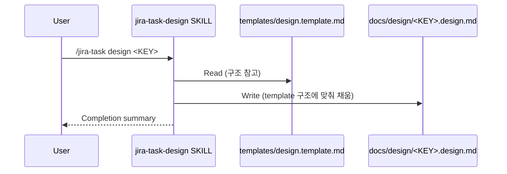

# Design: MAE-128 - [1.3.1] 각 단계별 template 목록 확정 + 섹션 정의

## Overview

5종 template(`requirements`/`design`/`test-report`/`review`/`pr-description`)의 섹션 구조를 확정하고, 4개 스킬(`jira-task-design`/`-test`/`-review`/`-pr`) SKILL.md에 template 참조 규칙을 추가한다. 가변 섹션은 template 내 주석 마커로 표현하며 별도 정책 문서·CI lint는 두지 않는다(MAE-129/130/131 흡수 결정).

## Architecture

본 작업은 코드 변경이 아닌 **문서/스킬 지시 변경**이므로 컴포넌트 다이어그램은 N/A. 다만 산출물-스킬 매핑은 다음과 같다:

| Template (신규/검토) | 채우는 스킬 | 산출 위치 패턴 |
|--|--|--|
| `requirements.template.md` (검토) | `jira-task-discover` | `docs/requirements/<slug>.requirements.md` |
| `plan.template.md` (기존) | `jira-task-plan` | `docs/plan/<TASK-ID>.plan.md` |
| `design.template.md` (신규) | `jira-task-design` | `docs/design/<TASK-ID>.design.md` |
| `test-report.template.md` (신규) | `jira-task-test` | `docs/test/<TASK-ID>.test-report.md` |
| `review.template.md` (신규) | `jira-task-review` | `docs/review/<TASK-ID>.review.md` |
| `pr-description.template.md` (신규) | `jira-task-pr` | (PR body, 파일 산출 없음) |

## Data Model

N/A — no data changes. 본 작업은 정적 문서/스킬 지시만 다룬다.

## Sequence Diagram

신규 template 적용 후 산출물 생성 흐름 (예: design 단계):

## Section Frequency Analysis (필수/옵셔널 분류 근거)

기존 산출물의 H2 섹션 출현 빈도 분석. **임계치: ≥80% = 필수, 30~79% = 권장, <30% = 옵셔널**.

### design (n=16)

| 섹션 | 빈도 | 비율 | 분류 |
|--|--|--|--|
| Architecture | 16/16 | 100% | 필수 |
| Implementation Plan | 16/16 | 100% | 필수 |
| Test Plan | 16/16 | 100% | 필수 |
| Sequence Diagram | 16/16 | 100% | 필수 |
| Security Checklist | 16/16 | 100% | 필수 |
| Error Handling | 16/16 | 100% | 필수 |
| Data Model | 9/16 | 56% | 권장 (현 SKILL.md가 권장으로 명시 — 본 분석 일치) |
| Overview | 7/16 | 44% | 권장 |
| Out of Scope | 2/16 | 13% | 옵셔널 |
| Open Items / Open Questions | 2~3/16 | <20% | 옵셔널 |
| Interfaces / Types | 2/16 | 13% | 옵셔널 |
| Verification against AC | 2/16 | 13% | 옵셔널 (test 단계 산출물과 중복) |
| Notes | 1/16 | <10% | 옵셔널 |

### test-report (n=16)

| 섹션 | 빈도 | 비율 | 분류 |
|--|--|--|--|
| Summary | 16/16 | 100% | 필수 |
| Failed Tests Detail | 14/16 | 88% | 필수 (실패 0건이어도 "없음" 명시 관행) |
| Screenshots | 12/16 | 75% | 권장 (UI 없으면 "해당 없음") |
| (테스트 분류 1개 이상: Unit/E2E/Scenario/Manual 등) | 16/16 | 100% | 필수 (구체 명칭은 자유) |
| Notes | 5/16 | 31% | 권장 |
| Skipped Tests / Out of Scope | 3~5/16 | <30% | 옵셔널 |
| Test Strategy | 3/16 | 19% | 옵셔널 |
| Test Environment | 2/16 | 13% | 옵셔널 |
| Acceptance Criteria 매핑 | 2~4/16 | <30% | 옵셔널 (review에서도 다룸) |
| Conclusion / 결론 | 6/16 | 38% | 권장 |
| Raw Output | 1/16 | <10% | 옵셔널 |

### review (n=16)

| 섹션 | 빈도 | 비율 | 분류 |
|--|--|--|--|
| Summary | 16/16 | 100% | 필수 |
| Gap Analysis | 16/16 | 100% | 필수 |
| Code Quality Findings | 16/16 | 100% | 필수 |
| Lint & Format | 16/16 | 100% | 필수 |
| Positive Notes | 14/16 | 88% | 필수 |
| Changed Files / Files Changed | 5/16 | 31% | 권장 |
| Conclusion / 결론 / Recommendation | 5/16 | 31% | 권장 |
| Acceptance Criteria 검증 | 2/16 | 13% | 옵셔널 (test에서도 다룸) |
| Security Review / Checklist | 2/16 | 13% | 옵셔널 |
| Out of Scope / Open Items | 2/16 | 13% | 옵셔널 |
| Verification Commands | 1/16 | <10% | 옵셔널 |

### pr-description (n=0)

기존 산출물이 없으므로 빈도 분석 불가. 대신 `jira-task-pr` SKILL.md의 인라인 PR 본문 형식(Step 3)을 그대로 옮겨와 template화. 섹션 분류는 SKILL.md의 의도를 따른다:
- **필수**: Summary, Jira Issue, Changes, Acceptance Criteria, Test Plan
- **옵셔널**: Screenshots (UI 없으면 생략), Key Changes (Changes 안에 통합 가능)

## Implementation Plan

순서대로 진행. 각 항목은 1-2줄 요약(코드 금지).

| # | 파일 | 변경 내용 |
|--|--|--|
| 1 | `templates/design.template.md` | 신규. 위 빈도 분석의 "필수 6 + 권장 2 + 옵셔널 5" 구조로 작성. 옵셔널은 `<!-- optional: <조건> -->` 마커 + 빈 헤더 형태. |
| 2 | `templates/test-report.template.md` | 신규. 필수 4(Summary/Failed Tests/테스트 분류/Screenshots는 75%이지만 관행으로 필수 처리) + 권장 2 + 옵셔널 5. |
| 3 | `templates/review.template.md` | 신규. 필수 5(Summary/Gap/Findings/Lint/Positive) + 권장 2 + 옵셔널 4. |
| 4 | `templates/pr-description.template.md` | 신규. `jira-task-pr` SKILL.md의 PR Body 형식을 옮겨오되 옵셔널 섹션(Screenshots)에 마커. |
| 5 | `templates/requirements.template.md` | 검토만. 이미 옵셔널 마커 사용 중. **변경 없음** 결정 — 이미 일관성 있음. design 문서에 검토 결과 기록. |
| 6 | `skills/jira-task-design/SKILL.md` | Step 3(Generate Design Document)에 1줄 추가: ``templates/design.template.md`의 구조를 따른다.`` 기존 인라인 섹션 지시는 그대로 유지(template와 일치하므로 무해, 점진적 외부화). |
| 7 | `skills/jira-task-test/SKILL.md` | 동일 패턴으로 1줄 추가. |
| 8 | `skills/jira-task-review/SKILL.md` | 동일. |
| 9 | `skills/jira-task-pr/SKILL.md` | 동일. PR Body 생성 단계(Step 3)에 참조 추가. |
| 10 | `.claude-plugin/plugin.json` | `version` patch 증가(`0.17.16` → `0.17.17`). |

### 가변 섹션 마커 규약

- 형식: `<!-- optional: <조건 또는 사유> -->` — 헤더 직전 줄에 위치.
- 예: `<!-- optional: Bug 유형 등 UI 영향 없는 경우 생략 -->\n## Screenshots`
- **자동 처리 대상이 아님** — 마커는 LLM/사람이 작성 시 참고하는 힌트일 뿐. lint 도구 없음(MAE-131 won't do).
- 옵셔널 섹션을 생략할 때는 헤더 자체를 제거하거나 본문에 "해당 없음 / N/A — <사유>" 한 줄 작성. 둘 다 허용.

### review.template.md vs review-report.template.md 명명 결정

기존 산출물 패턴(`docs/review/<KEY>.review.md`)과 일치하도록 **`review.template.md`**로 확정. Jira 본문의 `review-report.template.md` 표기는 따르지 않음(코멘트로 결정 사유 기록).

### requirements.template.md 위치 차이 처리

기존 `templates/requirements.template.md`는 이미 옵셔널 마커(`<-- --lite 모드면 ... -->`)를 사용 중이며, 본 작업의 마커 규약(`<!-- optional: ... -->`)과는 **표기 방식이 다르다**. 일관성을 위해 통일할지 검토했으나:

- 검토 결과: **변경하지 않음**. 사유:
  1. 기존 마커도 의미 전달 충분.
  2. discover 스킬이 이미 기존 마커를 인식해 동작 중 — 변경 시 회귀 위험.
  3. 본 작업의 Out of Scope에 "기존 산출물 마이그레이션 안 함"을 명시했고, requirements 마커도 동일 원칙 적용.
- design 문서에 차이만 명시하고 종결.

## Error Handling

본 작업은 **정적 문서/스킬 지시 변경**으로 런타임 에러 시나리오가 없다. 다만 다음을 고려:

| 시나리오 | 처리 |
|--|--|
| 신규 template 작성 후 기존 SKILL.md 인라인 지시와 섹션 명칭이 미세하게 다름 (예: "Failed Tests Detail" vs "Failed Tests") | template를 정답으로 간주. SKILL.md의 인라인 지시는 본 작업에서는 손대지 않음(점진적 외부화 원칙). 다음 task에서 SKILL.md 인라인 제거 시 정합. |
| `jira-task-pr` 스킬이 실제로 PR 본문 생성 시 template를 읽지 않음 (현재 인라인 지시만 사용) | 본 작업은 **참조 규칙 추가**까지만. 스킬이 실제로 template를 읽고 따르도록 만드는 것은 후속 task 범위. SKILL.md 추가 1줄로 사람/LLM이 두 곳을 동시에 참고하게 됨. |
| `.claude-plugin/plugin.json` 버전 증가 누락 | review 단계에서 git diff로 검증. 누락 시 critical로 분류. |

## Security Checklist

| 항목 | 해당 여부 | 비고 |
|--|--|--|
| 입력 검증 | N/A | 코드 변경 없음 |
| 인증/인가 | N/A | 〃 |
| 비밀 관리 | N/A | 〃 |
| 로깅 | N/A | 〃 |
| 의존성 | N/A | package.json 변경 없음 |
| 데이터 보안 | N/A | 〃 |

문서 변경만 다루므로 보안 영향 없음.

## Test Plan

본 작업은 코드가 없어 자동 테스트 대상이 없다. **수동 검증** 위주:

### 검증 케이스 명세

| # | 케이스 | 검증 방법 | 기대 결과 |
|--|--|--|--|
| V1 | 신규 4종 template 파일 존재 | `ls templates/` | 5개 파일 모두 존재 |
| V2 | design.template.md 필수 섹션 6개 포함 | `grep -c "^## " templates/design.template.md` | 필수 6 + 권장 2 + 옵셔널 헤더 합계 11~13 |
| V3 | test-report.template.md 필수 섹션 포함 | `grep "^## " templates/test-report.template.md` | Summary/Failed Tests Detail/Screenshots/(테스트 분류) 4개 헤더 확인 |
| V4 | review.template.md 필수 섹션 포함 | `grep "^## " templates/review.template.md` | Summary/Gap Analysis/Code Quality Findings/Lint & Format/Positive Notes 5개 헤더 확인 |
| V5 | pr-description.template.md 필수 섹션 포함 | `grep "^## " templates/pr-description.template.md` | Summary/Jira Issue/Changes/Acceptance Criteria/Test Plan 5개 헤더 확인 |
| V6 | 옵셔널 섹션 마커 사용 | `grep "<!-- optional:" templates/*.template.md` | 신규 4종에 최소 1개씩 마커 등장 |
| V7 | 4개 SKILL.md에 template 참조 추가 | `grep "templates/.*\.template\.md" skills/jira-task-{design,test,review,pr}/SKILL.md` | 각 파일에서 매칭 1건 이상 |
| V8 | plan 스킬의 참조 패턴과 일관 | `grep "templates/.*template.*따른다" skills/jira-task-*/SKILL.md` | plan + 신규 4개 = 5개 매칭 |
| V9 | requirements.template.md 변경 없음 | `git diff templates/requirements.template.md` | 빈 diff |
| V10 | plugin.json 버전 증가 | `git diff .claude-plugin/plugin.json` | `version` 필드만 patch 증가 |
| V11 | 기존 산출물(docs/{design,test,review}/*.md) 변경 없음 | `git status docs/` | M 항목 없음 (신규 plan/design/test-report/review만 추가) |

### Acceptance Criteria 매핑

| AC (plan) | 검증 케이스 |
|--|--|
| AC-1: 5종 template 존재 | V1 |
| AC-2: 섹션 구조 + contract 명세 | V2~V6 |
| AC-3: 4개 SKILL.md template 참조 | V7, V8 |
| AC-4: 기존 산출물 섹션 패턴 반영 | 본 design.md의 "Section Frequency Analysis" 섹션 자체가 증거. + V2~V5의 헤더 구성이 빈도표와 일치 |

자동화 테스트가 없으므로 test 단계에서는 위 V1~V11을 bash로 실행하여 결과를 `docs/test/MAE-128.test-report.md`에 기록한다.

## Out of Scope (Design 단계 명시)

- 기존 `docs/{design,test,review}/*.md` 산출물 마이그레이션
- SKILL.md 인라인 섹션 지시 제거 (점진적 외부화 — 후속 task)
- 스킬이 실제로 template 파일을 read해서 동적으로 따르는 메커니즘 (현재는 LLM이 두 곳을 동시 참고)
- CI lint, template-스킬 일관성 자동 검증
- requirements.template.md 표기 통일

## Open Items (impl 단계 진입 직전 결정)

없음. design 단계에서 모든 결정 완료.
