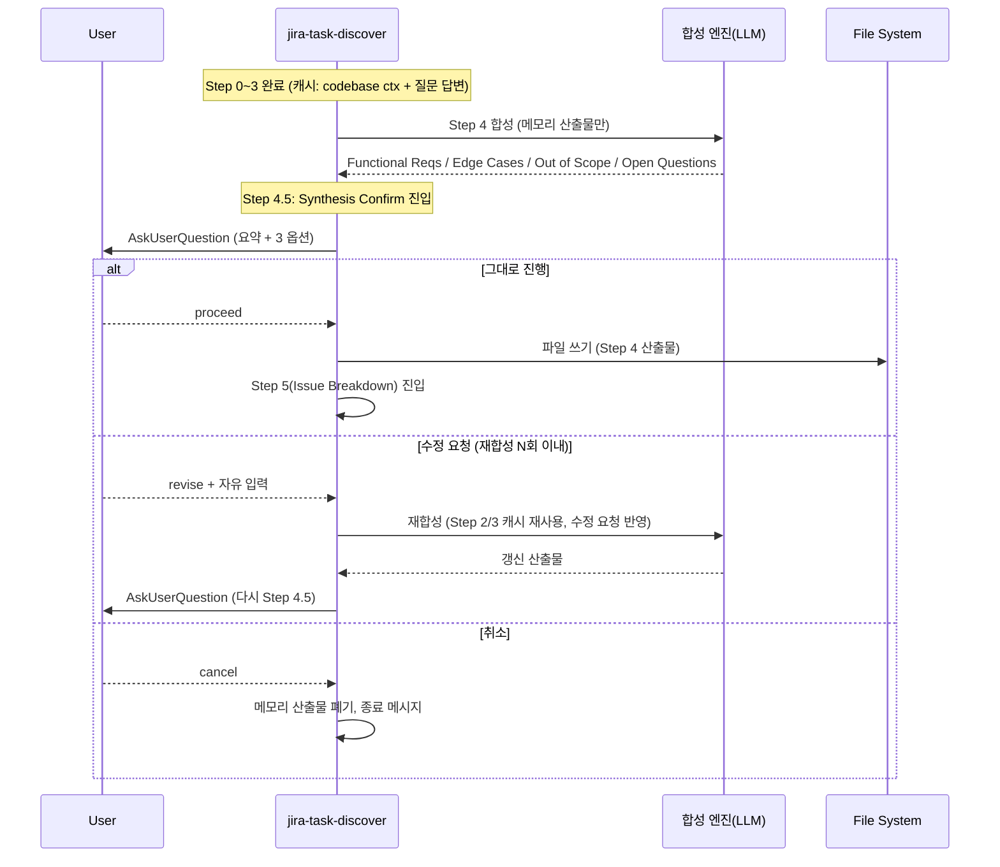
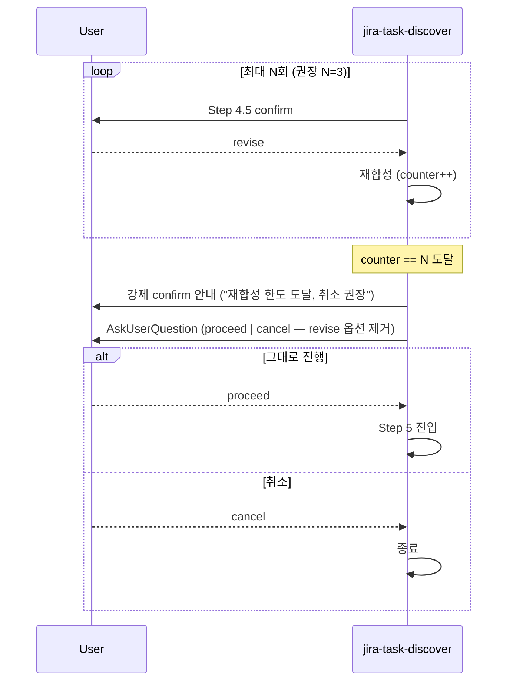

# Design: MAE-168 - [1.1.9] discover Step 4.5 Confirm Gate 도입

## Overview

본 설계는 단일 마크다운 파일(`skills/jira-task-discover/SKILL.md`) 수정에 대한 **경량(lightweight) 설계**이다. 코드 변경은 없으며, discover 스킬 워크플로의 Step 4와 Step 5 사이에 합성 결과 confirm gate(`Step 4.5: Synthesis Confirm`)를 삽입해 LLM hallucination·임의 분해 끊김·모순 입력으로 인한 품질 저하를 사용자 검증으로 차단한다.

- **Plan 참조**: `docs/plan/MAE-168.plan.md`
- **수정 대상 스킬**: `skills/jira-task-discover/SKILL.md` (단일 파일)
- **참고 패턴**: 같은 스킬의 기존 `AskUserQuestion` 호출(Step 0/Step 1/Step 3), `jira-task-create` 스킬의 batched 질문 패턴
- **협력 관계**: MAE-170(Conflict Detection)의 결과를 Step 4.5에서 우선 표시하는 인터페이스 한 줄을 본 설계에서 미리 합의 — 실제 데이터 표시 구현은 MAE-170 머지 후 후속 PR

## Architecture

### 워크플로 변경 위치

```
Step 0: Parse Arguments
Step 1: Slug Generation & Confirm
Step 2: Codebase Context Collection
Step 3: Batched Questions
Step 4: Generate Requirements Document          ← (변경) 합성을 메모리상에 보관, 파일 쓰기 시점 지연
Step 4.5: Synthesis Confirm                      ← (신규) 본 태스크의 핵심
Step 5: Issue Breakdown Section                  ← (유지) 진입 조건만 "Step 4.5 confirm 통과 후"로 명시
Step 6: Completion Summary                       ← (보강) "다음 단계" 안내에 변동 없음
Inline Fallback Template                         ← (불변)
Error Handling                                   ← (보강) 시나리오 2건 추가
Non-goals                                        ← (불변)
```

### Step 4의 책임 재정의 (Plan Risk #4 대응)

기존 Step 4는 "합성 + 파일 쓰기"를 한 번에 수행하는 것으로 읽힐 수 있다. 본 변경 후에는 **합성은 메모리상 산출물로만 두고 파일 쓰기는 Step 4.5 confirm 통과 후로 지연**하는 것을 SKILL.md에 명시한다. 이렇게 해야 "취소" 분기에서 cleanup 비용 없이 종료 가능하다(Plan Edge Case 3).

- 재합성 시 Step 2(코드 컨텍스트), Step 3(질문 답변)은 **재사용**한다 — Step 4의 "합성" 부분만 다시 실행
- 캐시 키: `(slug, mode, fromPath, step3 answers hash)` 단위로 변하지 않음을 SKILL.md에 명시

### Confirm 표시 규약 (인터페이스 합의)

| 모드 | confirm 대상 섹션 |
|------|------------------|
| default | Functional Requirements / Edge Cases / Out of Scope / Open Questions |
| `--lite` | Functional Requirements / Open Questions (Edge Cases·Out of Scope는 lite에서 생성하지 않으므로 자동 제외) |
| `--from` | default와 동일 — 단, "import 베이스 위에서 합성·보강된 부분"임을 안내 문구로 표기 (Trace Marker는 MAE-169 위임) |

각 섹션은 **요약 표시 3줄 이내** (Plan Risk #1: 단순 입력 마찰 최소화). 항목이 많으면 상위 3개 + "외 N건" 표기.

### MAE-170 협력 인터페이스 (선표기)

MAE-170(Conflict Detection)이 머지되면 `--from` 모드에서 입력간 모순이 conflict 결과 객체로 산출된다. 본 태스크는 다음 한 줄을 SKILL.md Step 4.5 모두(冒頭)에 미리 명시한다:

> "Conflict Detection 결과(MAE-170)가 존재하면 합성 결과 요약보다 먼저 표시한다."

본 태스크에서는 **conflict 데이터 자체는 수집·표시하지 않는다** — 인터페이스 슬롯만 예약한다.

## Sequence Diagram

### 정상 플로우 (default · --lite · --from 공통)



### 무한 루프 방지 가드 (재합성 N회 초과 시)



## Implementation Plan

본 태스크는 단일 파일 수정이며 **코드 변경이 없다**. 아래는 SKILL.md에 추가/보강할 마크다운 섹션의 변경 요약이다 (실제 본문은 impl 단계에서 작성).

| # | 위치 | 변경 내용 (1-2줄 요약) |
|---|------|----------------------|
| 1 | Step 4 본문 (현행 114-136줄) | 한 줄 추가: "합성 산출물은 메모리상으로만 보관하며, 파일 쓰기는 Step 4.5 confirm 통과 후로 지연한다." |
| 2 | Step 4와 Step 5 사이 (현행 137줄 직후) | 신규 `### Step 4.5: Synthesis Confirm` 섹션 삽입 (요약 표시 규칙 + AskUserQuestion 의사코드 + 3분기 절차 + 무한 루프 가드 + lite/from 분기) |
| 3 | Step 5 첫 문장 | 한 줄 보강: "Step 4.5 confirm을 통과한 합성 결과를 입력으로 받아 ..." (진입 조건 명시) |
| 4 | Step 6 Completion Summary | 변경 없음. **Progress 라인의 외부 단계명은 "discover" 그대로 유지** (Plan Risk #6: 외부 인터페이스 안정성) |
| 5 | Error Handling 표 | 시나리오 2건 추가: (a) "재합성 한도(N=3) 초과 — 강제 confirm + 취소 권장", (b) "Step 4.5 취소 — 메모리 산출물 폐기, 파일 미생성" |
| 6 | Non-goals 섹션 | 변경 없음. (`completedSteps` 갱신, Jira 이슈 생성 등 기존 Non-goal 그대로) |

### Step 4.5 본문 구성 명세 (인터페이스 수준)

impl 단계에서 작성할 Step 4.5 마크다운의 **구조만** 명시 — 실제 본문은 코드 작성 금지 원칙에 따라 impl에서 작성한다.

1. **헤딩**: `### Step 4.5: Synthesis Confirm`
2. **모두(冒頭) 1줄**: MAE-170 협력 인터페이스 선표기 (Conflict Detection 결과 우선 표시 안내)
3. **요약 표시 규칙 단락**: 어떤 섹션을 어떻게 (3줄 이내, 상위 3개 + "외 N건") 보여줄지 명시
4. **모드별 confirm 대상 매핑표**: default / `--lite` / `--from` 각 모드에서 표시할 섹션 목록 (위 Architecture 표와 동일)
5. **AskUserQuestion 의사코드 블록**: 옵션 3개와 라벨 명시 (실제 함수 호출이 아닌 명세 형태)
   - `proceed` — "그대로 진행"
   - `revise` — "수정 요청"
   - `cancel` — "취소"
6. **분기 처리 절차** (각 1단락):
   - **proceed**: Step 4 산출물 파일 쓰기 → Step 5 진입
   - **revise**: 자유 입력 1줄 수신 → 빈 문자열/공백이면 직전 결과로 confirm 복귀(Plan Edge Case 2) → 재합성 카운터 증가 → Step 2/3 캐시 재사용해 합성 부분만 재실행 → Step 4.5 재진입
   - **cancel**: 메모리 산출물 폐기 → 한국어 종료 메시지 → 비정상 종료 코드 없음 (정상 cancel)
7. **무한 루프 방지 가드**: 카운터 N=3 권장값 명시. 도달 시 revise 옵션 제거하고 proceed/cancel 2분기로 축약
8. **재합성 동일성 회피**: 직전 결과와 완전히 동일하면 "변경 없음" 안내 + 카운터 증가 (Plan Edge Case 1)
9. **비대화형 환경 안전장치**: AskUserQuestion 응답 부재 시 default `proceed` 적용 안내 (Plan Edge Case 4)
10. **Functional Requirements 0건 경고**: "합성 항목 없음 → 빈 문서 생성됨" 경고 1줄 (Plan Edge Case 6)

### Naming/Identifier 정의 (이름과 역할만 — 시그니처 수준)

| 식별자 | 종류 | 역할 |
|--------|------|------|
| `Step 4.5: Synthesis Confirm` | SKILL.md 헤딩 | 신규 섹션 헤딩. 정확한 헤딩명 고정 (AC-1 검증 기준) |
| `proceed` / `revise` / `cancel` | AskUserQuestion 옵션 라벨 ID | 3개 옵션의 내부 식별자. 실제 사용자 노출 라벨은 한국어 ("그대로 진행"/"수정 요청"/"취소") |
| `RESYNTHESIS_LIMIT` (값: 3) | 상수 (마크다운 명세상의 값) | 재합성 최대 횟수 가드. SKILL.md 본문에 숫자로 명시 |
| `synthesis cache key` | 개념적 캐시 키 | `(slug, mode, fromPath, step3 answers hash)`. 재합성 시 Step 2/3 결과 재사용 단위 |

## Error Handling

본 태스크에서 **새로 추가**되는 시나리오 (SKILL.md Error Handling 표에 신설):

| 시나리오 | 처리 전략 |
|---------|----------|
| Step 4.5에서 재합성 한도(N=3) 초과 | revise 옵션 제거 후 proceed/cancel 2분기 강제 confirm. 사용자에게 "재합성 한도 도달 — 취소 권장" 안내 메시지 |
| Step 4.5 cancel 선택 | 메모리상 합성 산출물 폐기. 파일 시스템에는 아직 쓰지 않은 상태이므로 cleanup 불필요. 한국어 종료 메시지 1줄 출력 후 정상 종료 |

기존 시나리오 변동 없음 (회귀 방지 — AC-5).

## Security Checklist

본 태스크는 마크다운 명세 수정만 다루며, 코드/네트워크/파일 시스템 변경이 없다.

- [x] 외부 입력 처리 없음 (사용자 입력은 AskUserQuestion 표준 흐름)
- [x] 자격증명/시크릿 노출 없음
- [x] 실행 가능 코드 추가 없음 (마크다운만)
- [x] 경로 트래버설 위험 없음 (수정 대상 경로 단일 고정)
- [x] 의존성 추가 없음
- [x] cancel 분기에서 임시 산출물이 파일로 새지 않도록 "Step 4 파일 쓰기 시점을 Step 4.5 이후로 지연" 명시 — 정보 누출 방지

별도 보안 검토 항목 없음.

## Test Plan

본 태스크는 SKILL.md 명세 변경이며, **자동화 테스트는 작성하지 않는다** (Plan Implementation Strategy: "Step 4.5 자체의 자동화/CI 테스트 추가 — 본 단계는 사용자 인터랙션 의존이 본질"). 대신 **수동 검증 명세** 6건으로 모든 AC를 커버한다. 각 케이스는 impl 단계에서 변경된 SKILL.md를 대상으로 즉시 실행 가능한 형태로 작성했다.

### Manual Verification Cases

#### TC-1: Step 4.5 섹션 신설 및 위치 (AC-1)

- **목적**: `### Step 4.5: Synthesis Confirm` 헤딩이 Step 4 ↔ Step 5 사이에 정확히 위치하고 본문이 비어있지 않음
- **방법**: `grep -n '^### Step ' skills/jira-task-discover/SKILL.md`로 모든 H3 헤딩 줄 번호 추출 → 순서가 `Step 0 → 1 → 2 → 3 → 4 → 4.5 → 5 → 6`인지 확인. `awk`로 Step 4.5 본문 라인 수 측정
- **기대 결과**:
  - `Step 4.5: Synthesis Confirm` 헤딩이 Step 4 다음 / Step 5 직전에 위치
  - Step 4.5 본문 라인 수 ≥ 20 (요약 표시 규칙 + 의사코드 + 3분기 + 가드)
- **경계 조건**: 헤딩이 누락되거나 위치가 어긋나면 AC-1 위반. 본문이 1-2줄에 그치면 명세 부족으로 AC-2 위반 가능

#### TC-2: AskUserQuestion 호출 형식과 3개 옵션 명시 (AC-2)

- **목적**: Step 4.5 본문에 AskUserQuestion 의사코드/예시가 포함되고, 옵션 3개(`proceed` / `revise` / `cancel`)가 모두 한국어 라벨과 함께 명시됨
- **방법**: `awk '/### Step 4.5/,/### Step 5/' skills/jira-task-discover/SKILL.md`로 Step 4.5 블록 추출 후, `AskUserQuestion`, "그대로 진행", "수정 요청", "취소" 각 키워드 grep
- **기대 결과**: 4개 키워드 모두 등장. 각 옵션이 분기 처리 절차와 함께 설명됨
- **경계 조건**: 옵션 1개라도 누락되면 AC-2 위반

#### TC-3: 무한 루프 방지 가드 (AC-3)

- **목적**: 재합성 최대 횟수 N(권장 3)이 명시되고, 초과 시 동작이 정의됨
- **방법**: TC-2와 동일하게 Step 4.5 블록 추출 후, "3" 또는 "N=3" 또는 "최대" 키워드와 "강제 confirm" 또는 "한도" 키워드 grep
- **기대 결과**: N 값이 숫자로 명시되고, 초과 시 동작(revise 옵션 제거 + proceed/cancel 강제 분기)이 1단락 이상으로 정의됨
- **경계 조건**: N 값이 모호("적당히 N회")하거나 초과 시 동작이 빠지면 AC-3 위반

#### TC-4: --lite 모드 호환성 (AC-4)

- **목적**: `--lite` 모드에서 confirm 대상 섹션 목록이 default와 어떻게 다른지 명시됨
- **방법**: Step 4.5 블록에서 `--lite` 키워드 라인 grep + 매핑표(default vs lite) 존재 확인
- **기대 결과**:
  - `--lite` 모드에서는 Edge Cases·Out of Scope 섹션이 confirm 대상에서 제외됨이 명시
  - Functional Requirements와 Open Questions는 lite 모드에서도 confirm 대상 유지(Plan Risk #5: lite gate 무의미화 방지)
- **경계 조건**: lite 분기 언급이 없거나 매핑표에서 lite 컬럼이 누락되면 AC-4 위반

#### TC-5: --from 모드 상호작용 (AC-6)

- **목적**: import 베이스 위에서 합성·보강된 부분의 식별·표시 정책이 1줄 이상 언급됨 (또는 MAE-169/170 위임 표기)
- **방법**: Step 4.5 블록에서 `--from` 키워드 라인 grep
- **기대 결과**:
  - `--from` 모드에서 합성·보강 부분 표시 정책 1줄 이상 언급
  - 또는 "Trace Marker는 MAE-169 위임", "Conflict Detection은 MAE-170 위임" 형태의 위임 표기 1건 이상
- **경계 조건**: `--from` 언급이 전혀 없으면 AC-6 미충족 (다만 AC-6은 "선택적 강화"라 plan 상 위반보다는 약점)

#### TC-6: 회귀 방지 — 다른 섹션 무결성 (AC-5)

- **목적**: Step 4.5 신설로 인한 부수 수정이 일관되며, 기존 섹션 의미를 깨지 않음
- **방법**: `git diff skills/jira-task-discover/SKILL.md`를 직접 검토. 다음 항목을 체크리스트로 확인:
  1. Step 0/1/2/3의 본문 의미 변동 없음 (공백·줄바꿈 외 변경 없음)
  2. Step 4 본문에 "파일 쓰기 시점 지연" 1줄만 추가됨 (다른 흐름 변동 없음)
  3. Step 5 본문에 "Step 4.5 통과 후" 진입 조건 1줄만 보강됨
  4. Step 6 Completion Summary의 Progress 라인은 변경 없음 (외부 단계명 "discover" 유지 — Plan Risk #6)
  5. Inline Fallback Template 본문 변동 없음 (placeholder, 섹션 순서 모두 동일)
  6. Error Handling 표에 시나리오 2건만 추가 (기존 행 수정 없음)
  7. Non-goals 섹션 변동 없음
- **기대 결과**: 7개 항목 모두 OK
- **경계 조건**: 1개 항목이라도 의도 외 변경이 있으면 AC-5 위반. 특히 외부 단계명("discover")이 Progress 라인에서 변경되면 외부 인터페이스 깨짐

### Acceptance Criteria → Test Case Mapping

| AC | 검증 케이스 |
|----|------------|
| AC-1 (Step 4.5 신설 및 위치) | TC-1 |
| AC-2 (AskUserQuestion 형식) | TC-2 |
| AC-3 (무한 루프 가드) | TC-3 |
| AC-4 (--lite 호환성) | TC-4 |
| AC-5 (회귀 방지) | TC-6 |
| AC-6 (--from 상호작용) | TC-5 |

### 사용자 인터랙션 시나리오 (수동, 선택 검증)

discover 스킬 실호출은 **선택**이며, 명세 자체가 contract이므로 review 단계에서는 위 TC-1~TC-6의 정적 검증만으로 AC를 모두 커버한다. 시간이 허락하면 다음 4개 시나리오로 동작 확인:

1. **정상 confirm**: 단순 주제 입력 → Step 4.5에서 `proceed` 선택 → 파일 생성 정상 완료
2. **수정 요청 1회**: Step 4.5에서 `revise` 선택 + 자유 입력 → 재합성 → 다시 Step 4.5 도달 → `proceed`로 종료
3. **수정 요청 N회 초과**: `revise`를 4회 연속 선택 → 4번째에서 revise 옵션 사라지고 proceed/cancel만 남음
4. **취소**: Step 4.5에서 `cancel` 선택 → 종료 메시지 출력 + `docs/requirements/<slug>.requirements.md` 미생성 확인

## Out of Scope (Design 단계 명시)

본 설계에서 의도적으로 다루지 않는 항목 (Plan Out of Scope와 정합):

- **Trace Marker 도입 (MAE-169)**: Step 4.5에서는 "import 베이스 위에서 합성·보강된 부분 표시 정책"을 한 줄 위임 표기로만 다룬다. 실제 마커 적용은 MAE-169 책임
- **Conflict Detection (MAE-170)**: Step 4.5 모두에 "conflict 결과 우선 표시" 인터페이스 한 줄만 예약. 실제 conflict 데이터 수집·표시는 MAE-170 머지 후 후속 PR
- **`templates/requirements.template.md` 변경 (MAE-171)**: 본 태스크 범위 외
- **discover 스킬 외 파일 변경**: `commands/jira-task.md`, hooks, CLAUDE.md 등 일체 변동 없음
- **Step 4.5의 자동화 테스트/CI**: 사용자 인터랙션 의존이 본질이므로 수동 검증으로 한정
- **`completedSteps` 갱신**: discover의 Non-goal 그대로 유지 (MAE-118 책임)
