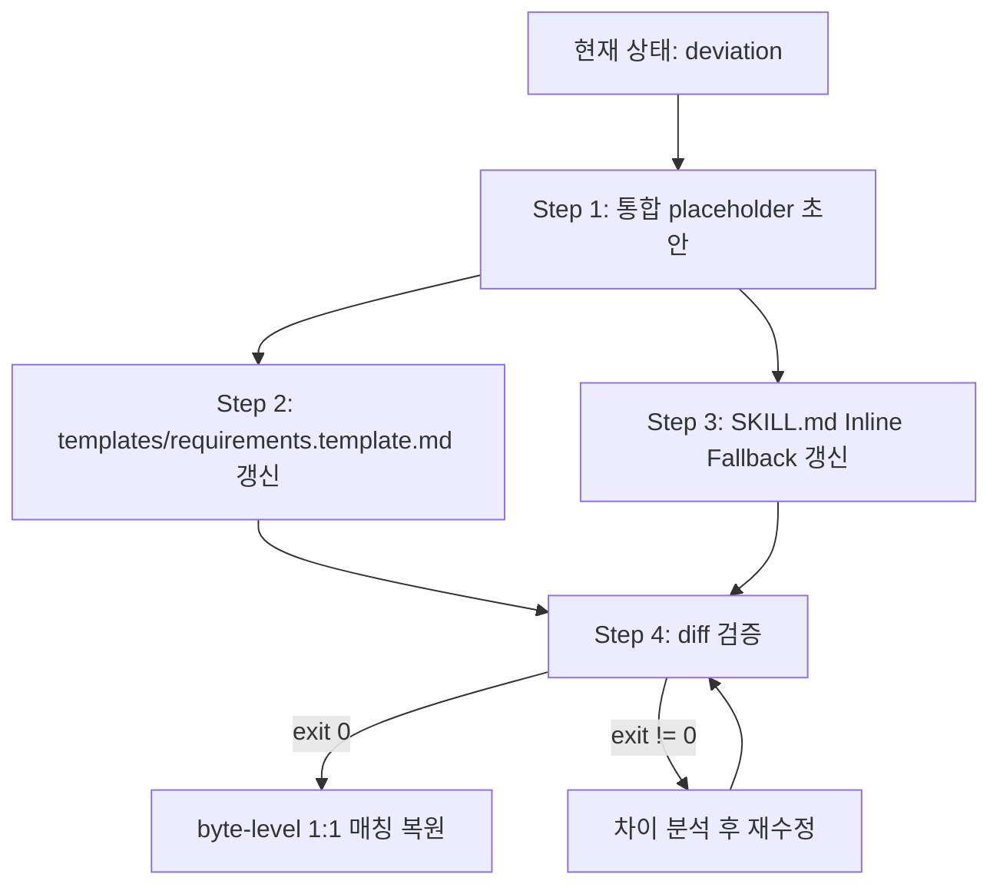

# Design: MAE-171 - [1.1.12] requirements.template.md placeholder 강화 + fallback 동기화

## Architecture

문서 템플릿 동기화 작업이므로 런타임 컴포넌트 변경은 없다. 영향 범위는 두 파일:

- `templates/requirements.template.md` — discover Step 4가 우선 참조하는 외부 템플릿
- `skills/jira-task-discover/SKILL.md`의 Inline Fallback Template (현재 L394-459) — 외부 템플릿 부재 시 fallback

**관계 (현재):**

```
discover Step 4
    │
    ├─ exists? ──→ templates/requirements.template.md   (외부 템플릿, 단순 placeholder)
    │
    └─ missing ─→ Inline Fallback Template (SKILL.md L394-459, trace marker 예시 포함)
```

**MAE-117 AC-2 규약**: 두 파일은 byte-level 1:1 매칭이어야 한다. 현재 1.1.10 시점부터 Inline Fallback에만 trace marker가 추가되어 deviation 상태. 본 작업으로 둘 다 강화된 placeholder로 동기화하여 매칭 복원.

## Data Model

`N/A — no data changes` (문서 placeholder 변경만 수행, 런타임 데이터 모델 변경 없음).

## Sequence Diagram

본 작업의 변경은 정적 파일 갱신이므로 시퀀스 다이어그램 대신 **변경 흐름**을 표시:



## Implementation Plan

### File 1: `templates/requirements.template.md`

전면 재작성 (작은 파일이라 부분 수정보다 전체 교체가 안전). 강화 대상 섹션:

- **Goals & Success Criteria**: placeholder에 측정 sub-template 형식 안내 추가 (`<지표명> · <현재값> → <목표값> · <측정방법>` 한 줄 예시)
- **Functional Requirements**: 각 항목에 1.1.10 trace marker 형식 4종 예시 (Q+code 결합 / Q-only / code-only / synthesized)
- **Edge Cases / Out of Scope**: trace marker 예시 동기화 (Inline Fallback과 일치)
- **Open Questions**: P1/P2/P3 우선순위 마커 형식 + 의미 설명 추가, [CONFLICT] 항목과의 관계 안내

### File 2: `skills/jira-task-discover/SKILL.md` (Inline Fallback Template 섹션, L394-459)

`Edit` 도구로 해당 코드 블록 전체를 File 1과 동일 내용으로 교체. 코드 블록 외부 텍스트(섹션 제목, 설명 문장)는 건드리지 않는다.

### 검증 단계

```bash
# Inline Fallback의 정확한 라인 범위 재확인 (수정 후 라인 시프트 가능)
grep -n "^# Requirements:" skills/jira-task-discover/SKILL.md   # 시작 라인
grep -n "^\`\`\`$" skills/jira-task-discover/SKILL.md           # 코드 블록 종료 라인 후보

# byte-level diff
diff <(sed -n '<start>,<end>p' skills/jira-task-discover/SKILL.md) templates/requirements.template.md
echo "exit: $?"   # 0이어야 함
```

### 주의사항

- 두 파일을 같은 세션에서 동기 수정 (한쪽 잊으면 즉시 deviation)
- Inline Fallback은 markdown 코드 블록 안에 있으므로, 펜스(```` ``` ````) 바깥은 수정 금지
- `--lite` 모드 안내 주석(`<-- --lite 모드면 이 섹션 통째로 생략 -->`)은 보존하면서 trace marker 안내만 동기화
- `[CONFLICT]` 예시 항목은 1.1.11(MAE-170) 산출물이므로 그대로 유지

## Error Handling

| 시나리오 | 처리 |
|---------|------|
| 두 파일이 byte-level 매칭 안 됨 (`diff` exit != 0) | `diff` 출력 분석 → 차이 부분 재수정 → 재검증 (impl Task 5에서 강제) |
| Inline Fallback 코드 블록 펜스 손상 | SKILL.md 마크다운 파싱 깨짐 — `Edit` 시 펜스 라인 제외하고 본문만 교체로 방지 |
| 라인 범위 변경(예: 본문 길이 증감)으로 `sed -n` 범위가 잘못됨 | `grep -n "^# Requirements:"` 와 종료 펜스 위치를 동적으로 재계산 |
| Goals 측정 sub-template이 `--lite` 5줄 제한 초과 | placeholder 예시는 1줄로 제한 (제약은 SKILL.md L214에 기존 명시) |

## Security Checklist

- [x] 외부 입력 처리 변경 없음 (문서 placeholder 갱신만)
- [x] 인증/인가 영향 없음
- [x] 시크릿/자격증명 변경 없음
- [x] 의존성 추가 없음

## Test Plan

런타임 코드 변경이 없으므로 unit/E2E 자동화 테스트는 추가하지 않는다. 대신 **수동 + 정적 검증**으로 AC를 만족시킨다.

### Manual Verification Cases

| Case | 검증 방법 | 기대 결과 | 대응 AC |
|------|----------|----------|--------|
| TC-1: Goals 측정 sub-template 적용 | `grep -A 2 "## Goals" templates/requirements.template.md` | `<지표명> · <현재값> → <목표값> · <측정방법>` 패턴 등장 | AC-1 |
| TC-2: FR trace 필드 적용 | `grep -A 6 "## Functional Requirements" templates/requirements.template.md` | `*(source: Q...` / `*(code: ...)*` / `*(synthesized)*` 4종 예시 모두 등장 | AC-2 |
| TC-3: trace marker 형식 1.1.10과 일치 | TC-2 결과를 SKILL.md L237-242의 marker 표준 표와 대조 | 마커 형식·콤마 구분·구두점 일치 | AC-2, 1.1.10 호환 |
| TC-4: Open Questions P1/P2/P3 마커 적용 | `grep -B 1 -A 8 "## Open Questions" templates/requirements.template.md` | `[P1]`, `[P2]`, `[P3]` 마커 + 의미 설명 등장 | AC-3 |
| TC-5: Inline Fallback 동기화 | `grep -n "^# Requirements:"` 로 시작 라인 확인 후 동일 강화 내용 존재 | TC-1~4의 강화 내용이 SKILL.md Inline Fallback 블록에도 등장 | AC-4 |
| TC-6: byte-level 1:1 매칭 (핵심) | `diff <(sed -n '<S>,<E>p' skills/jira-task-discover/SKILL.md) templates/requirements.template.md; echo $?` | 출력 없음, exit 0 | AC-5 |
| TC-7: --lite 안내 주석 유지 | `grep -- "--lite 모드" templates/requirements.template.md` | Edge Cases / Out of Scope 안내 주석 2건 존재 | AC-6 (MAE-117 AC-4 유지) |
| TC-8: 섹션 구조 호환 | 양 파일 H2 헤더 목록 추출 후 비교 (`grep "^## "`) | 동일 H2 9개 (Stakeholders, Goals, Constraints, NFR, Codebase Context, FR, Edge Cases, Out of Scope, Open Questions, Proposed Issue Breakdown — 총 10개) | AC-6 (MAE-117 AC-2/AC-3 유지) |
| TC-9: discover --from 분기 호환 | SKILL.md L245-254 `--from` marker 변형 표가 변경되지 않음 | 본 작업이 SKILL.md 본문(코드 블록 외)을 건드리지 않았음을 확인 (`git diff` 검토) | AC-6 |

### Regression Verification

- TC-6의 `diff` exit 0이 핵심 게이트. 이것 하나로 AC-1~AC-4의 동기화 여부가 한 번에 검증됨.
- TC-9는 본 작업의 surgical change 원칙(Inline Fallback 코드 블록만 수정) 확인.
