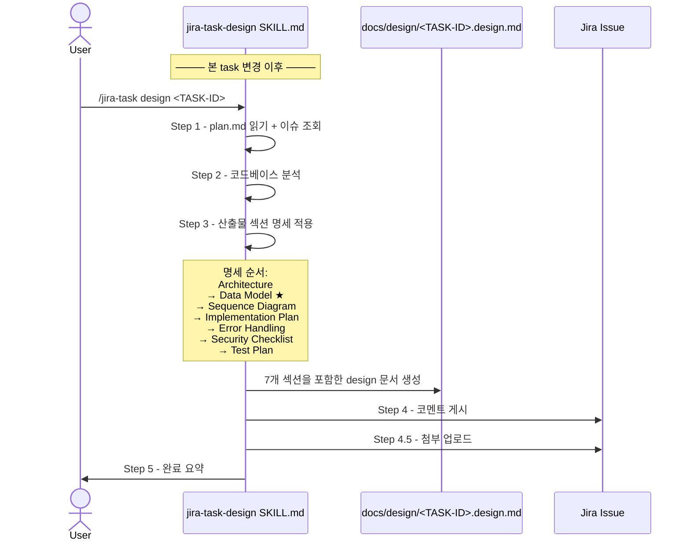

# Design: MAE-172 - [Phase 1.1] design 단계에 Data Model 섹션 추가

> 본 태스크는 단일 마크다운 문서(`skills/jira-task-design/SKILL.md`)의 surgical 편집이며, 인프라성(메타 레벨) 변경이다. 코드 로직 변경은 없으나 다른 모든 후속 task의 design 산출물 형식에 영향이 있으므로, 본 design 문서는 **편집 위치/문구/순서**를 정밀 명세하여 impl 단계가 기계적으로 적용 가능하도록 작성한다.

## Architecture

### 영향 범위 (Affected Components)

| 컴포넌트 | 경로 | 변경 종류 |
|----------|------|-----------|
| design 스킬 명세 | `skills/jira-task-design/SKILL.md` | 본문 편집 (Step 3 산출물 섹션 목록 확장) |
| 플러그인 메타 | `.claude-plugin/plugin.json` | `version` 패치 증가 (`0.15.0` → `0.15.1`) |
| (참조 only) plan/impl/test/review 스킬 | `skills/jira-task-{plan,impl,test,review}/SKILL.md` | 변경 없음 (영향 없음 검증 대상) |
| (참조 only) 기존 design 문서들 | `docs/design/MAE-*.design.md` | 변경 없음 (retrofit 안 함) |

### 변경 레이어와 책임 경계

```
사용자 입력 (/jira-task design <TASK-ID>)
        │
        ▼
commands/jira-task.md  ← 변경 없음 (라우팅 그대로)
        │
        ▼
skills/jira-task-design/SKILL.md  ← 본 태스크의 책임 (Step 3 명세 확장)
   - Step 1: prerequisites
   - Step 2: codebase analysis
   - Step 3: 산출물 섹션 명세 ★ Data Model 항목 추가 위치 ★
   - Step 4: Jira 코멘트
   - Step 4.5: 첨부 업로드
   - Step 5: completion summary
        │
        ▼
docs/design/<TASK-ID>.design.md  ← 본 변경 이후 생성되는 문서들에 자동 반영
```

본 task는 **Step 3의 산출물 섹션 목록**만 편집한다. Step 1/2/4/4.5/5는 변경 없음. 따라서 다른 스킬 동작이나 워크플로 흐름에는 영향을 주지 않는다.

### Data Model 섹션 위치 결정의 근거

design 문서의 자연스러운 독해 흐름:

```
정적 구조 (Architecture)
    → 데이터 구조 (Data Model)         ← 신규 삽입 위치
        → 동적 흐름 (Sequence Diagram)
            → 변경 계획 (Implementation Plan)
                → 예외 (Error Handling)
                    → 안전 (Security Checklist)
                        → 검증 (Test Plan)
```

Architecture(컴포넌트가 무엇인지)와 Sequence Diagram(컴포넌트가 어떻게 상호작용하는지) 사이에 Data Model(컴포넌트가 다루는 데이터가 무엇인지)이 들어가는 것이 인지적으로 일관된다.

## Data Model

> 본 task는 SKILL.md 명세 문서 한 파일의 텍스트 편집이며, DB/엔티티/API 페이로드/도메인 객체 등 데이터 모델 변경이 전혀 없다.

**N/A — no data changes**

(자기 적용 사례: 본 task가 도입하는 fallback 가이드 문구를 본 design 문서 자체에서도 적용하여, 향후 사용자가 동일한 케이스를 만났을 때의 표준 처리 예시로 기능한다.)

## Sequence Diagram



본 task의 변경은 위 시퀀스에서 **Step 3의 산출물 섹션 목록**에만 국한된다. 호출 순서/파라미터/반환값 등 외부 인터페이스는 변경되지 않는다.

## Implementation Plan

### 변경 파일 목록

| 파일 | 변경 요약 | 변경 라인 추정 |
|------|----------|--------------|
| `skills/jira-task-design/SKILL.md` | Step 3 산출물 섹션 목록에 Data Model 항목을 Architecture와 Sequence Diagram 사이에 삽입 + fallback 가이드 추가 | +18 ~ +22 라인 |
| `.claude-plugin/plugin.json` | `version` 필드 `0.15.0` → `0.15.1` | 1 라인 수정 |

### 변경 위치 정밀 명세

#### 1. `skills/jira-task-design/SKILL.md` — Step 3 본문

**현재 라인 46-58 사이의 산출물 섹션 목록**을 다음 순서로 재구성한다:

| 순서 | 섹션 | 현행 | 변경 후 |
|------|------|------|---------|
| 1 | Architecture | 라인 46 | 동일 (변경 없음) |
| 2 | **Data Model** | (없음) | **신규 추가** ★ |
| 3 | Sequence Diagram | 라인 47 | 위치만 한 칸 밀림 (변경 없음) |
| 4 | Implementation Plan | 라인 48-51 | 동일 |
| 5 | Error Handling | 라인 52 | 동일 |
| 6 | Security Checklist | 라인 53 | 동일 |
| 7 | Test Plan | 라인 54-58 | 동일 |

#### 2. Data Model 섹션 명세 본문 (SKILL.md에 삽입할 텍스트)

다음 구조의 텍스트를 Architecture 직후, Sequence Diagram 직전에 삽입한다 (코드는 impl 단계에서 작성, 본 design 단계에서는 명세 수준):

- 섹션 헤더: **Data Model**
- 한 줄 설명: 데이터 모델링 합의 (엔티티 / 스키마 / DTO / 도메인 / 상태 / 흐름)
- 권장 하위 항목 6종 (모두 "해당 시 (applicable when)" 가이드 명시):
  1. **새/변경되는 엔티티**: 속성 · 타입 · 제약 · 관계
  2. **DB 스키마**: 테이블 / 컬럼 / 인덱스 / FK / 마이그레이션 전략
  3. **API 페이로드**: 요청 / 응답 DTO 구조 (시그니처 수준 — 코드 금지)
  4. **도메인 객체**: 핵심 entity / value object 구조 (이름과 역할)
  5. **상태 모델**: 상태 전이 다이어그램 (Mermaid `stateDiagram` 권장)
  6. **데이터 흐름**: source → transform → sink (in-memory 캐시/세션 포함)
- fallback 가이드: 데이터 변경이 전혀 없는 task는 **`N/A — no data changes`** 한 줄로 처리 가능
- 코드 작성 금지 규칙은 Implementation Plan과 동일 (시그니처/명세 수준만 허용) — 일관성 유지

#### 3. `.claude-plugin/plugin.json` — version 증가

```diff
- "version": "0.15.0",
+ "version": "0.15.1",
```

CLAUDE.md 규칙: "프로젝트 내용(스킬, 훅, 설정 등)이 변경되면 `.claude-plugin/plugin.json`의 `version`도 반드시 함께 증가시킬 것." → 패치 레벨 증가 (스킬 명세 추가, 기능 추가 아님).

### Step 4 Jira 코멘트 예시 영향 검토

현행 SKILL.md Step 4 (라인 60-79)의 코멘트 템플릿은 다음 3개 키만 노출한다:

- 아키텍처
- 수정 파일
- 테스트 전략

**결정: 본 task에서는 Step 4 코멘트 예시를 변경하지 않는다.**

근거:
- 코멘트는 "요약" 목적이며, 모든 섹션을 1:1 매핑하지 않는다 (현행도 Sequence/Error Handling/Security가 코멘트에 없음)
- Data Model을 코멘트에 추가하면 데이터 변경 없는 task에서 매번 "N/A"가 노출되어 노이즈가 됨
- 데이터 변경이 핵심인 task의 경우, 작성자가 "아키텍처" 항목에 Data Model 요약을 자유 형식으로 포함시킬 수 있음 (가이드 충분)

이 결정을 **AC-5의 충족 근거**로 plan/design 문서에 명시 (AC-5: "영향이 없다면 변경 없음(현 상태 유지)이 의도적 결정이다").

### 구현 순서 (impl 단계 작업 순서)

1. SKILL.md 라인 46-47 사이에 Data Model 섹션 텍스트 삽입 (Architecture 다음)
2. fallback 가이드 문구(`N/A — no data changes`)가 섹션 본문에 포함되어 있는지 확인
3. plugin.json `version` 0.15.0 → 0.15.1 변경
4. 변경 후 grep 검증:
   - `grep -n "Data Model" skills/jira-task-design/SKILL.md` → 1개 이상 매치
   - `grep -n "N/A — no data changes" skills/jira-task-design/SKILL.md` → 1개 이상 매치
   - `grep -n "0.15.1" .claude-plugin/plugin.json` → 1개 매치
5. 다른 스킬 SKILL.md 파일에 Data Model 관련 변경이 침범하지 않았는지 git diff로 확인 (surgical change 검증)

## Error Handling

본 task는 단일 마크다운 문서 텍스트 편집 + 단일 JSON 필드 값 변경이다. 런타임 에러 시나리오는 사실상 없다. 다만 **편집 자체의 실패 모드**를 다음과 같이 정의하여 impl/review 단계 검증 기준으로 사용한다.

| 시나리오 | 발생 조건 | 처리 전략 |
|---------|----------|----------|
| 섹션 위치 오삽입 | Architecture와 Sequence Diagram 사이가 아닌 다른 위치 (예: Test Plan 뒤) | review 단계에서 섹션 순서 grep 검증 / 위치 시정 |
| fallback 문구 누락 | "N/A — no data changes" 문구 미포함 | grep 검증 실패 시 추가 편집 |
| 권장 하위 항목 6종 누락 | 6종 중 일부만 명시 | review 단계 체크리스트로 6종 모두 명시 확인 |
| plugin.json version 미증가 | impl 시 잊고 빠뜨림 | review 체크리스트 / 후속 task의 캐시 미반영 위험 차단 |
| 다른 스킬 SKILL.md 무관 변경 | 실수로 인접 파일을 수정 | git diff 확인 — `skills/jira-task-design/SKILL.md`와 `.claude-plugin/plugin.json` 외 변경 없어야 함 |
| 권장 하위 항목 6종을 사용자가 강제로 모두 채우려 시도 | 가이드 문구의 톤 문제 | "권장 (recommended)" 및 "해당 시 (applicable when)" 명시로 완화 |

## Security Checklist

본 task는 데이터 처리 / 인증 / 외부 호출 / 민감 정보 다루지 않는다. 보안 면 영향은 없으나, 추가되는 Data Model 섹션이 향후 다른 task의 design 품질에 미치는 **간접 보안 효과**는 다음과 같다 (참고용).

- [x] 코드 변경 없음 — 직접 보안 영향 없음
- [x] 외부 API 호출 변경 없음
- [x] 민감 정보(자격 증명 / 토큰 / PII) 신규 노출 없음
- [x] (간접 효과) 향후 task에서 PII / 민감 데이터를 다루는 엔티티가 design 단계에서 명시적으로 합의되도록 유도 — Data Model 섹션이 보안 분류 항목 (예: "민감도 등급") 추가의 자연스러운 위치를 제공
- [x] (간접 효과) DB 스키마 항목이 명시되어 SQL injection / 마이그레이션 실수 등 위험을 design 단계에서 조기 발견하는 인프라 제공

## Test Plan

### 테스트 전략

본 task는 마크다운 문서 + JSON 필드 텍스트 편집이므로 **자동화 단위 테스트 대상이 아니다**. 검증은 다음 3축으로 수행한다:

1. **정적 검증 (Static Verification)**: grep / diff 기반 텍스트 검증
2. **샘플 적용 검증 (Dry-run Sanity Check)**: 본 design 문서 자체가 새 형식의 첫 번째 적용 사례 (자기 적용)
3. **회귀 검증 (Regression)**: 다른 스킬에 영향 없음 확인

### 정적 검증 케이스 (Static Verification)

| # | 케이스 | 명령/방법 | 기대 결과 |
|---|--------|-----------|----------|
| S-1 | Data Model 섹션 명시 확인 | `grep -nE "^- \*\*Data Model\*\*:" skills/jira-task-design/SKILL.md` | 1개 이상 매치 |
| S-2 | 섹션 위치 확인 (Architecture 다음, Sequence Diagram 앞) | `grep -nE "^- \*\*(Architecture\|Data Model\|Sequence Diagram)\*\*" skills/jira-task-design/SKILL.md` | 라인 번호 순서: Architecture < Data Model < Sequence Diagram |
| S-3 | 권장 하위 항목 6종 명시 | `grep -E "엔티티\|DB 스키마\|API 페이로드\|도메인 객체\|상태 모델\|데이터 흐름" skills/jira-task-design/SKILL.md` | 6개 키워드 모두 매치 |
| S-4 | fallback 문구 명시 | `grep -F "N/A — no data changes" skills/jira-task-design/SKILL.md` | 1개 이상 매치 |
| S-5 | "권장 (recommended)" 또는 "해당 시 (applicable when)" 톤 명시 | `grep -E "권장\|해당 시\|applicable when" skills/jira-task-design/SKILL.md` | 1개 이상 매치 |
| S-6 | "코드 작성 금지" 일관성 (Implementation Plan과 동일 톤) | `grep -nE "코드 작성 금지\|시그니처 수준" skills/jira-task-design/SKILL.md` | Data Model 섹션 본문에서 1개 이상 매치 |
| S-7 | plugin.json version 증가 | `grep -F '"version": "0.15.1"' .claude-plugin/plugin.json` | 1개 매치 |
| S-8 | 변경 파일 범위 제한 (surgical change) | `git diff --name-only main` | 정확히 2개 파일: `skills/jira-task-design/SKILL.md`, `.claude-plugin/plugin.json` (+ docs/{plan,design}/MAE-172.*) |

### 샘플 적용 검증 케이스 (Dry-run Sanity Check)

| # | 케이스 | 검증 방법 | 기대 결과 |
|---|--------|----------|----------|
| D-1 | 본 design 문서(`docs/design/MAE-172.design.md`)에 Data Model 섹션 존재 | `grep -nE "^## Data Model" docs/design/MAE-172.design.md` | 1개 매치 (자기 적용 사례 구현됨) |
| D-2 | 본 design 문서가 fallback 가이드 사용 | `grep -F "N/A — no data changes" docs/design/MAE-172.design.md` | 1개 이상 매치 (메타 task 자체가 데이터 변경 없는 케이스이므로 fallback 적용) |
| D-3 | 섹션 순서가 새 형식 따름 | 문서 시각 검토 | Architecture → Data Model → Sequence Diagram → Implementation Plan → Error Handling → Security Checklist → Test Plan |

### 회귀 검증 케이스 (Regression)

| # | 케이스 | 검증 방법 | 기대 결과 |
|---|--------|----------|----------|
| R-1 | 다른 스킬 SKILL.md 무변경 | `git diff --name-only main -- 'skills/**/SKILL.md'` | `skills/jira-task-design/SKILL.md` 단일 파일 |
| R-2 | design 스킬의 Step 1, 2, 4, 4.5, 5 무변경 | `git diff main -- skills/jira-task-design/SKILL.md`에서 변경 hunk 위치 확인 | Step 3 영역 (라인 41-58 부근)에만 변경 hunk 존재 |
| R-3 | 기존 design 문서들 무변경 (retrofit 안 함) | `git diff --name-only main -- 'docs/design/MAE-1[0-9][0-9].design.md'` | 빈 결과 (MAE-172.design.md만 신규 추가) |
| R-4 | Step 4 Jira 코멘트 예시 무변경 결정 일관성 | `git diff main -- skills/jira-task-design/SKILL.md`에서 Step 4 영역 확인 | Step 4 (라인 60-79) hunk 없음 |

### Acceptance Criteria 매핑

| AC | 검증 케이스 | 충족 근거 |
|----|-----------|----------|
| AC-1 | S-1 | Data Model 섹션 명시 grep 매치 |
| AC-2 | S-2 | 섹션 라인 번호 순서로 위치 박힘 검증 |
| AC-3 | S-3, S-5, S-6 | 6종 키워드 + 권장 톤 + 코드 금지 일관성 |
| AC-4 | S-4, D-2 | fallback 문구 명시 + 자기 적용 사례 |
| AC-5 | R-4 (의도적 변경 없음 결정의 문서화) | Implementation Plan에 결정 근거 명시 + Step 4 무변경 |
| AC-6 | R-1, R-2 | 다른 스킬 무변경 + Step 3 외 무변경 |

### 테스트 단계 권고

본 task는 자동화 테스트 대상이 아니므로, `/jira-task test MAE-172` 단계에서는 다음을 수행한다:

1. 위 정적 검증 S-1 ~ S-8을 명령어로 실행하여 결과 캡처
2. 샘플 적용 검증 D-1 ~ D-3을 본 design 문서로 확인
3. 회귀 검증 R-1 ~ R-4를 git diff로 확인
4. Test Report에 결과 표 형태로 기록 후 Jira 코멘트 게시
