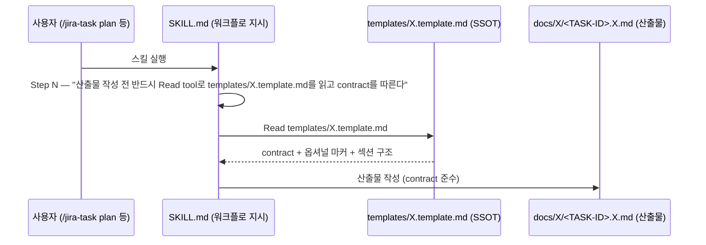

# Design: MAE-173 - [1.3.5] plan.template.md 통일 + 5개 SKILL.md 강화

## Overview

`templates/plan.template.md`를 신규 4종 template과 동일한 contract 패턴으로 정렬하고, 5개 SKILL.md(plan/design/test/review/pr)의 template 참조 라인을 강한 표현으로 통일하면서 SSOT 위반(인라인 섹션 정의 중복)을 제거한다. 코드 변경 없이 문서/규약 변경만 발생.

## Architecture

```
templates/
├── plan.template.md         ← 변경 대상 #1 (contract 추가)
├── design.template.md       (참조 모범 — 그대로)
├── test-report.template.md  (참조 모범 — 그대로)
├── review.template.md       (참조 모범 — 그대로)
└── pr-description.template.md (참조 모범 — 그대로)

skills/
├── jira-task-plan/SKILL.md   ← 변경 #2: 참조 라인 강화 + 인라인 섹션 제거
├── jira-task-design/SKILL.md ← 변경 #3: 참조 라인 강화 + 인라인 섹션 제거
├── jira-task-test/SKILL.md   ← 변경 #4: 참조 라인 강화 + 인라인 섹션 제거
├── jira-task-review/SKILL.md ← 변경 #5: 참조 라인 강화 + 인라인 섹션 제거
└── jira-task-pr/SKILL.md     ← 변경 #6: 참조 라인 강화 + 인라인 섹션 제거

.claude-plugin/plugin.json    ← 변경 #7: version 0.17.17 → 0.17.18
```

## Data Model

N/A — no data changes (문서/규약 변경 작업)

## Sequence Diagram



## Implementation Plan

| # | 파일 | 변경 유형 | 요약 |
|---|------|---------|------|
| 1 | `templates/plan.template.md` | 수정 | 상단에 Section contract 주석 블록 + 옵셔널 마커 규약 설명 추가. 옵셔널 섹션에 `<!-- optional: ... -->` 마커 부착 |
| 2 | `skills/jira-task-plan/SKILL.md` | 수정 | line 86 참조 라인을 강한 표현으로 교체. 88-93 인라인 섹션 정의(`문서에 포함할 내용:` 6줄 블록) 제거 |
| 3 | `skills/jira-task-design/SKILL.md` | 수정 | line 40 참조 라인 강화. 42-69 대형 인라인 섹션 정의 블록 제거 (template이 SSOT) |
| 4 | `skills/jira-task-test/SKILL.md` | 수정 | line 133 참조 라인 강화. 134~ 인라인 markdown 표 블록(Test Report 템플릿 사본) 제거 |
| 5 | `skills/jira-task-review/SKILL.md` | 수정 | line 141 참조 라인 강화. 143-148 인라인 섹션 bullet list(`Summary/Gap Analysis/...`) 제거 |
| 6 | `skills/jira-task-pr/SKILL.md` | 수정 | line 60 참조 라인 강화. 62~ 인라인 PR Body markdown 블록 제거 |
| 7 | `.claude-plugin/plugin.json` | 수정 | version `0.17.17` → `0.17.18` |

### 작업 순서

1. plan.template.md 섹션 분류 확정 → contract 주석 블록 + 마커 부착
2. 5개 SKILL.md 일괄 수정 (참조 라인 통일 → 인라인 섹션 정의 제거)
3. plugin.json version bump
4. grep 기반 검증 (Section contract / optional 마커 / 통일 참조 라인 매칭)

### plan.template.md 섹션 분류 결정 (분류 근거)

| 섹션 | 분류 | 근거 |
|--|--|--|
| Background | 필수 | 모든 plan은 컨텍스트가 있어야 후속 단계 가능 |
| Scope (In/Out) | 필수 | 작업 경계 합의는 plan의 핵심 |
| Acceptance Criteria | 필수 | 검증 기준이 없으면 done 판정 불가 |
| Task Breakdown | 필수 | impl 단계가 의존하는 분해 |
| Risks | 옵셔널 | 사소한 task는 위험 식별 불필요할 수 있음 |
| Edge Cases | 옵셔널 | 일부 task는 경계 조건이 자명함 |

design.template.md 분류와의 일관성: design은 Architecture/Data Model/Sequence Diagram/Implementation Plan/Error Handling/Security Checklist/Test Plan을 필수로 둠. plan은 더 가벼운 단계라 4개 필수 + 2개 옵셔널.

### Interfaces / Types

N/A — 코드 변경 없음

## Error Handling

| 시나리오 | 처리 |
|--|--|
| SKILL.md의 인라인 섹션 정의가 워크플로 지시와 섞여 있어 정확히 식별이 어려움 | "## Step N: Generate ... Document" 섹션 안에서 `templates/X.template.md` 참조 라인 직후의 markdown 블록 또는 bullet list만 제거. Step 4 등 다른 step의 markdown 블록(예: Jira 코멘트 템플릿)은 유지 |
| version bump 누락 | 검증 단계에서 `git diff .claude-plugin/plugin.json`으로 확인 |
| plan.template.md의 일부 옵셔널 섹션이 기존 문서에서 필수로 사용 중 | retroactive 마이그레이션은 Out of Scope이므로 영향 없음. 신규 산출물부터 마커 적용 |

## Security Checklist

| 항목 | 해당 여부 | 비고 |
|--|--|--|
| 입력 검증 | N/A | 문서 변경 |
| 인증/인가 | N/A | 문서 변경 |
| 비밀 관리 | N/A | 문서 변경 |
| 로깅 (민감정보) | N/A | 문서 변경 |
| 의존성 (CVE) | N/A | 문서 변경 |
| 데이터 보안 | N/A | 문서 변경 |

## Test Plan

본 작업은 코드가 아닌 문서/규약 변경이므로 자동화 테스트 대신 **수동 grep 기반 검증**을 수행한다.

### Unit Tests

N/A — 문서 변경 작업

### E2E / Integration Tests

N/A — 문서 변경 작업

### 검증 케이스 (수동)

| # | 케이스 | 명령 / 입력 | 기대 결과 |
|--|--|--|--|
| V1 | plan.template.md에 Section contract 주석이 존재 | `grep -c "Section contract" templates/plan.template.md` | `1` |
| V2 | plan.template.md에 옵셔널 마커가 최소 1개 존재 | `grep -c "<!-- optional:" templates/plan.template.md` | `>= 1` |
| V3 | 5개 SKILL.md 모두 통일된 참조 라인 포함 | `grep -lc "Read tool로 templates/" skills/jira-task-{plan,design,test,review,pr}/SKILL.md` | 모두 `1` |
| V4 | plugin.json version bump | `grep '"version"' .claude-plugin/plugin.json` | `0.17.18` |
| V5 | SKILL.md에서 인라인 섹션 정의 블록이 제거됨 | 수동 diff 검토 (impl 단계에서 진행) | 워크플로 지시는 유지, template과 중복되는 섹션 구조 markdown 블록은 삭제 |

### Acceptance Criteria 매핑

| AC (plan) | 검증 케이스 |
|--|--|
| AC-1 (contract 적용) | V1 |
| AC-2 (옵셔널 마커) | V2 |
| AC-3 (참조 라인 통일) | V3 |
| AC-4 (인라인 정의 제거) | V5 |
| AC-5 (version bump) | V4 |

## Out of Scope

- 기존 `docs/plan/*.plan.md` 산출물의 retroactive 마이그레이션
- `scripts/check-template-usage.sh` lint 자동화 (MAE-131과 같은 over-engineering 함정)
- "plan은 별도 패러다임 유지" 옵션 (외부 리뷰가 일관성을 요구했으므로 통일 방향으로 결정)

## Open Items

없음. 분류 근거가 명문화되어 impl 진입 가능.

## Notes

- 통일된 참조 라인 문구 확정안: **`산출물 작성 전 반드시 Read tool로 templates/<X>.template.md를 읽고 contract를 따른다.`**
- 인라인 섹션 정의 제거 시 "워크플로 지시"와 "섹션 구조 정의"를 구분: 전자(예: "Plan 문서 + 코드베이스 분석 결과를 기반으로 ... 생성")는 유지, 후자(예: `- **Architecture**: 관련 컴포넌트/모듈 구조`)는 제거
