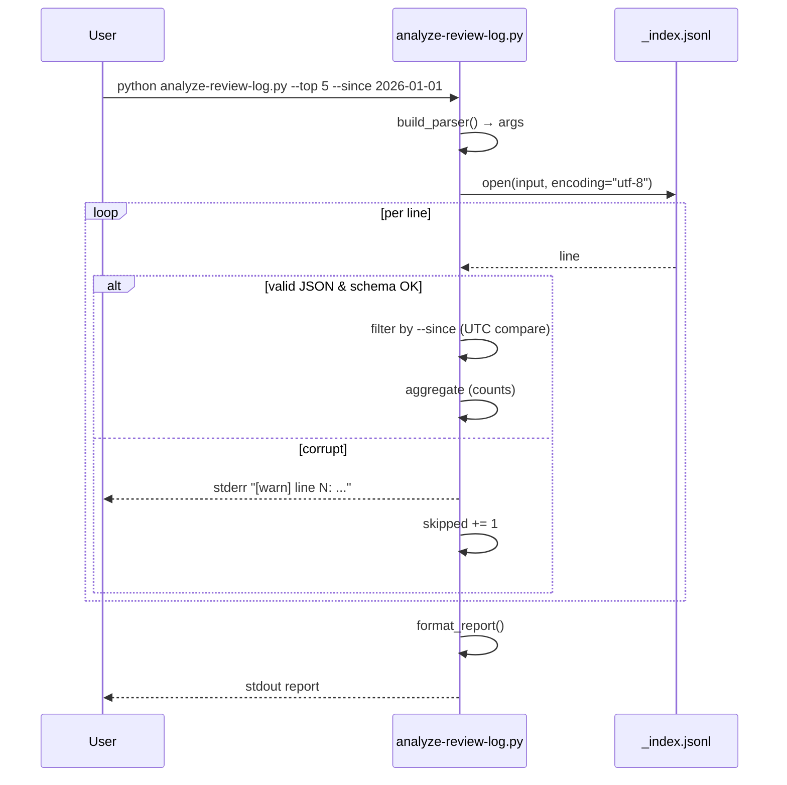

# Design: MAE-181 - [Story 3] 분석 스크립트 scripts/analyze-review-log.py

## Overview

`_index.jsonl`(MAE-179 산출물, MAE-180에서 append됨)을 입력으로 누적 review 통계를 출력하는 단일 파일 Python 스크립트를 구현한다. 외부 의존성을 두지 않으므로 모듈 분리 없이 `scripts/analyze-review-log.py` 한 파일에 stdlib 함수 조합으로 작성한다. design은 plan에서 이월된 두 정책 결정(`--since` timezone, 손상 라인 처리)과 stdlib만으로 5초 SLO를 지키기 위한 단순한 1-pass 파이프라인을 확정한다.

## Plan Inputs

- **Plan doc**: `docs/plan/MAE-181.plan.md`

### Plan Open Items 처리

| # | plan Open Item | design에서의 처리 | 결과 |
|---|---|---|---|
| 1 | `--since` 비교 시 timezone 처리 정책 (UTC vs local) | resolved | **모든 timestamp를 UTC aware datetime으로 정규화**. 입력 `--since YYYY-MM-DD`는 UTC 자정(00:00:00+00:00)으로 해석. 로그 entry의 timestamp는 ISO8601 파싱 후 timezone 정보가 없으면 UTC로 가정 (MAE-179 스키마가 ISO8601 권장이며 review 스킬이 `datetime.now(timezone.utc).isoformat()`로 기록한다는 가정). 사용자에게는 `--help`에 "비교 기준은 UTC"임을 명시. |
| 2 | 손상 라인 발견 시 silent skip vs stderr 경고 | resolved | **stderr에 경고 출력 후 skip**. 형식: `[warn] line N: <reason>` (ex. JSON decode error, missing required field). stdout은 통계 결과만 유지하여 파이프 호환성 보장. 손상 라인 수도 통계 풋터에 `skipped: N`로 표기. |
| 3 | Windows 실기 검증 수행 주체/방법 | deferred | test 단계에서 확정. design은 코드 레벨에서 `pathlib.Path` + `encoding="utf-8"` + `open(..., newline="")`을 강제. |

### AC ↔ 구현 매핑

| AC (plan) | 구현 위치 (design) |
|---|---|
| AC-1 stdlib만 | `scripts/analyze-review-log.py` 모듈 헤더 import 블록 (`json`, `argparse`, `pathlib`, `collections`, `datetime`, `sys`만) |
| AC-2 1000건 5초 | `iter_entries()` (line-by-line `json.loads`) + `aggregate()` (단일 패스, `Counter` 사용) |
| AC-3 크로스 플랫폼 | `pathlib.Path` 사용 + `open(path, encoding="utf-8")` 명시 |
| AC-4 CLI 인자 | `build_parser()` (argparse: `--input`, `--top`, `--since`) |
| AC-5 출력 항목 4종 | `format_report()` (cumulative count / severity dist / category top N / FP rate) |
| AC-6 사용 예시 + 벤치 | 모듈 docstring (사용 예시 3종) + `tests/fixtures/review-log-1000.jsonl` 생성 스크립트 + 벤치 결과는 `docs/test/MAE-181.test-report.md`에 기록 |

## Architecture

- **신규 컴포넌트**: `scripts/analyze-review-log.py` (단일 파일). 함수 단위로 책임 분리하되 모듈 분리는 하지 않음.
- **수정 컴포넌트**: 없음. MAE-179/MAE-180 산출물(`_index.jsonl` 스키마, append 로직)은 read-only로 의존.
- **모듈 의존 방향**: `main` → `build_parser` → `iter_entries` → `aggregate` → `format_report` (단방향).
- **외부 시스템 경계**: 파일시스템 read-only(in-process). 네트워크/DB 없음. stdout(보고서) + stderr(경고)만 사용.
- **테스트 fixture 위치**: `tests/fixtures/review-log-1000.jsonl` (생성 스크립트는 `tests/fixtures/gen_review_log.py`로 분리하여 벤치 재현성 확보).

```
scripts/
  analyze-review-log.py     (신규)
tests/
  fixtures/
    gen_review_log.py       (신규, fixture 생성용)
    review-log-1000.jsonl   (생성 산출물; .gitignore 권장)
  test_analyze_review_log.py (신규, 단위 테스트)
```

## Key Decisions

| # | 결정 | 대안 | 선택 이유 | 비용/제약 |
|---|---|---|---|---|
| 1 | 단일 파이프라인 (1-pass aggregation) | 2-pass(filter→aggregate) | 1000건/5초 SLO에 충분. 메모리도 entry 단위 generator라 부하 적음 | `--since` 필터를 aggregate 내부에서 inline 적용 |
| 2 | timestamp 비교는 모두 UTC aware로 정규화 | naive datetime 또는 string 비교 | local TZ 환경 차이로 인한 경계 케이스 제거. plan Risk "timezone 불일치" 봉쇄 | timezone 미포함 timestamp는 UTC로 가정 (MAE-179 스키마와 일치) |
| 3 | 손상 라인은 stderr 경고 + skip + 풋터 카운트 | silent skip | 운영자가 입력 품질을 인지 가능. stdout은 깨끗하게 유지 | 출력 라인 수 약간 증가 |
| 4 | severity/category 필드 누락 시 `"unknown"` 버킷 | 손상으로 간주 skip | 부분 정보 보존이 통계 정확도에 더 유리 | "unknown"이 누적되면 스키마 drift 신호로 활용 가능 |
| 5 | FP 비율은 `falsePositive == True` 비율로 계산하되 필드 부재 시 분모/분자 모두 0 → "0.0% (0/N)" 출력 | 항상 "0.0%" 하드코딩 | MAE-179 스키마에 `falsePositive` 필드가 정의되어 있으므로 *조건부로* 0%인 것이 자연스럽고 후속 확장 무수정 | 필드 의미 변경 시 재검토 필요 |
| 6 | 출력 포맷은 plain text 고정, `--json` 옵션 도입 안 함 | `--json` 옵션 추가 | plan Scope Decision #3에 따라 over-engineering 회피 | 후속 task 후보 |
| 7 | findings 단위 집계는 entry당 `findings` 배열을 평탄화 | entry 단위만 집계 | severity/category는 finding 속성이므로 의미 부합 | finding이 0개인 entry도 cumulative review count에 1로 반영 |

## Data Model

스키마 변경 없음 — read-only 소비. 본 스크립트가 가정하는 entry 형태(MAE-179 산출물):

| 필드 | 타입 | 사용 |
|--|--|--|
| `taskId` | string | (집계엔 미사용, 향후 확장 여지) |
| `timestamp` | ISO8601 string | `--since` 필터 비교 |
| `reviewerVersion` | string | (미사용) |
| `findings` | array of object | severity/category 집계 source |
| `findings[].severity` | string (e.g. "high"/"medium"/"low") | severity 분포 카운트 |
| `findings[].category` | string | category Top N 카운트 |
| `findings[].falsePositive` | bool (optional) | FP 비율 계산 |

내부 집계 산출물(in-memory):

- `cumulativeReviewCount: int` — 유효 entry 수
- `severityDist: Counter[str]` — severity → count
- `categoryFreq: Counter[str]` — category → count
- `findingsTotal: int`, `fpTotal: int` — FP 비율 = fpTotal / findingsTotal
- `skipped: int` — 손상 라인 수

## Sequence Diagram



## Implementation Plan

| # | 파일 | 변경 유형 | 규모 | 요약 |
|---|------|---------|---|------|
| 1 | `scripts/analyze-review-log.py` | 신규 | M | 모듈 docstring(사용 예시 3종) + `build_parser` + `parse_since` + `iter_entries` + `aggregate` + `format_report` + `main` |
| 2 | `tests/fixtures/gen_review_log.py` | 신규 | S | 1000건 fixture 생성 (severity/category 분포 무작위 with seed) |
| 3 | `tests/fixtures/review-log-1000.jsonl` | 생성물 | S | gen_review_log.py 결과 산출물 (.gitignore 권장) |
| 4 | `tests/test_analyze_review_log.py` | 신규 | S | unittest 기반 단위 테스트 (U1~U7) |
| 5 | `.gitignore` | 수정 | S | `tests/fixtures/review-log-*.jsonl` 추가 |

규모 추정은 plan Task Breakdown(Task 1~8 모두 S, Task 7만 M)과 일치 — 어긋남 없음.

### 작업 순서

1. plan Task 1: MAE-179 산출물(`_index.jsonl` 실제 샘플 또는 스키마 문서) 확인 → 스키마 가정 검증.
2. `build_parser`, `parse_since` 구현 (UTC 정규화 정책 반영).
3. `iter_entries` 구현 (손상 라인 처리: stderr warn + skip + 카운트).
4. `aggregate` 구현 (1-pass, `--since` inline 적용, findings 평탄화).
5. `format_report` 구현 (4종 출력 + skipped 풋터).
6. fixture 생성 스크립트 + 1000건 생성 + `time` 측정 (5초 SLO 검증).
7. docstring 사용 예시 + 벤치 결과 commit message/test report에 기록.

### Interfaces / Types

- `build_parser() -> argparse.ArgumentParser`
- `parse_since(s: str) -> datetime` — `YYYY-MM-DD` → `datetime(.., tzinfo=timezone.utc)`. invalid 입력 시 argparse error.
- `iter_entries(path: Path) -> Iterator[dict]` — 손상 라인은 stderr warn + skip. 호출자에 valid entry만 yield. `skipped` 카운트는 별도 클로저/list로 노출.
- `aggregate(entries: Iterable[dict], since: datetime | None) -> AggregateResult` — `AggregateResult`는 `dataclass` 또는 단순 `dict`.
- `format_report(result: AggregateResult, top: int) -> str`
- `main(argv: list[str] | None = None) -> int`

## Error Handling

| 시나리오 | 유형 | 처리 |
|--|--|--|
| `--input` 파일 없음 | a | argparse error로 exit 2 (`FileNotFoundError`를 명시 메시지로) |
| `--since` 형식 오류 (예: `2026/01/01`) | a | argparse error로 exit 2, "use YYYY-MM-DD (UTC)" 안내 |
| `--top` 음수/0 | a | argparse error로 exit 2 |
| JSON decode 실패 라인 | b | stderr "[warn] line N: invalid JSON" + skip + skipped++ |
| 필수 필드 누락 (`timestamp` 부재) | b | stderr "[warn] line N: missing timestamp" + skip + skipped++ |
| `findings`가 list 아님 | b | stderr "[warn] line N: findings not list" + entry는 count에 포함하되 finding 집계는 0개로 처리 |
| `severity`/`category` 필드 부재 | b | "unknown" 버킷에 카운트 (Key Decision #4) |
| 빈 파일 | a | 정상 처리 — count=0, 모든 분포 비어있음, exit 0 |
| 파일 인코딩 오류 (cp949 등) | b | stderr에 명시 후 exit 1 (UTF-8 강제 정책) |

## Security Checklist

| 항목 | 해당 여부 | 비고 |
|--|--|--|
| 입력 검증 | Yes | argparse type 검증 + JSON schema sanity check |
| 인증/인가 | N/A | 로컬 read-only 스크립트 |
| 비밀 관리 | N/A | 비밀 미사용 |
| 로깅 (민감정보) | Yes | review 코드 스니펫 등 민감 정보가 로그에 있을 수 있음 — 본 스크립트는 entry 본문을 stdout에 출력하지 *않음* (집계 결과만). 손상 라인 warn 메시지에도 line 번호와 reason만 포함하고 본문은 echo 금지 |
| 의존성 (CVE) | N/A | 외부 의존 0개 (stdlib만) |
| 데이터 보안 | Yes | 입력 파일은 절대경로/상대경로 모두 허용하나 write/delete 없음. 출력은 stdout/stderr only |

## Test Plan

### Unit Tests (`tests/test_analyze_review_log.py`)

| # | 케이스 | 입력 | 기대 결과 |
|--|--|--|--|
| U1 | 정상 5건 entry 집계 | inline JSONL 5라인 | cumulative=5, severity/category Counter 정확 |
| U2 | 손상 라인 skip + warn | 5라인 중 2라인 invalid JSON | cumulative=3, skipped=2, stderr에 warn 2건 |
| U3 | `--since` UTC 경계 | 2026-01-01 자정 직후/직전 entry | 직후만 포함 |
| U4 | `--since` 형식 오류 | `--since 2026/01/01` | argparse SystemExit code 2 |
| U5 | `--top N` 적용 | category 7종 entry | 출력에 상위 N개만 포함 |
| U6 | findings 빈 entry | findings=[] | cumulative count에는 +1, finding 집계는 0 |
| U7 | FP 비율 계산 | falsePositive=true 1건 / 4건 finding | "25.0% (1/4)" |
| U8 | 빈 파일 | 0 lines | exit 0, count=0 |
| U9 | severity/category 부재 | finding에 필드 없음 | "unknown" 버킷에 카운트 |
| U10 | timezone 미포함 timestamp | naive ISO8601 | UTC로 간주되어 `--since` 비교 정상 |

### E2E / Integration Tests

| # | 시나리오 | 사전 조건 | 검증 |
|--|--|--|--|
| E1 | 1000건 fixture 5초 이내 (AC-2) | `gen_review_log.py`로 생성한 1000라인 | `time python scripts/analyze-review-log.py --input <fixture>` real time < 5s |
| E2 | `--help` 정상 (AC-1, AC-4) | 스크립트 작성 완료 | exit 0, 사용 예시 + 옵션 노출 |
| E3 | macOS/Linux 동일 출력 (AC-3) | 동일 fixture | 출력 hash 동일 |
| E4 | 사용 예시 docstring (AC-6) | 모듈 헤더 | `python -c "import importlib.util; ..."`로 docstring에 `--top`, `--since` 예시 포함 검증 |

### Acceptance Criteria 매핑

| AC (plan) | 검증 케이스 |
|--|--|
| AC-1 stdlib만 | E2, U1~U10 (외부 import 없이 동작) |
| AC-2 1000건 5초 | E1 |
| AC-3 크로스 플랫폼 | E3 + 코드 리뷰 (Windows는 plan Open Item #3에 따라 test 단계 결정) |
| AC-4 CLI 인자 | U3, U4, U5, E2 |
| AC-5 출력 항목 4종 | U1, U7 |
| AC-6 사용 예시 + 벤치 | E1(real time 기록), E4(docstring) |

## Out of Scope

- `--json` 출력 포맷 (plan Scope Decision #3)
- FP 분류 로직 자체 (AC상 0% — Key Decision #5는 필드 사용만)
- 시각화 / HTML 리포트
- 90일 아카이브 / 압축 정책 (enhancement-roadmap Phase 1 별도 항목)

## Open Items

- Windows 실기 검증 수행 주체 — test 단계에서 결정 (P2, plan에서 이월). impl 진입 게이트는 통과.
- N/A — P1 미해결 항목 없음. impl 진입 가능.

## Notes

- `--since` UTC 고정 정책은 `--help` 메시지와 모듈 docstring 양쪽에 반드시 명시한다 (사용자 혼동 방지).
- 손상 라인 카운트가 일정 비율을 넘으면 (e.g. 10%) 향후 exit code를 다르게 가져갈 수 있으나 본 task 범위 밖.
