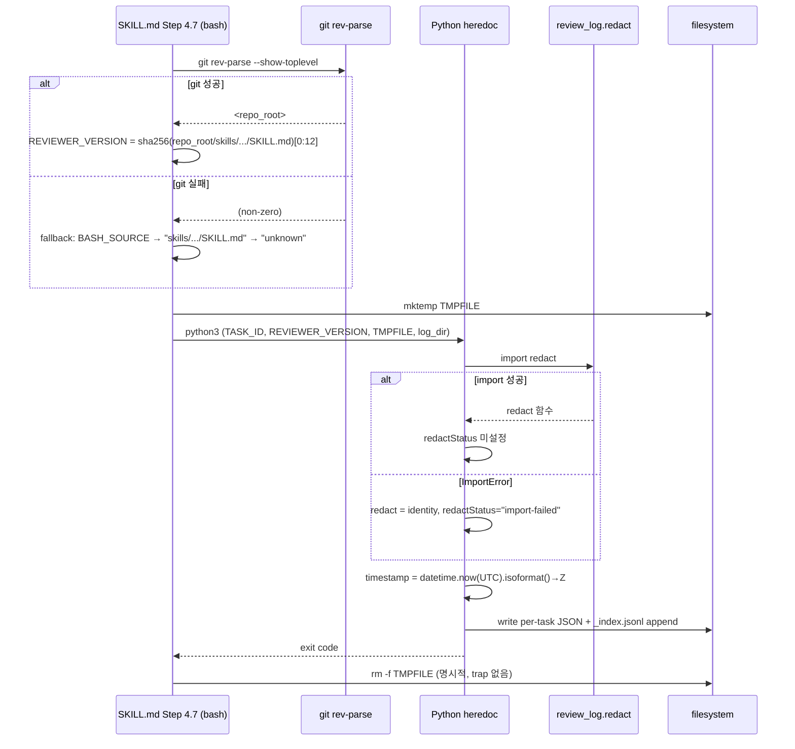

# Design: MAE-190 - Reviewer Calibration Log Robustness Hardening

## Overview

Phase 3.1 (MAE-111) 진입 전 reviewer-log append 경로의 4개 robustness finding(F-001~F-004)과 timestamp UTC 강제 항목을 단일 PR로 묶어 보강한다. 모든 변경은 `skills/jira-task-review/SKILL.md` Step 4.7 한 영역과 `docs/review-log/README.md` 한 줄로 국한된다. 본 design은 plan에서 정해진 처리 방향(F-002 표식 채택, F-004 README 명시)을 받아 구체적 구현 방식(import try/except 구조, git rev-parse 분기, cleanup 위치, timestamp 호출 형태)을 확정한다.

## Plan Inputs

- **Plan doc**: `docs/plan/MAE-190.plan.md`

### Plan Open Items 처리

N/A — plan에 미해결 항목 없음.

### AC ↔ 구현 매핑

| AC (plan) | 구현 위치 (design) |
|---|---|
| AC-1 (F-002 redact 표식) | `skills/jira-task-review/SKILL.md` Step 4.7 — Python heredoc의 `try/except ImportError` 블록 + entry dict 조립부 |
| AC-2 (F-001 reviewerVersion) | `skills/jira-task-review/SKILL.md` Step 4.7 — bash 영역의 `SKILL_MD_PATH` 산출 로직 |
| AC-3 (F-003 trap 제거) | `skills/jira-task-review/SKILL.md` Step 4.7 — bash 영역의 `trap` 라인 제거 + 함수 말미 cleanup |
| AC-4 (F-004 정책 명시) | `docs/review-log/README.md` "민감정보 보안 정책" 섹션 |
| AC-5 (timestamp UTC Z) | `skills/jira-task-review/SKILL.md` Step 4.7 — Python heredoc의 timestamp 생성 라인 |
| AC-6 (회귀 없음) | 전체 (T7 단위 테스트 게이트) |
| AC-7 (dogfooding) | T6 — 본 Task 변경 적용 후 review 1회 실행 |

## Architecture

- **수정 대상**: 기존 컴포넌트 2개의 부분 수정만. 신규 컴포넌트/모듈/함수 없음.
  - `skills/jira-task-review/SKILL.md` Step 4.7 (bash + 임베디드 Python heredoc)
  - `docs/review-log/README.md` (정책 1줄 추가)
- **모듈 의존 방향**: 변경 없음. 기존 `scripts/review_log/redact.redact`를 import해서 쓰는 구조 그대로 유지.
- **외부 시스템 경계**: 모두 in-process (file I/O + subprocess `git rev-parse`만). 네트워크/Jira API 호출 없음.

## Key Decisions

| # | 결정 | 대안 | 선택 이유 | 비용/제약 |
|---|---|---|---|---|
| 1 | F-002 표식은 `redactStatus` 필드를 entry 최상위에 옵셔널 키로 추가. 정상 시 키 자체 미존재, import 실패 시 `"import-failed"`. | (a) 항상 `"ok"`/`"import-failed"`로 채움, (b) findings 각 항목에 표식 부착 | (a)는 기존 entry shape 변경 폭이 큼; (b)는 finding 단위 의미 모호. 옵셔널 최상위 키가 분석 스크립트 호환성 영향 최소. | schema doc 갱신은 본 Task에서 하지 않음(별도 schema bump 비용 회피, README 변경이력만 기록 옵션) |
| 2 | reviewerVersion 산출은 `git rev-parse --show-toplevel` → repo root 절대 경로 + `skills/jira-task-review/SKILL.md`로 조합. 실패 시 기존 fallback chain(`BASH_SOURCE` → 상대 경로 → `unknown`) 유지. | git 명령 없이 `realpath` / `pwd` 기반 탐색 | git 워크트리 환경에서 가장 안정적. 비-git cwd는 매우 드문 경계 케이스이므로 기존 fallback 재활용. | `git` 바이너리 의존성 추가되지만 본 플러그인은 이미 git 워크트리를 전제로 함 |
| 3 | F-003 cleanup은 Python heredoc 호출 직후 `rm -f "$TMPFILE" 2>/dev/null` 한 줄. `trap` 라인 제거. | trap 유지하면서 명시 cleanup 추가(이중) | 이중 cleanup은 trap이 본 셸 컨텍스트의 다른 EXIT 트랩과 간섭 위험. 단일 명시 cleanup이 의도가 더 명확. | Python heredoc이 SIGINT로 중단되면 임시파일 잔류 가능 — 허용 가능한 trade-off (best-effort 정신) |
| 4 | timestamp는 `datetime.now(timezone.utc).isoformat(timespec="seconds").replace("+00:00","Z")` 사용. | 기존 `strftime("%Y-%m-%dT%H:%M:%SZ")` 유지(이미 Z) | 현재 `strftime` 형태도 의미상 같으나 plan AC-5는 "UTC Z suffix 강제"이며 표준화된 isoformat이 future-proof(microsecond/timezone 유지 의도가 명확). 기존 분석 스크립트는 prefix 매칭이라 호환. | 새 entry는 초 단위 정밀도 유지(`timespec="seconds"`)로 기존 entry 형식과 동일 외형 |
| 5 | F-004는 README "민감정보 보안 정책" 섹션 끝에 1문장 추가 — "`aws_secret_key` 등 식별 가능한 키 라인의 *전체 매치 redact*는 의도된 보호적 동작이다." 코드 변경 없음. | redact.py 정규식 정렬(option a), 알람 추가(option b) | 동작이 이미 안전(over-redact). 코드 변경은 redact 단위 테스트 영향. README 명시가 비용/위험 최저. | 향후 redact 정밀화 시 본 문장 갱신 필요 |

## Data Model

신규 데이터 변경 없음. 단, entry에 옵셔널 최상위 키 1개 추가:

- **`redactStatus`** (옵셔널, string)
  - 존재 의미: 본 entry append 시점에 `from review_log.redact import redact`가 실패함
  - 값: 고정 문자열 `"import-failed"` (현재 단계는 단일 값. 향후 enum 확장 여지)
  - 정상 경로(import 성공): 키 미존재 (기존 분석 스크립트 호환)

> 주: README "Entry 필수 필드" 표 업데이트는 본 Task scope에 포함하지 않는다 (Out of Scope 참고). plan의 변경 영향(분석 스크립트 호환성)은 옵셔널 키이므로 OK.

## Sequence Diagram

## Implementation Plan

| # | 파일 | 변경 유형 | 규모 | 요약 |
|---|------|---------|---|------|
| 1 | `skills/jira-task-review/SKILL.md` | 수정 | S | Step 4.7의 bash 영역에서 `git rev-parse --show-toplevel` 기반 SKILL_MD_PATH 산출 + 기존 fallback chain 보존; `trap ... EXIT` 제거 후 Python heredoc 직후 명시 `rm -f "$TMPFILE"` 추가 |
| 2 | `skills/jira-task-review/SKILL.md` | 수정 | S | Step 4.7의 Python heredoc에서 redact import try/except 블록에 `redact_import_ok` 플래그 도입; entry 조립 시 실패면 `redactStatus="import-failed"` 키 삽입 |
| 3 | `skills/jira-task-review/SKILL.md` | 수정 | S | Python heredoc의 timestamp 라인을 `datetime.now(timezone.utc).isoformat(timespec="seconds").replace("+00:00","Z")`로 교체 |
| 4 | `docs/review-log/README.md` | 수정 | S | "민감정보 보안 정책" 섹션 끝에 정책 1줄 추가 (F-004); 변경이력 표에 MAE-190 라인 추가 |
| 5 | `.claude-plugin/plugin.json` | 수정 | S | version bump (현재 0.22.0 기준 patch 증가) |

plan의 Task Breakdown 규모(T1~T8 모두 S)와 일치. 어긋남 없음.

### 작업 순서

1. (T2) reviewerVersion 산출 로직 교체 → bash 단독 동작 확인 (`bash -n`).
2. (T3) trap 제거 + 명시 cleanup 추가.
3. (T1) Python heredoc redact import 블록에 `redact_import_ok` 플래그 + entry `redactStatus` 삽입.
4. (T4) timestamp 라인 교체.
5. (T5) README 정책 1줄 추가 + 변경이력 갱신.
6. (T8) plugin.json version bump.
7. (T7) 회귀 테스트(`pytest scripts/`) 실행.
8. (T6) dogfooding `/jira-task review MAE-190` 1회 → 5개 항목 entry로 검증.

### Interfaces / Types

신규 시그니처 없음. 기존 동일.

## Error Handling

| 시나리오 | 유형 | 처리 |
|--|--|--|
| `git rev-parse --show-toplevel` 비-0 종료 (비-git cwd / git 미설치) | b (외부 시스템 실패) | 기존 fallback chain (`BASH_SOURCE` → 상대 경로 → `unknown`) 유지. 표준 출력에 ⚠️ 라인 1개. |
| `shasum` 미존재/실패 | b | `REVIEWER_VERSION="unknown"` 기존 라인 그대로. |
| `from review_log.redact import redact` ImportError | b | identity 함수 대체 + `redact_import_ok=False` 플래그. entry에 `redactStatus="import-failed"` 부착. ⚠️ 출력. |
| `mktemp` 실패 | b | `set +e`로 묶여 있어 Python heredoc 인자 부재로 실패; APPEND_EXIT≠0 경로로 ⚠️ 출력 후 워크플로 계속. |
| Python heredoc 비정상 종료 (SIGINT/예외) | c (내부 invariant) | trap 제거로 임시파일 잔류 가능. best-effort 정신상 허용 — 다음 review 실행 시 새 mktemp 사용. |
| 정상 종료 후 `rm -f "$TMPFILE"` 실패 | b | `2>/dev/null`로 silent. APPEND_EXIT 영향 없음. |

## Security Checklist

| 항목 | 해당 여부 | 비고 |
|--|--|--|
| 입력 검증 | N/A | 외부 입력 없음 (subagent 결과는 신뢰 경계 내) |
| 인증/인가 | N/A | 로컬 file I/O만 |
| 비밀 관리 | Yes | redact import 실패 시 `redactStatus="import-failed"` 표식으로 silent degrade 차단 (G1, F-002). 후속 분석에서 해당 entry 필터 가능 |
| 로깅 (민감정보) | Yes | 기존 redact 정책 유지. F-004 README 명시로 over-redact 의도 명확화 |
| 의존성 (CVE) | N/A | 신규 의존성 없음. `git`은 시스템 기 보유 |
| 데이터 보안 | Yes | 임시파일은 `/tmp` mktemp 권한(0600), 명시적 cleanup으로 잔류 최소화 |

## Test Plan

본 Task는 SKILL.md(셸+Python heredoc)와 README 변경이라 격리 가능한 unit test가 적다. 회귀 게이트는 기존 1514건 단위 테스트(`scripts/review_log/` 등)로 확보하고, 핵심 동작은 1회 dogfooding e2e로 검증한다.

### Unit Tests

| # | 케이스 | 입력 | 기대 결과 |
|--|--|--|--|
| U1 | 기존 redact 단위 테스트 회귀 | `pytest scripts/` | 1514건 PASS, 0 FAIL |
| U2 | (옵션) timestamp 라인 isolated check | Python REPL: `datetime.now(timezone.utc).isoformat(timespec="seconds").replace("+00:00","Z")` | 결과 문자열이 `Z`로 끝나고 정규식 `^\d{4}-\d{2}-\d{2}T\d{2}:\d{2}:\d{2}Z$` 매치 |

### E2E / Integration Tests

| # | 시나리오 | 사전 조건 | 검증 |
|--|--|--|--|
| E1 (dogfooding) | 본 Task 변경 적용 후 `/jira-task review MAE-190` 1회 실행 | 변경 사항 적용, 워크트리 cwd | `docs/review-log/MAE-190.json` 신규 entry 생성, `timestamp` Z suffix, `reviewerVersion` 12 hex, `redactStatus` 키 부재(정상 경로), 임시파일 `/tmp/review_subagent_*` 잔류 0 |
| E2 (워크트리 하위 cwd) | `cd docs/` 후 reviewerVersion 산출 로직 단독 검증 (수작업) | `cd docs/` | bash 스니펫이 12 hex `REVIEWER_VERSION`을 출력 |
| E3 (redact import 실패 시뮬레이션) | `scripts/review_log/redact.py` 임시 rename 후 review 실행 | redact.py 부재 | entry에 `redactStatus: "import-failed"` 키 존재, ⚠️ 메시지 출력 |

> E3는 dogfooding과 별개의 수작업 검증. 본 Task scope의 단일 PR 정책 하에서 자동 테스트 추가는 over-engineering이라 판단 — Open Items로 두지 않고 수작업 가이드만 작성.

### Acceptance Criteria 매핑

| AC (plan) | 검증 케이스 |
|--|--|
| AC-1 (F-002) | E1 (정상 경로 키 부재) + E3 (실패 경로 키 존재) |
| AC-2 (F-001) | E1 + E2 |
| AC-3 (F-003) | E1 (잔류 0 검증) + grep `trap` 부재 정적 확인 |
| AC-4 (F-004) | README 변경 diff 검토 (수작업) |
| AC-5 (timestamp Z) | U2 + E1 |
| AC-6 (회귀) | U1 |
| AC-7 (dogfooding) | E1 |

## Out of Scope

- README "Entry 필수 필드" 표에 `redactStatus` 옵셔널 키 행 추가. (옵셔널 키이며 schemaVersion bump가 필요 없는 호환 변경 — 본 Task는 단일 PR scope 유지를 위해 보류)
- E3 자동화 단위 테스트 작성 (수작업 검증으로 갈음)
- 분석 스크립트(`scripts/analyze-review-log.py`)에서 `redactStatus` 필드 활용 로직 (Phase 3.1 후속)

## Open Items

N/A — 모두 해결.

## Notes

- 본 Task는 단일 SKILL.md 영역에 4개 변경이 집중되어 충돌/회귀 위험이 낮음. 그러나 5번째 변경(README)과 시점이 어긋나면 dogfooding entry에서 F-004가 검증되지 않을 수 있어 작업 순서 5(README)는 dogfooding 전에 끝낸다.
- `redactStatus` 키 이름은 schemaVersion 1을 깨지 않는 옵셔널 확장으로 의도. 향후 schema 1→2 bump 시 enum 정식화 검토.
