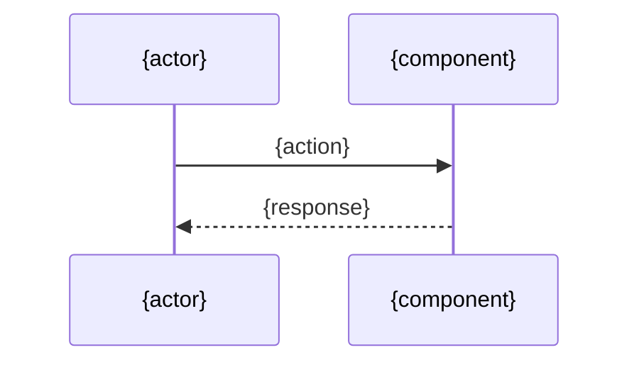

# Design: {task_id} - {summary}

<!--
Section contract:
- 필수(required): Architecture, Data Model, Sequence Diagram, Implementation Plan, Error Handling, Security Checklist, Test Plan
- 권장(recommended): Overview
- 옵셔널(optional): Out of Scope, Open Items, Interfaces / Types, Notes — 필요 시 포함

가변 섹션 마커 규약:
- 형식: `<!-- optional: <조건 또는 사유> -->`
- 헤더 직전 줄에 위치. 자동 처리 대상이 아닌 LLM/사람 참고용 힌트.
- 옵셔널 섹션을 생략할 때는 헤더 자체를 제거하거나, 본문에 "N/A — <사유>" 한 줄로 둔다.
-->

<!-- optional: 작업 개요나 맥락이 design 내부에서 별도로 필요할 때 포함. plan.md로 충분하면 생략. -->
## Overview

{1-3 paragraph 작업 요지. plan과 중복되지 않게 design 관점만.}

## Architecture

{관련 컴포넌트/모듈 구조. 디렉토리 트리, 컴포넌트 역할, 인터페이스 위치 등.}

## Data Model

{엔티티/스키마/DTO/도메인/상태/흐름 합의. 권장 하위 6종(아래 중 해당 시):

1. **새/변경되는 엔티티**: 속성 · 타입 · 제약 · 관계
2. **DB 스키마**: 테이블 / 컬럼 / 인덱스 / FK / 마이그레이션 전략
3. **API 페이로드**: 요청 / 응답 DTO 구조 (시그니처 수준)
4. **도메인 객체**: 핵심 entity / value object 구조 (이름과 역할)
5. **상태 모델**: 상태 전이 다이어그램 (Mermaid `stateDiagram` 권장)
6. **데이터 흐름**: source → transform → sink

코드 작성 금지(시그니처/명세 수준만). 데이터 변경이 없으면 "N/A — no data changes" 한 줄.}

## Sequence Diagram

## Implementation Plan

{구현 순서와 파일별 변경 사항. 각 파일에 대해 "무엇을 변경하는지"를 1-2줄로. 코드 작성 금지.}

| # | 파일 | 변경 유형 | 요약 |
|---|------|---------|------|
| 1 | `{path}` | 신규/수정/삭제 | {1-2줄 요약} |

<!-- optional: 작업 순서나 단계별 의존성이 표만으로 표현되지 않을 때만 추가. -->
### 작업 순서

1. {step}

<!-- optional: 시그니처가 design 시점에 확정되어야 할 때만 포함. -->
### Interfaces / Types

- `funcName(arg: Type): ReturnType` — {역할 한 줄}

## Error Handling

{에러 시나리오와 처리 전략. 시나리오 → 처리 매핑 표 권장.}

| 시나리오 | 처리 |
|--|--|
| {case} | {strategy} |

## Security Checklist

| 항목 | 해당 여부 | 비고 |
|--|--|--|
| 입력 검증 | Yes/No/N/A | {} |
| 인증/인가 | Yes/No/N/A | {} |
| 비밀 관리 | Yes/No/N/A | {} |
| 로깅 (민감정보) | Yes/No/N/A | {} |
| 의존성 (CVE) | Yes/No/N/A | {} |
| 데이터 보안 | Yes/No/N/A | {} |

## Test Plan

{테스트 전략 + 구체적 테스트 케이스 명세. impl 단계에서 구현 가능한 수준으로 구체적이어야 함.}

### Unit Tests

| # | 케이스 | 입력 | 기대 결과 |
|--|--|--|--|
| U1 | {what} | {input} | {expected} |

### E2E / Integration Tests

| # | 시나리오 | 사전 조건 | 검증 |
|--|--|--|--|
| E1 | {scenario} | {given} | {then} |

### Acceptance Criteria 매핑

| AC (plan) | 검증 케이스 |
|--|--|
| AC-1 | U1, E1 |

<!-- optional: design 단계에서 명시적으로 제외한 항목이 있을 때. -->
## Out of Scope

- {item}

<!-- optional: impl 진입 직전 결정해야 할 미결 항목이 있을 때. -->
## Open Items

- {item}

<!-- optional: 위 섹션에 들어가지 않는 부가 메모. -->
## Notes

- {note}
