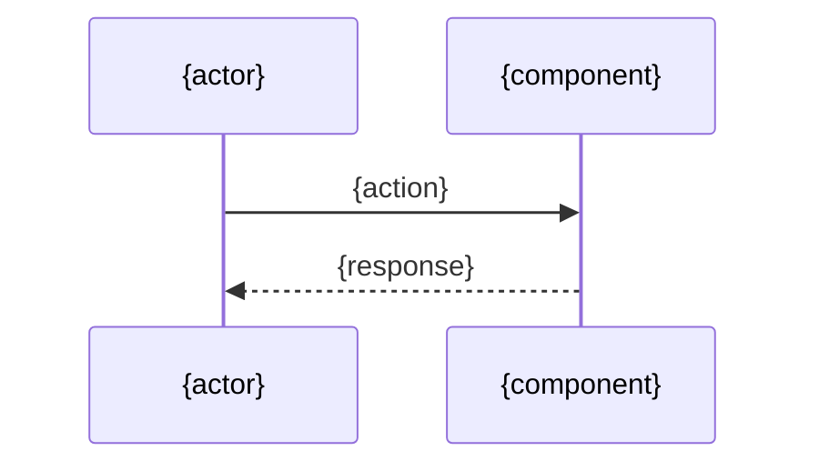

# Design: {task_id} - {summary}

<!--
Section contract:
- 필수: Plan Inputs, Architecture, Key Decisions, Data Model, Implementation Plan, Error Handling, Test Plan
- 권장: Overview
- 옵셔널: Sequence Diagram, Security Checklist (영향 있을 때), Out of Scope, Interfaces / Types, Open Items, Notes

옵셔널 섹션은 비면 헤더째 삭제. 필수가 비면 "N/A — <사유>" 한 줄.

plan vs design 경계:
- plan = "*무엇을 / 어디까지*" (스코프 결정)
- design = "*어떻게*" (구현 방식 결정)
- Key Decisions에는 후자만. 스코프 결정은 plan으로.
-->

<!-- optional: plan.md로 충분하면 생략. -->
## Overview

{1-3 paragraph design 관점 요지. plan과 중복 금지.}

## Plan Inputs

- **Plan doc**: `docs/plan/<TASK-ID>.plan.md` *(plan 생략 시 "N/A — <출처>")*

<!-- plan의 Open Items 처리 + AC↔구현 매핑을 한 표로. plan이 깨끗하면 매핑만. -->

| 출처 | 항목 | design에서의 처리 / 구현 위치 |
|---|---|---|
| Open Item 1 | {plan 미해결} | resolved / deferred — {답 또는 사유} |
| AC-1 | {criterion} | {component / module / file} |

## Architecture

<!-- 최소 셋: (1) 신규 vs 수정 컴포넌트, (2) 모듈 의존 방향, (3) 외부 시스템 경계.
     형식 자유 (다이어그램 / 트리 / 텍스트). -->

{관련 컴포넌트/모듈 구조.}

## Key Decisions

<!-- *구현 방식* 결정만. 0건일 수 없음 — "기존 패턴 유지" 결정도 한 줄. 1건이면 bullet. -->

| # | 결정 | 대안 | 선택 이유 | 비용/제약 |
|---|---|---|---|---|
| 1 | {what} | {alt} | {why} | {cost} |

## Data Model

<!-- 해당 시: 엔티티/스키마/DTO/도메인/상태/데이터 흐름 합의.
     코드 작성 금지 (시그니처/명세 수준만). 데이터 변경 없으면 "N/A — no data changes". -->

{엔티티·스키마·DTO·상태 전이·데이터 흐름.}

## Implementation Plan

<!-- 규모: S/M/L. plan의 Task Breakdown과 어긋나면 Open Items로 이월. -->

| # | 파일 | 변경 유형 | 규모 | 요약 |
|---|------|---------|---|------|
| 1 | `{path}` | 신규/수정/삭제 | S/M/L | {1-2줄} |

<!-- optional: 단계별 의존이 표만으로 안 보일 때만. -->
### 작업 순서

1. {step}

<!-- optional: 시그니처가 design 시점에 확정되어야 할 때만. -->
### Interfaces / Types

- `funcName(arg: Type): ReturnType` — {역할 한 줄}

## Error Handling

<!-- 유형: (a) 사용자 입력, (b) 외부 시스템 실패, (c) 내부 invariant 위반. -->

| 시나리오 | 유형 | 처리 |
|--|--|--|
| {case} | a/b/c | {strategy} |

## Test Plan

### Unit Tests

| # | 케이스 | 입력 | 기대 결과 | 검증 AC |
|--|--|--|--|--|
| U1 | {what} | {input} | {expected} | AC-1 |

### E2E / Integration Tests

| # | 시나리오 | 사전 조건 | 검증 | 검증 AC |
|--|--|--|--|--|
| E1 | {scenario} | {given} | {then} | AC-1 |

<!-- optional: 보안 영향이 있을 때만 펼침. 영향 없으면 헤더째 생략하고 본 줄만 둔다.
     기본 한 줄: "보안 영향: No — <사유>" -->
## Security Checklist

| 항목 | 해당 여부 | 비고 |
|--|--|--|
| 입력 검증 / 인증·인가 / 비밀 관리 / 로깅(민감정보) / 의존성 CVE / 데이터 보안 | Yes/No/N/A | {} |

<!-- optional: design에서 명시적으로 제외한 항목이 있을 때만. -->
## Sequence Diagram

<!-- optional: design에서 명시적으로 제외한 항목이 있을 때만. -->
## Out of Scope

- {item}

<!-- optional: impl 진입 게이트. 미해결 P1이 있는 채로 impl 금지. -->
## Open Items

- {item — 사유 + 누가/언제}

<!-- optional: 위 섹션에 안 맞는 부가 메모. -->
## Notes

- {note}
