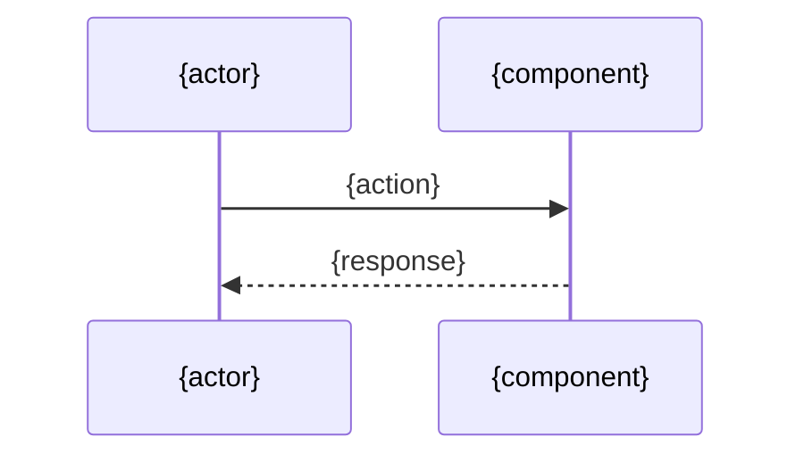

# Design: {task_id} - {summary}

<!--
Section contract:
- 필수(required): Plan Inputs, Architecture, Key Decisions, Data Model, Sequence Diagram, Implementation Plan, Error Handling, Security Checklist, Test Plan, Open Items
- 권장(recommended): Overview
- 옵셔널(optional): Out of Scope, Interfaces / Types, Notes — 필요 시 포함

가변 섹션 마커 규약:
- 형식: HTML 주석 형태로 `optional: <조건 또는 사유>`
- 헤더 직전 줄에 위치. 자동 처리 대상이 아닌 LLM/사람 참고용 힌트.
- 옵셔널 섹션을 생략할 때는 헤더 자체를 제거하거나, 본문에 "N/A — <사유>" 한 줄로 둔다.
- 필수 섹션은 비어 있을 수 없다. 해당 사항이 없으면 "N/A — <사유>" 한 줄을 둔다.

plan vs design 결정 경계:
- plan = "*무엇을 / 어디까지* 할 것인가" (스코프 결정).
- design = "*어떻게* 만들 것인가" (구현 방식 결정).
- Key Decisions에는 후자만 기록. 스코프 결정은 plan의 Scope Decisions로.
-->

<!-- optional: 작업 개요나 맥락이 design 내부에서 별도로 필요할 때 포함. plan.md로 충분하면 생략. -->
## Overview

{1-3 paragraph 작업 요지. plan과 중복되지 않게 design 관점만.}

## Plan Inputs

- **Plan doc**: `docs/plan/<TASK-ID>.plan.md`
  (plan 미수행 시: "N/A — plan 생략 (출처: <Jira issue / 직접 협의>)")

### Plan Open Items 처리

<!-- plan의 Open Items 섹션을 그대로 받아, 각 항목에 design에서의 처리 결과를 기록.
     plan의 Open Items가 "N/A — 모두 해결"이었으면 이 표도 "N/A — plan에 미해결 항목 없음" 한 줄. -->

| # | plan Open Item | design에서의 처리 | 결과 |
|---|---|---|---|
| 1 | {plan의 Open Item} | resolved / deferred / out-of-scope | {답 또는 사유} |

### AC ↔ 구현 매핑

<!-- plan의 AC가 design의 어느 컴포넌트/모듈로 실현되는지.
     Test Plan의 매핑(AC ↔ U/E)과는 별개:
     - 여기는 "어디서 구현되는가"
     - Test Plan은 "어디서 검증되는가" -->

| AC (plan) | 구현 위치 (design) |
|---|---|
| AC-1 | {component / module / file} |

## Architecture

<!-- 최소한 다음 셋은 명시 (해당 없으면 "N/A"):
     1. 새로 추가되는 컴포넌트 vs 기존 컴포넌트 수정
     2. 모듈 간 의존 방향
     3. 외부 시스템과의 경계 (in-process / sync API / async)
     본문 형식은 자유 (다이어그램 / 트리 / 텍스트). -->

{관련 컴포넌트/모듈 구조. 디렉토리 트리, 컴포넌트 역할, 인터페이스 위치 등.}

## Key Decisions

<!-- design이 내린 *구현 방식*에 대한 결정. 스코프 결정은 plan의 Scope Decisions로.
     0건일 수 없다 — "변경 없음 — 기존 패턴 유지" 결정 자체도 한 줄 기록.
     1건 이하면 표 대신 bullet으로 대체 가능. -->

| # | 결정 | 대안 | 선택 이유 | 비용/제약 |
|---|---|---|---|---|
| 1 | {what — e.g. "OTP를 비동기 큐로 검증"} | {alternative — e.g. "동기 호출"} | {why} | {cost/constraint} |

## Data Model

{엔티티/스키마/DTO/도메인/상태/흐름 합의. 권장 하위 6종(아래 중 해당 시):

1. **새/변경되는 엔티티**: 속성 · 타입 · 제약 · 관계
2. **DB 스키마**: 테이블 / 컬럼 / 인덱스 / FK / 마이그레이션 전략
3. **API 페이로드**: 요청 / 응답 DTO 구조 (시그니처 수준)
4. **도메인 객체**: 핵심 entity / value object 구조 (이름과 역할)
5. **상태 모델**: 상태 전이 다이어그램 (Mermaid `stateDiagram` 권장)
6. **데이터 흐름**: source → transform → sink

코드 작성 금지(시그니처/명세 수준만). 데이터 변경이 없으면 "N/A — no data changes" 한 줄.}

## Sequence Diagram

## Implementation Plan

<!-- 규모: S(<반나절) / M(반나절~2일) / L(2일+).
     plan의 Task Breakdown 규모 추정과 어긋나면 Open Items로 이월. -->

| # | 파일 | 변경 유형 | 규모 | 요약 |
|---|------|---------|---|------|
| 1 | `{path}` | 신규/수정/삭제 | S/M/L | {1-2줄 요약} |

<!-- optional: 작업 순서나 단계별 의존성이 표만으로 표현되지 않을 때만 추가. -->
### 작업 순서

1. {step}

<!-- optional: 시그니처가 design 시점에 확정되어야 할 때만 포함. -->
### Interfaces / Types

- `funcName(arg: Type): ReturnType` — {역할 한 줄}

## Error Handling

{에러 시나리오와 처리 전략. 시나리오 → 처리 매핑 표 권장.
 권장: 유형 컬럼으로 분류 — (a) 사용자 입력 오류, (b) 외부 시스템 실패, (c) 내부 invariant 위반.}

| 시나리오 | 유형 | 처리 |
|--|--|--|
| {case} | a/b/c | {strategy} |

## Security Checklist

| 항목 | 해당 여부 | 비고 |
|--|--|--|
| 입력 검증 | Yes/No/N/A | {} |
| 인증/인가 | Yes/No/N/A | {} |
| 비밀 관리 | Yes/No/N/A | {} |
| 로깅 (민감정보) | Yes/No/N/A | {} |
| 의존성 (CVE) | Yes/No/N/A | {} |
| 데이터 보안 | Yes/No/N/A | {} |

## Test Plan

{테스트 전략 + 구체적 테스트 케이스 명세. impl 단계에서 구현 가능한 수준으로 구체적이어야 함.}

### Unit Tests

| # | 케이스 | 입력 | 기대 결과 |
|--|--|--|--|
| U1 | {what} | {input} | {expected} |

### E2E / Integration Tests

| # | 시나리오 | 사전 조건 | 검증 |
|--|--|--|--|
| E1 | {scenario} | {given} | {then} |

### Acceptance Criteria 매핑

| AC (plan) | 검증 케이스 |
|--|--|
| AC-1 | U1, E1 |

<!-- optional: design 단계에서 명시적으로 제외한 항목이 있을 때. -->
## Out of Scope

- {item}

## Open Items

<!-- impl 진입 게이트. plan에서 이월된 미해결 항목과 design 중 발견된 미결을 모두 모은다.
     없으면 "N/A — 모두 해결" 한 줄. 미해결 P1 항목이 있는 채로 impl 진입 금지. -->

- {item — 사유 + 누가/언제 풀 것인가}

<!-- optional: 위 섹션에 들어가지 않는 부가 메모. -->
## Notes

- {note}
